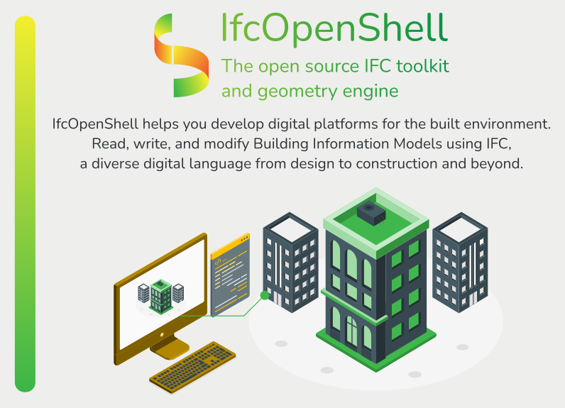

Let's learn IfcOpenShell!
=========================

.. toctree::
   :hidden:
   :maxdepth: 1
   :caption: Main:

   introduction
   ifcopenshell
   ifcopenshell-cpp
   ifcopenshell-python
   ifcconvert
   ifcviewer
   bonsai
   bonsai-viewer

.. toctree::
   :hidden:
   :maxdepth: 1
   :caption: Utilities:

   bcf
   bimserver-plugin
   bsdd
   ifc2ca
   ifc4d
   ifc5d
   ifccityjson
   ifcclash
   ifccsv
   ifcdiff
   ifcedit
   ifcfm
   ifcmax
   ifcmcp
   ifcpatch
   ifcquery
   ifcsverchok
   ifctester
   other

.. toctree::
   :hidden:
   :maxdepth: 1
   :caption: API:

   C++ API Reference <cpp-api>
   Python API Reference <autoapi/index>
   indices
