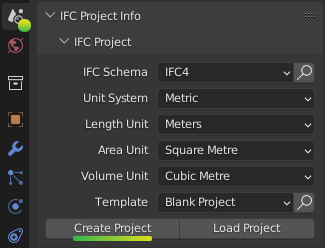
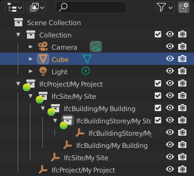
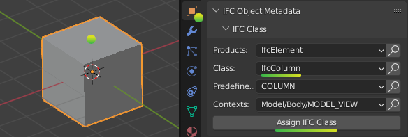
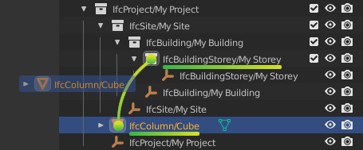
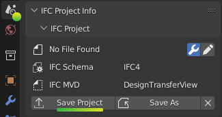
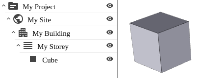

Creating an IFC model
=====================

We're going to create a new native IFC model from scratch, starting from a
single shape, up to a simple building.

A BIM model is not just a 3D format. This means that you cannot just load any 3D
model, and press a "Save as IFC" button. In fact, 3D is optional and you
can have a large IFC model storing work schedules, cost rates, asset registers
and more, and absolutely no 3D geometry at all.

However, in these tutorials, we will focus on basic 3D geometry. At a minimum,
you will need to categorise your 3D elements (such as "Wall", "Column",
"Window", etc), and give them a location (such as "Level 01" of a building).

Creating a single object
------------------------

In the **Properties** panel in the bottom right, activate the icon for the
**Scene Properties** tab, and find the **IFC Project** subpanel. Click on
**Create Project** to create a blank IFC project.

In the top right **Outliner** panel, you will see a hierarchy of spaces that has
been automatically created for you.  This hierarchy is known is the **Spatial
Tree**. The Camera, Cube, and Light come with a fresh new Blender session by
default, and are not part of your IFC project.

Any Blender object that you want to be part of IFC project must be converted
into a IFC object by assigning a category. This category is known as the **IFC
Class**.

Select only the default Blender Cube (selected objects are highlighted in
orange, careful not to select anything else!), switch to the **Object
Properties** tab, and find the **IFC Class** panel. Let's pretend our Cube is a
column, so select **IfcColumn** from the **Class** drop-down, and press **Assign
IFC Class**.

.. tip::

   There are no restrictions on which **IFC Class** you can choose regardless of
   the shape of your object. You can have a monkey-shaped wall if you want!

All IFC objects must also belong inside the **Spatial Tree**. In the
**Outliner** panel, you can drag and drop your newly created **IfcColumn/Cube**
inside the **IfcBuildingStorey/Ground Floor**. Wasn't that simple? 

Go back to the **Scene Properties** tab and to the **IFC Project** panel and
press **Save Project**. Save your new IFC model somewhere on your computer.

Congratulations! You have now created your first OpenBIM model from Blender! You
can open the IFC file in any other program, and you will see something similar
to the image below. Three simple open source online viewers you can test with
are `IfcPipeline <https://view.ifcopenshell.org>`__, `IFC.JS
<https://ifcjs.github.io/web-ifc-viewer/example/index>`__, and `3DViewer
<https://3dviewer.net/>`__.

Placing occurrences of an element type
--------------------------------------

TODO

Changing the locations of elements
----------------------------------

TODO

Modeling a simple building
--------------------------

TODO
