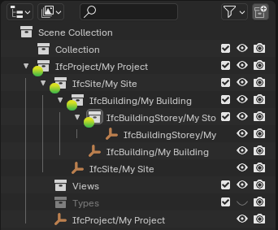
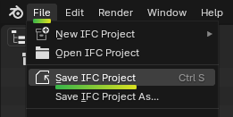

Creating an IFC model
=====================

We're going to create a new native IFC model from scratch, starting from a
single shape, up to a simple building.

A BIM model is not just a 3D format. This means that you cannot just load any 3D
model, and press a "Save as IFC" button. In fact, 3D is optional and you
can have a large IFC model storing work schedules, cost rates, asset registers
and more, and absolutely no 3D geometry at all.

However, in these tutorials, we will focus on basic 3D geometry. At a minimum,
you will need to categorise your 3D elements (such as "Wall", "Column",
"Window", etc), and give them a location (such as "Level 01" of a building).

Creating a single object
------------------------

In the **Properties** panel on the right, ensure the icon for the **Scene
Properties** tab is active showing the **Project Overview**. Click on **Create
Project** to create a blank IFC project.

In the left **Outliner** panel, you will see a hierarchy of spaces that has
been automatically created for you. This hierarchy is known is the **Spatial
Tree**.

There are many ways to create objects. In practice, you should use an element
type library, and we will see how to do this later. For now, we will only add a
single element. In the **Add** menu, add a cube.

Any Blender object that you want to be part of IFC project must be converted
into a IFC object by assigning a category. This category is known as the **IFC
Class**.

.. seealso::

   Use the `IFC Class search tool
   <https://blenderbim.org/search-ifc-class.html>`__ to help choose an **IFC
   Class**!

Select the cube (selected objects are highlighted in orange, careful not to
select anything else!) and switch to the **Object Information** tab. Let's
pretend our Cube is a column, so select **IfcElement** from the **Products**
dropdown, **IfcColumn** from the **Class** drop-down, and press **Assign IFC
Class**.

.. tip::

   There are no restrictions on which **IFC Class** you can choose regardless of
   the shape of your object. You can have a monkey-shaped wall if you want!

All IFC objects must also belong inside the **Spatial Tree**. In the
**Outliner** panel, you will see that your newly created **IfcColumn/Cube** has
been automatically placed in **IfcBuildingStorey/My Storey**.

In the top left **File** menu, Save your new IFC model on your computer.

Congratulations! You have now created your first OpenBIM model from Blender! You
can open the IFC file in any other program, and you will see something similar
to the image below. Three simple open source online viewers you can test with
are `IfcPipeline <https://view.ifcopenshell.org>`__, `ThatOpenEditor
<https://platform.thatopen.com/app>`__, and `3DViewer
<https://3dviewer.net/>`__.

Placing occurrences of an element type
--------------------------------------

TODO

Changing the locations of elements
----------------------------------

TODO

Modeling a simple building
--------------------------

TODO
