Exploring an IFC model
======================

We're going to load an existing IFC model and explore some common properties
most users will be interested in.

If you don't have an IFC model available, here's a small one for your
convenience provided by the Institute for Automation and Applied Informatics
(IAI) / Karlsruhe Institute of Technology.  It's in German, so you may need to
use some creativity when reading the data :)

.. container:: blockbutton

    `Download sample IFC <https://www.ifcwiki.org/images/e/e3/AC20-FZK-Haus.ifc>`__

.. seealso::

    You can find more sample models online in the `OSArch Open Data Directory
    <https://wiki.osarch.org/index.php?title=AEC_Open_Data_directory>`__

Loading a model
---------------

Blender's interface is divided into panels. The main **Viewport** panel shows 3D
geometry.  The top right **Outliner** panel shows a tree of geometric objects.
The bottom right **Properties** panel shows data and relationships.

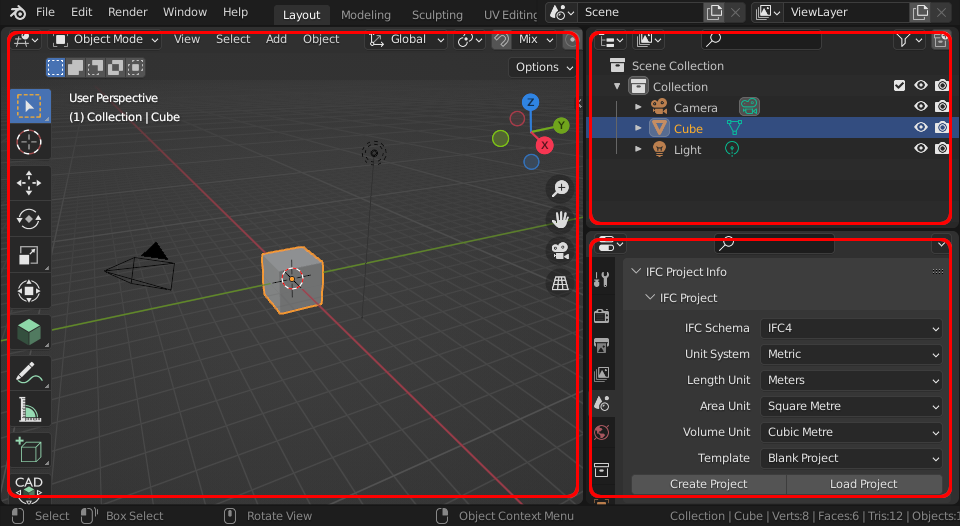

The **Properties** panel has tabs to switch between different types of
properties. Make sure you have the **Scene Properties** tab activated, and find
the **IFC Project** subpanel. Click on **Load Project** and browse to your
``.ifc`` file.

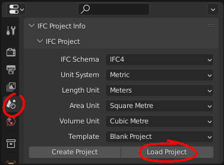

After loading, you will see the model appear in the **Viewport** panel.

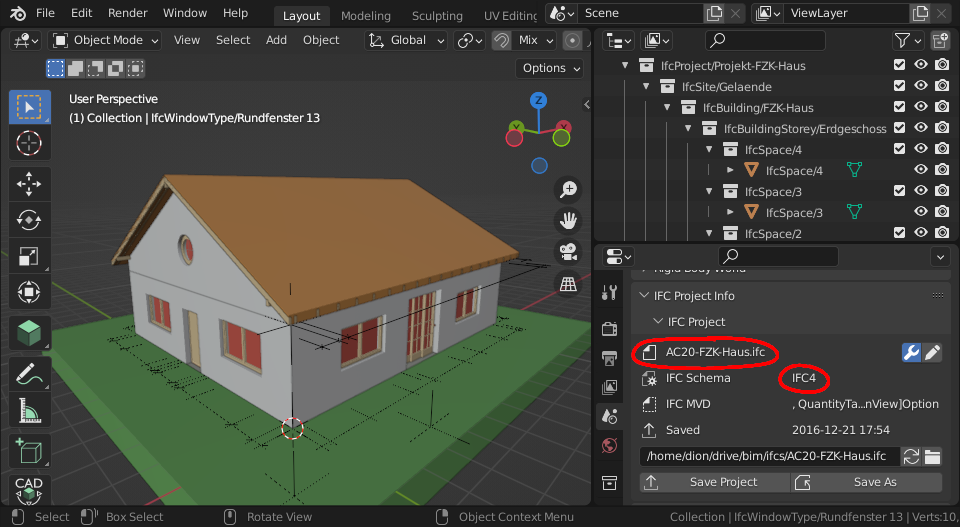

Let's take a look at the **IFC Project** subpanel again. It shows the loaded
filename, as well as the **IFC Schema**. There are two commonly seen **IFC
Schema** versions: IFC2X3 and IFC4. Checking the **IFC Schema** is important
because it has an impact on what BIM data may be stored. IFC4 is the newer
version and it is recommended to use IFC4 models as it has significantly more
BIM capabilities compared to IFC2X3. 

.. tip::

   Blender's interface is highly customisable. Panels, panel types, colours,
   sizes, and tabs may be edited to suit your workflow. If you want a `Hot Pink
   theme <https://github.com/kame404/Blender-Themes>`__ look no further.

Navigating a model in 3D
------------------------

To navigate, can use the **Navigate Gizmo** on the top right corner of the
**Viewport** panel. Click and drag on the coloured axes to **Orbit**, click and
drag on the magnifying glass to **Zoom**, and click and drag on the hand icon to
**Pan**.  You can also click on the grid icon to switch between perspective and
orthographic view.

To switch to a top view, front view, or side view, click the relevant axis on
the **Navigate Gizmo**.

.. image:: navigate-gizmo.png

You can also use your mouse to navigate. Hover your mouse over the **Viewport**
panel and click and drag the Middle Mouse Button (``MMB``) to **Orbit**. Scroll
the mousewheel to **Zoom**, and use ``Shift-MMB`` to **Pan**.

If you have a numpad, you can use the numpad keys to quickly switch to top,
front, or side view. Use ``7`` for top view, ``1`` for front view, and ``3`` for
side view.

.. warning::

   Blender's hotkeys are context sensitive. This means that a hotkey has a
   different meaning depending on the panel your mouse cursor is hovering over.
   If you press ``7`` to go to top view, make sure your mouse cursor is over the
   **Viewport** panel. Be very careful where your mouse is, or you might press a
   hotkey and it will have unintended consequences!

If you click on an object, such as a wall in the **Viewport** panel, you can
zoom to the selected object by clicking on ``View > Frame Selected``. The hotkey
is the ``.`` button on the numpad. After zooming into an element, when you
**Orbit** the 3D view will rotate around the center of that element.

You can also zoom to all objects in the project by clicking on ``View > Frame
All``.

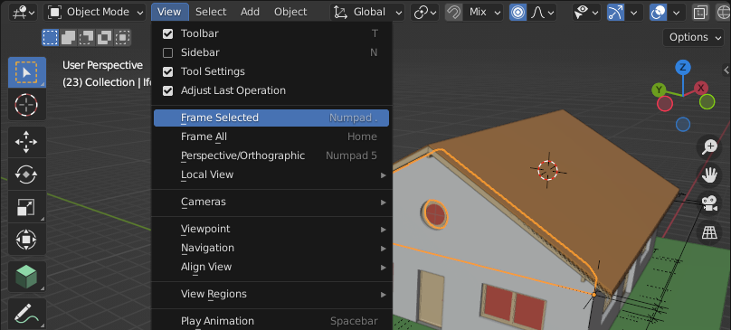

Another good way to navigate is by flying or walking around similar to a video
game. Choose ``View > Navigation > Walk Navigation``, or use the ``Shift-```
hotkey (the backtick key is usually to the left of the number 1 on the
keyboard). With **Walk Navigation** enabled, use the ``WASD`` keys and the mouse
to move around like a video game. You can use the ``Shift`` key to switch
between moving fast and slow. If you scroll with the mousewheel, it will adjust
the speed that you move at.

Sometimes, you want to look through objects. You can toggle **X-Ray Mode** by
pressing the button on the top right of the **Viewport** panel. The hotkey is
``Alt-Z``.

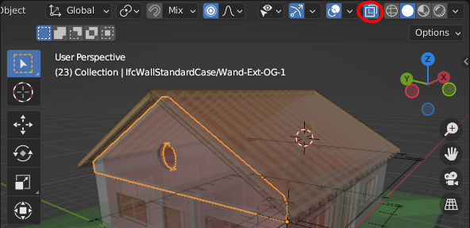

.. tip::

   Blender has lots of hotkeys to do things quickly. These can take time to
   learn but it is worth it as you will be much faster. These hotkeys can be
   customised in Blender's preferences.


Overview of all objects
-----------------------

The **Outliner** panel on the top right shows a hierarchy of all the currently
loaded physical **Objects** in your IFC project. These **Objects** correlate to
what you can see in the **Viewport** panel.

Every **Object** in the **Outliner** represents an IFC **Element**. These
**Objects** have a name with the pattern ``Class/Name``. The class prefix
represents the type of object, and the name is the name of the object.  Examples
of classes you will see are ``IfcBuilding``, or ``IfcWall``. This naming
convention makes it easy to quickly spot types of objects.

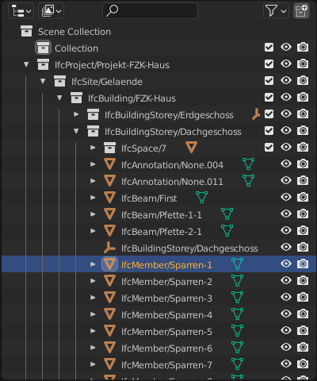

Objects are organised in a hierarchy. By default, this hierarchy represents a
breakdown of spaces, from large spaces such as a site and a building, down to
smaller spaces like building storeys and room spaces. The hierarchy will always
begin with an **IfcProject** object. You can click on the triangle to toggle the
hierarchy.

.. tip::

   In large projects with deep hierarchies, you can ``Shift-LMB`` click the
   triangle to recursively toggle the hierarchy. You can also click and drag the
   ``MMB`` to pan left and right.

When there are lots of objects, you can type a name in the filter box to quickly
identify objects by name or type.

.. image:: outliner-filter.png

Clicking on an object in the **Outliner** panel also selects the corresponding
object in the **Viewport** panel. A good strategy to find objects is to then use
``View > Frame Selected`` to zoom to it in the **Viewport**.

The **Outliner** panel is also great for isolating portions of your project. You
can include and exclude portions by clicking on the **Tick Icon** next to
collections of objects in the hierarchy.

Let's isolate a single building storey. Start by disabling the **Tick Icon**
next to the **IfcProject** collection. This will hide everything in the project.
Then navigate through the hierarchy and enable the **Tick Icon** next to an
**IfcBuildingStory**.

.. image:: outliner-isolate.png

Viewing element classes
-----------------------

Usually the first thing you'll want to check is the **Class** of element that an
object represents. The IFC **Class** is an international classification system
provided by IFC. Example IFC **Classes** are Wall, Slab, and Door. Every IFC
element must have a **Class**.

**Classes** aren't just for categorising elements. They also indicate what types of
properties and relationships it is allowed to have. For example, a Wall
**Class** can have a fire rating property, but a Grid **Class** cannot.

.. note::

   There are hundreds of **Classes** to represent all aspects of our built
   environment, including non geometric classes like Task, Occupant, and CostItem.
   However, we'll focus only on simple physical **Classes** in this guide. Don't
   worry about memorising all the available **Classes**, you'll get a feel for them
   as you explore more.

To view an object's class, click on an object in the **Viewport** or **Outliner**
panel, then switch to the **Object Properties** tab in the **Properties** panel.
You can see the **Class** name in the **IFC Class** subpanel.

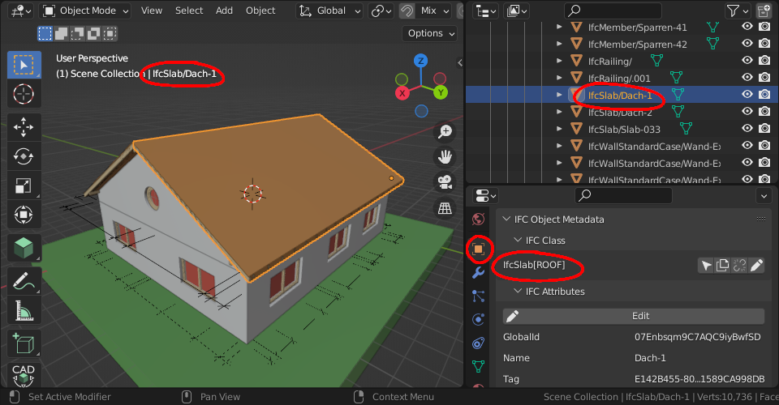

In this case, the **Class** of our roof is an **IfcSlab**. You'll notice this is
the same **Class** name used as a prefix for the object name in the **Outliner**
panel. You can also see the name of the actively selected object in the top left
of the **Viewport** panel.

.. warning::

   Sometimes, an IFC model will use the wrong **Class**. For example, a chair might
   be assigned as the Wall **Class** instead the Furniture **Class**. There is a
   special class known as **IfcBuildingElementProxy**, used when the user is
   unable to find a more semantic **Class**. If you see many
   **IfcBuildingElementProxy** **Classes**, it is likely a symptom of a low
   quality IFC model. If this is the case, scold the project manager and ask
   them to do a better job.

After **IfcSlab** it also says **ROOF**. This is known as the
**Predefined Type** of the element. You can think of it as a further level of
classification. In this case, it distinguishes our object as a roof slab,
compared to other types of slabs. The **Predefined Type** is optional so you may
not see it all the time.

.. seealso::

    You can use the `Search IFC Class
    <https://blenderbim.org/search-ifc-class.html>`__ tool to learn the correct
    classes and predefined types you should see.

Press the **Select Icon** to select all objects that are of the same
**IfcSlab** **Class**. Then, you can isolate these elements by going to ``Object
> Show/Hide > Hide Unselected`` (hotkey ``Shift-H``). To show all elements again, you can use
``Object > Show/Hide > Show Hidden Objects`` (hotkey ``Alt-H``). If you want to
hide elements instead, you can use ``Object > Show/Hidden > Hide Selected``
(hotkey ``H``).

.. image:: element-class-select.png

.. note::

   Remember that Blender's hotkeys are context sensitive. Make sure your mouse
   is hovering over the **Viewport** panel when you press a hotkey or no cake
   for you.

You can also see statistics about the number of selected objects. If you right
click on the bottom right status bar and enable **Scene Statistics** you will
see information like **Objects 4/4**, which means that 4 objects are selected
out of 4 available objects. This is a great way of counting objects like toilets.

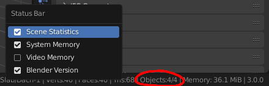

Viewing attributes and properties
---------------------------------

You can view the **Attributes**, **Properties**, and **Quantities** of the
selected object in the **Object Properties** tab.

Let's focus on **Attributes** first. Scroll down to the **IFC Attributes**
subpanel. **Attributes** are a limited set of fundamental data (usually less
than 10) associated with all IFC elements. These are fixed by the IFC standard.

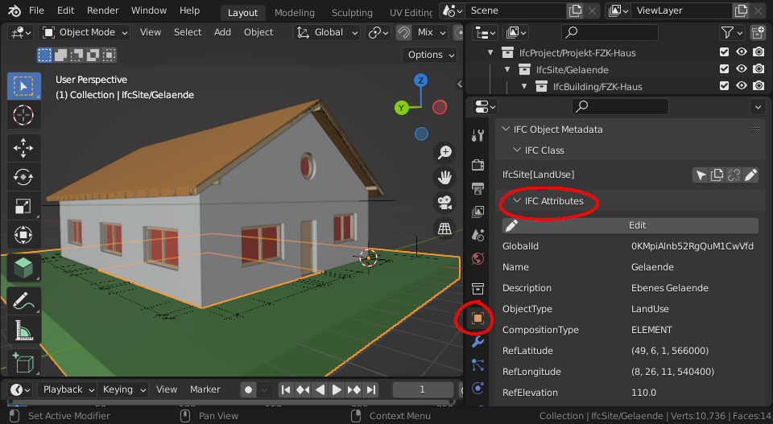

Here are some common attributes and what they mean:

- **GlobalId**: a unique ID for the element useful for computer geeks
- **Name**: a short name, code, number, or label to identify the object for a
  human. If you had to annotate the object on a drawing or a schedule, the
  **Name** is what you should see. For example, a pump **Name** might be ``P-10-A``.
- **Description**: typically the longer form of the name, written to be
  descriptive and readable for humans. For example a pump **Description** might
  be ``Water Suction Pump``.
- **Tag**: this is an ID that may link it back to another BIM application. For
  example if the IFC model was produced using Revit or ArchiCAD, it might hold
  the Revit or ArchiCAD element ID.
- **Predefined Type**: A further level of classification to be read
  in conjunction with the IFC class.

.. warning::

   Some IFC models have poor quality data. For example, if the **Name**
   of a Window doesn't match the window code (e.g. ``W01``) you see on a
   drawing, the project manager has clearly not put enough effort. Shame on
   them.

**Properties** are other data associated with the object. Every project will
have different **Properties** depending on what information they want to store.
Each **Property** has a name and a value, and are grouped into **Property
Sets**. Each **Property Set** also has a name. 

You can find **Properties** in the **IFC Property Sets** subpanel.

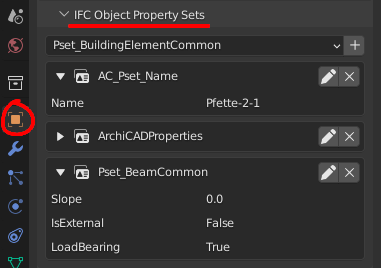

Some very common **Properties** are standardised by international BIM standards.
For example, the load bearing **Property** of a beam should always be called
``LoadBearing``. If a **Property Set** is part of the international standard, it
has a prefix of ``Pset_``, like ``Pset_BeamCommon``.

If you see a **Property Set** without the ``Pset_`` prefix, it is a custom
property defined by the author of the IFC model.

.. tip::

   It's important to distinguish between **Properties** that are
   part of the standard compared to custom ones. When **Properties** are
   standardised, it makes it easy to manage data. So if you need to isolate all
   ``LoadBearing`` elements, you now know exactly where to look.

**Quantities** are very similar to properties. They also have a name and a
value, and are grouped into **Quantity Sets**. Similarly, there are also common
quantities defined as part of the international standard, denoted by the prefix
``Qto_``. This prefix is short for "Quantity Take-Off".

You can find **Quantities** in the **IFC Quantity Sets** subpanel.

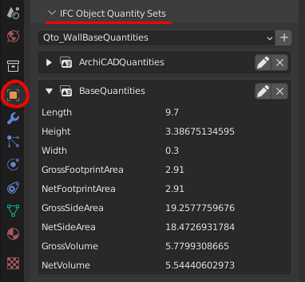

Finding the location of objects
-------------------------------

Every object in the built environment has a location in the world. For example,
a chair will be located in a space, and a wall is typically located in a
building storey. You've already seen this hierarchy of spaces in the
**Outliner** panel, where an IFC project is broken down into site, building,
storeys, and spaces.

Sometimes, objects may have multiple relevant locations, such
as a multi-storey column which can be related to multiple building storeys.
Even in these cases, IFC enforces one location to be its primary
location, known as its **Spatial Container**.

If you click on any object, you can see its location in the **IFC Spatial
Container** subpanel in the **Object Properties** tab.

Press the **Select Icon** to select all objects that are in the same location.

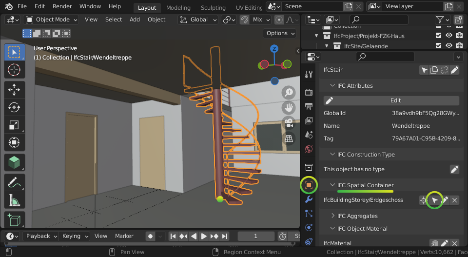

Checking construction types
---------------------------

Almost everything in the built environment will have a **Construction Type**.
For example, an architect will specify a door type for every door in a project.

You can see a list of **Construction Types** in the **Outliner** panel in the
**Types** collection. For example, if the architect has a wall types schedule
with the wall type names of ``WT01``, ``WT02``, and ``WT03``, you should see
three **IfcWallType** objects with those same names in the **Outliner**.

You can click on these types to see more details about them in the **Object
Properties** panel.

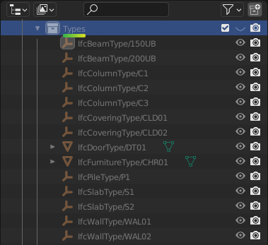

When selecting an object, you can also see its construction type in **Object
Properties** under the **IFC Construction Type** subpanel. You can press the
**Select Icon** to select all objects that are of the same **Construction
Type**. You can use the hide and isolate hotkeys to quickly view them in the
model.

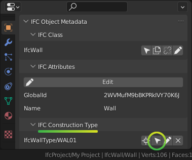

A **Construction Type** defines properties that are common to all occurrences of
that type. For example, if a wall type specifies a fire rating property, then
all walls of that wall type will inherit that fire rating too.

A **Construction Type** may also specify geometry or geometric rules that are
common to all occurrences of the type. For example, a pump type will define the
geometry of the pump, so all occurrences of that pump will have the same
geometry.

You can visually inspect types in isolation to the rest of the model. Types are
hidden by default, so first enable the visibility of the **Types** collection in
the **Outliner** by pressing the **Visibility Icon**. Then, select a type, and
click on ``View > Local View > Toggle Local View`` (hotkey ``/``) in the
**Viewport**. Toggle the view to see the entire model again.

.. image:: type-local-view.png

.. note::

   Only **Construction Types** where the geometry is exactly the same for all
   occurrences will specify geometry. When the geometry varies based on the
   occurrence (such as a wall, which varies based on the wall length), the
   **Construction Type** will typically have no geometry.

Filtering by materials
----------------------

Everything in the built environment is made from a physical raw **Material**
resources. For example, a **Material** might be a 140mm core filled block.
Another **Material** might be a 190mm hollowcore block. **Materials** are
grouped into categories like steel, concrete, brick, block, and so on.

We can see a list of **Materials** used in the project in the **IFC Materials**
subpanel in the **Scene Properties** tab.

Press the **Select Icon** to select all objects that are of the selected
material.

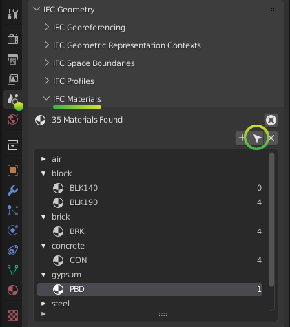

Taking simple measurements
--------------------------

The simplest form of measurement is the one that's already taken for you. The
**Viewing attributes and properties** section describes how to view
pre-calculated **Quantities**.

Sometimes, you may wish to take manual measurements yourself. To view the
overall dimensions of an object, first select an object, then expand out the
viewport **Sidebar**.

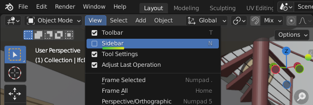

In the **Item** tab, you can find the X, Y, and Z overall **Dimensions** of the
currently selected object.

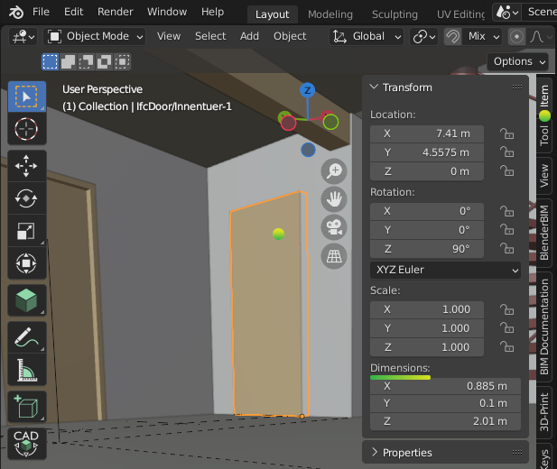

Another way to manually measure from two points is to use the **Measure** tool.
First, press the **Snap Icon** to enable snapping. Then choose snap targets in
the **Snap Menu** in the top middle section of the **Viewport** panel.

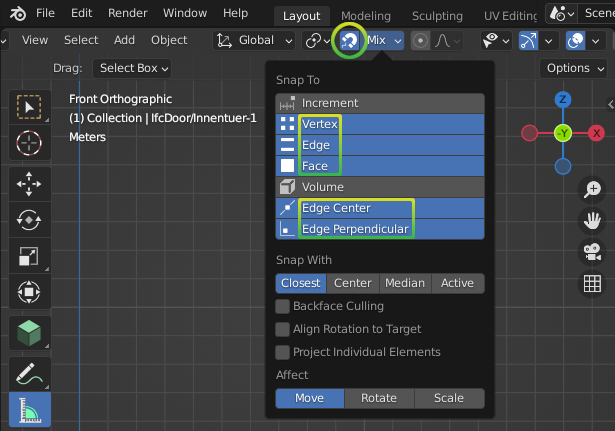

.. tip::

   It is recommended to choose multiple snap targets, like **Vertex**, **Edge**, and
   **Face**, and **Edge Center**. You can use the ``Shift`` key to select
   multiple snap targets. For example, the **Face** snap target means that your
   measurements will automatically snap to the nearest object's surface.

Now that you have configured snapping, press the **Measure Tool Icon** on the
left of the **Viewport** panel. **Click** and **Drag** in the 3D viewport to
take a measurement. A circle will appear guiding the first point of your
measurement. While **Dragging**, press the ``X`` key to lock the measurement
line along the X axis. Alternatively, press the ``Y`` or ``Z`` key to lock the
measurement line along the Y or Z axis. Let go of the mouse to finish your
measurement.

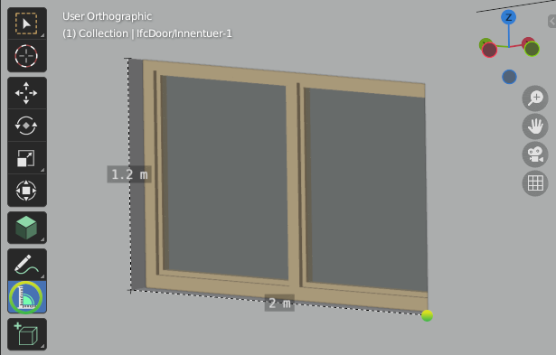

To delete a measurement, just click on one point of the measurement, and press
the ``Delete`` key. You can also click and drag the ends of your measurement
lines to measure to another location.

What else is there?
-------------------

Congratulations, and welcome to the digital built environment!

We've barely scratched the surface of the data and relationships available in an
IFC model. We've yet to cover documents and drawings, clearance zones, tasks,
cost items, structural loads and forces, analytical models, distribution system
connectivity, energy analysis, rendering textures, and so much more. Our built
environment and its relationships are vast and complex and it is exciting that
you can join us on its digital journey!

Please do not hesitate to reach out with any questions.

- `OSArch live chat <https://osarch.org/chat>`__
- `OSArch community forum <https://community.osarch.org>`__
