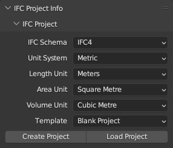
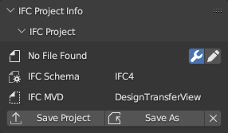
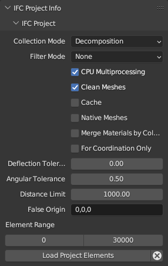

IFC Project
===========

Overview
--------

.. container:: location-scene

   |location| Scene Properties |>| IFC Project Info |>| IFC Project

   .. |location| image:: /images/location-scene.svg
   .. |>| image:: /images/location-breadcrumb.svg

The IFC Project panel lets you create a new IFC project, load an existing IFC
project, or view high level project metadata about the currently loaded project.

**IFC Schema**
   Choose between which IFC schema version to use when creating a new project.
   IFC4 is recommended for all new projects.

**Unit System**
   Choose between metric and imperial units of measurement when creating a
   project.

**Length Unit**
   Depending on the unit system, choose the default unit to be used for all
   length measurements. Lengths are used for moving objects around in the 3D
   scene, as well as lengths, widths, height, and depth quantity take-off data.

**Area Unit**
   Depending on the unit system, choose the default unit to be used for all
   area measurements. Areas are typically used for quantity take-off.

**Volume Unit**
   Depending on the unit system, choose the default unit to be used for all
   volume measurements. Volumes are typically used for quantity take-off.

**Template**
   Choose between starting a completely blank project with no objects, or with
   preloaded object assets (such as wall types, beam types, etc) that you can
   use immediately. The blank project is recommended for users who want to
   curate assets, whereas the IFC4 Demo Template is recommended for users wanting
   to experiment and learn with a basic set of objects.

   This also shows other larger object libraries for steel and countries
   available with the BlenderBIM Add-on. These contain hundreds of objects and
   are not recommended to be loaded as a template.

   .. seealso::

      You can start with a blank project and load in more assets later from a
      library using the IFC Project Library panel.

**Create Project**
   Create a new project based on the selected settings and template. By default,
   your project will be created with a basic spatial structure, including a
   single site, a building, and a single storey within the building.

**Load Project**
   Load an existing project from an IFC file. The IFC may come from any source,
   including exported from proprietary BIM software.

Project details
---------------

Once a project is created, basic metadata about the project will be displayed,
with basic features to save and unload the project.

|FILE| **Filename**
   Shows the URI of where the IFC is saved, or "No File Found" if the IFC has
   not yet been saved.

|GREASEPENCIL| **Enable Editing Header**
   Enable editing basic metadata about the project.

|FILE_CACHE| **IFC Schema**
   Shows the IFC schema identifier of the model. This cannot be changed while
   the model is open. It is typically one of IFC2X3, IFC4, or IFC4X3. Other
   values are not standardised and not supported by the BlenderBIM Add-on.

|FILE_HIDDEN| **IFC MVD**
   The Model View Definition (MVD) defines the intended purpose of the IFC
   model. "Design Transfer" is the most advanced MVD, meaning that IFC may be
   used for native authoring of the model. Other examples include "Reference
   View" for purely read only geometry (i.e. "dumb geometric model") or
   "Coordination View" for coordinating models between different disciplines.

   The Design Transfer MVD is used by all BlenderBIM Add-on projects, and is a
   superset of all other MVDs.

|EXPORT| **Save Project**
   Saves the current IFC project to a file on disk. Note that this should be
   used to save the IFC project, *not* the regular Blender ``File > Save`` menu.

|FILE_TICK| **Save Project As**
   Saves the current IFC project to a file on a disk with a different filename.

Advanced mode
-------------

The advanced mode will not load the model right away, but preload it and
provide additional loading possibilities like :ref:`users/dealing_with_large_models:Filtered model loading`.

.. |FILE| image:: /images/icon-FILE.svg
   :class: icon

.. |FILE_CACHE| image:: /images/icon-FILE_CACHE.svg
   :class: icon

.. |FILE_HIDDEN| image:: /images/icon-FILE_HIDDEN.svg
   :class: icon

.. |GREASEPENCIL| image:: /images/icon-GREASEPENCIL.svg
   :class: icon

.. |EXPORT| image:: /images/icon-EXPORT.svg
   :class: icon

.. |FILE_TICK| image:: /images/icon-FILE_TICK.svg
   :class: icon
