Property Editor
===============

Overview
--------

BlenderBIM adds new functionality to the `Property Editor` -> `Scene` tab.

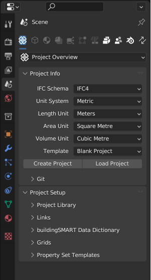

   The property editor on Blender startup.

Most of these sub-tabs become available with a created or loaded IFC file.
Don't worry, the default Blender scene properties are still reachable under their own dedicated sub-tab.

   Overview over the added property sub-tabs by BlenderBIM.

1. Project Overview
2. Object Information
3. Geometry and Materials
4. Drawings and Documents
5. Services and Systems
6. Structural Analyses
7. Costing and Scheduling
8. Facility Management
9. Quality and Coordination
10. Blender Properties - the default Blender scene properties moved under its own dedicated panel
11. Switch Tab - quick access to switch between the last 2 used Property panels

You can also select the needed panel via the drop-down menue.

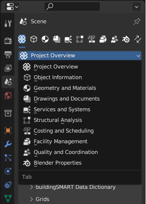

   Switching between BlenderBIM property editor sub-tabs via the drop-down menue.

Project Overview
----------------

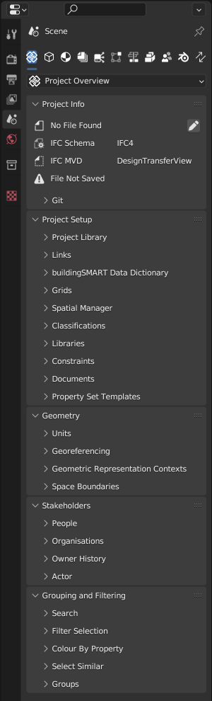

   Project Overview sub-tab with subsection panels.

Project Info
   tbd

Project Setup
   tbd

Geometry
   tbd

Stakeholders
   tbd

Grouping and Filtering
   tbd

Object Information
------------------

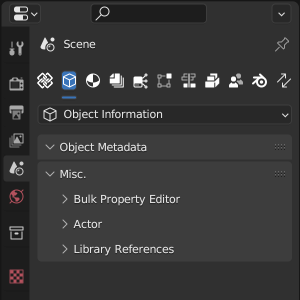

   Object Information sub-tab.

Object Metadata
   tbd

Miscellaneous
   tbd

Geometry and Materials
----------------------

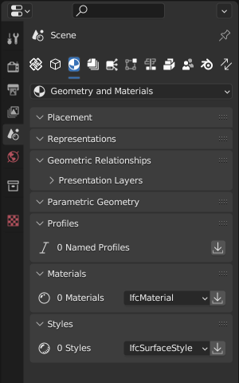

   Geometry and Materials sub-tab.

Placement
   tbd

Representations
   tbd

Geometric Relationships
   tbd

Parametric Geometry
   tbd

Profiles
   tbd

Materials
   tbd

Styles
   tbd

Drawings and Documents
----------------------

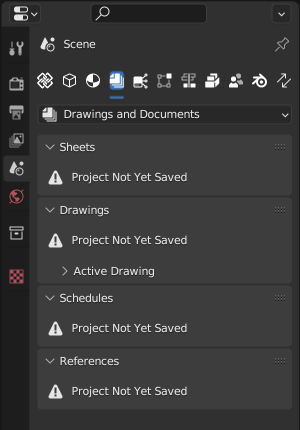

   Drawings ans Documents sub-tab.

Sheets
   tbd

Drawings
   tbd

Schedules
   tbd

References
   tbd

Services and Systems
--------------------

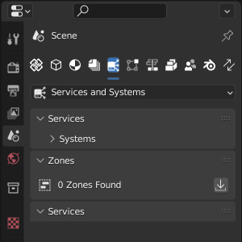

   Services and Systems sub-tab.

Services
   tbd

Zones
   tbd

Structural Analyses
-------------------

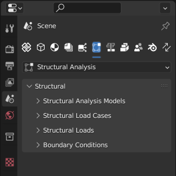

   Structural Analysis sub-tab.

Costing and Scheduling
----------------------

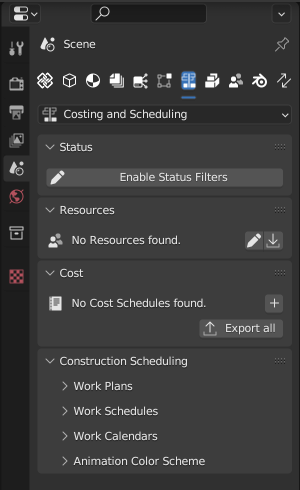

   Costing and Scheduling sub-tab.

Status
   tbd

Resources
   tbd

Cost
   tbd

Construction Scheduling
   tbd

Facility Management
-------------------

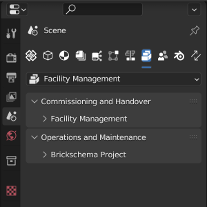

   Facility Management sub-tab.

Commissioning and Handover
   tbd

Operations and Maintenance
   tbd

Quality and Coordination
------------------------

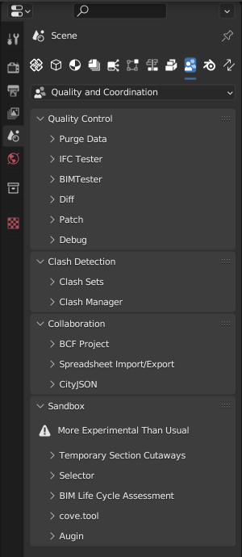

   Quality and Coordination sub-tab.

Quality Control
   tbd

Clash Detection
   tbd

Collaboration
   tbd

Sandbox
   tbd
