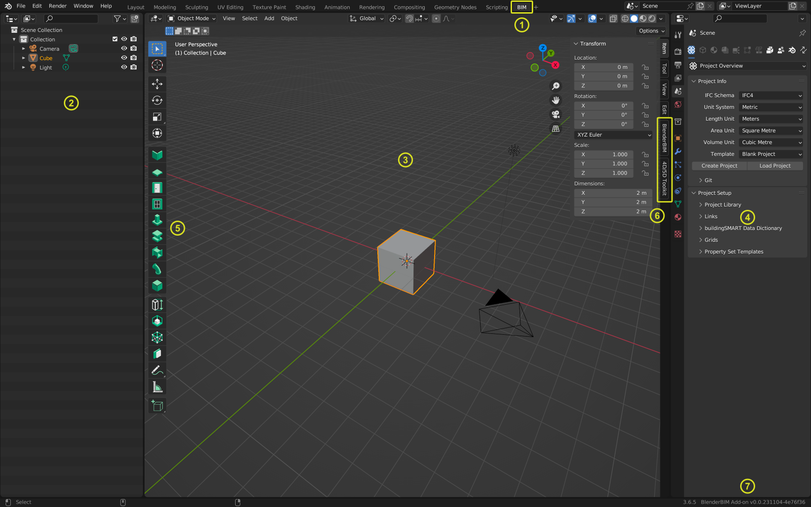
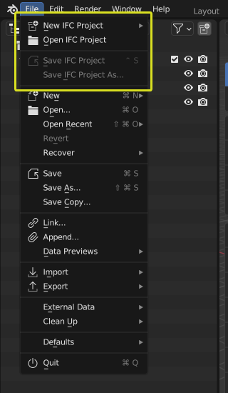

Workspace
=========

For general informations about the Blender user interface see the respective 
`Blender handbook section <https://docs.blender.org/manual/en/latest/interface/index.html>`__.

After installation of BlenderBIM the default Blender start-up screen looks different from the standard Blender interface.

BlenderBIM adds a new `BIM` **Workspace** to the interface and by default activates this workspace on start-up.
It also modifies the layout of views and sidebars and adds custom functionality to the toolbar.
The left **Outliner** panel shows a tree of geometric objects. The centre main **Viewport** panel shows 3D geometry.
The right **Properties** panel shows data and relationships.

   Blender start-up window with installed BlenderBIM add-on.

1. BlenderBIM `BIM` workspace tab
2. Outliner with the document tree
3. Main 3D viewport
4. Property editor
5. Toolbar with added BIM functionality
6. Sidebar with BlenderBIM & 4D/5D Toolkit panels
7. Status bar with information about the currently used Blender and BlenderBIM version

Additionally, the `File` menue in the Topbar adds menue entries to Create/Open and Save an IFC project directly.

   
   Additional file menue options related to IFC projects.