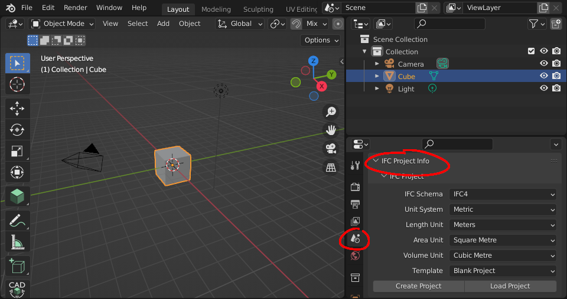

Installation
============

1. **Download and install Blender**

   Blender is a free and open-source program for 3D authoring. It works on
   Linux, Mac, and Windows. It is developed by the Blender community.

.. container:: blockbutton

    `Download Blender <https://www.blender.org/download/>`__

.. tip::

    No administrator rights on Windows? Choose the "Portable .zip" option when
    downloading from the Blender website.

2. **Download the BlenderBIM Add-on**

   The BlenderBIM Add-on extends Blender with OpenBIM related capabilities.

.. container:: blockbutton

   `Download BlenderBIM Add-on <https://blenderbim.org/download.html>`__

.. warning::

   If you are not using Blender version >=3.1, please follow the **Unstable installation** instructions. :doc:`Read more <../devs/installation>`

3. **Install the BlenderBIM Add-on**

   Open up Blender, and click on ``Edit > Preferences``.

   .. image:: install-blenderbim-1.png

   Select the **Add-ons** tab, and press **Install...** on the top right. Navigate
   to the .zip you downloaded in Step 2, and press **Install Add-on**.

   .. image:: install-blenderbim-2.png

   .. warning::
   
      You do not need to unzip the add-on file. You should install it as a zipped file.

   You should now see **Import-Export: BlenderBIM** available in your add-ons list. Enable the add-on by pressing the checkbox.

   .. image:: install-blenderbim-3.png

All done! If you check your Scene properties in the panel on the bottom right, you will see a panel to manage your **IFC Project**.

You can enable add-ons permanently by using ``Save User Settings`` from the Addons menu.

.. seealso::

    If you are a poweruser, you may be interested in the **Unstable installation** to help with testing. :doc:`Read more <../devs/installation>`

Where is the add-on installed?
------------------------------

If you downloaded Blender as a ``.zip`` file without running an installer, you
will find the BlenderBIM Add-on installed in the following directory, where
``X.XX`` is the Blender version:
::

    /path/to/blender/X.XX/scripts/addons/

Otherwise, if you installed Blender using an installation package, the add-ons
folder depends on which operating system you use. On Linux:
::

    ~/.config/blender/X.XX/scripts/addons/

On Mac:
::

    /Users/{YOUR_USER}/Library/Application Support/Blender/X.XX/

On Windows:
::

    C:\Users\{YOUR_USER}\AppData\Roaming\Blender Foundation\X.XX\scripts\addons

Upon installation, the BlenderBIM Add-on is stored in the ``blenderbim/``
directory.

Updating
--------

First uninstall the current BlenderBIM add-on, then install the latest version.

Uninstalling
------------

Navigate to ``Edit > Preferences > Add-ons``. Due to a limitation in Blender,
you have to first disable the BlenderBIM Add-on in your Blender preferences by
pressing the checkbox next to the add-on, then restart Blender. After
restarting, you can uninstall the BlenderBIM Add-on by pressing the ``Remove``
button in the Blender preferences window.

Alternatively, you may uninstall manually by deleting the ``blenderbim/``
directory in your Blender add-ons directory.

.. warning::

    It is important to follow the sequence of disabling, restarting, then removing.
    If you do not restart Blender, the add-on will fail to remove correctly, and you
    will need to uninstall manually.

FAQ
---

1. **I get an error similar to "ImportError: IfcOpenShell not built for 'linux/64bit/python3.7'"**

   Check which BlenderBIM Add-on build you are using. The zip will have either
   ``py37``, ``py39``, or ``py310`` in the name. See the instructions in the
   **Unstable installation** section to check that you have installed the
   correct version.

2. **I am on Ubuntu and get an error similar to "ImportError: /lib/x86_64-linux-gnu/libm.so.6: version GLIBC_2.29 not found"**

   Our latest package which uses IfcOpenShell v0.7.0 is built using Ubuntu 20 LTS.
   If you have an older Ubuntu version, you can either upgrade to 19.10 or above,
   or you'll need to compile IfcOpenShell yourself.
