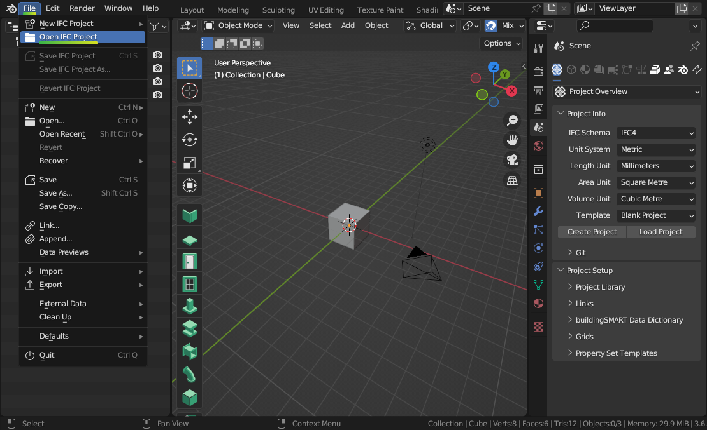

Installation
============

1. **Download and install Blender**

   Blender is a free and open-source program for 3D authoring. It works on
   Linux, Mac, and Windows. It is developed by the Blender community.

.. container:: blockbutton

    `Download Blender <https://www.blender.org/download/>`__

.. tip::

    No administrator rights on Windows? Choose the "Portable .zip" option when
    downloading from the Blender website.

2. **Download the BlenderBIM Add-on**

   The BlenderBIM Add-on extends Blender with OpenBIM related capabilities.

.. container:: blockbutton

   `Download BlenderBIM Add-on <https://blenderbim.org/download.html>`__

.. warning::

   If you are not using Blender version >=4.1, please follow the **Unstable installation** instructions. :doc:`Read more <../devs/installation>`

3. **Install the BlenderBIM Add-on**

   Open up Blender, and click on ``Edit > Preferences``.

   .. image:: images/install-blenderbim-1.png

   Select the **Add-ons** tab, and press **Install...** on the top right. Navigate
   to the .zip you downloaded in Step 2, and press **Install Add-on**.

   .. image:: images/install-blenderbim-2.png

   .. warning::
   
      You do not need to unzip the add-on file. You should install it as a zipped file.

   You should now see **Import-Export: BlenderBIM** available in your add-ons list. Enable the add-on by pressing the checkbox.

   .. image:: images/install-blenderbim-3.png

All done! Your interface will now look similar to below. If you check the ``File`` menu you should also see an option to ``Open IFC Project``.

You can enable add-ons permanently by using ``Save User Settings`` from the Addons menu.

.. seealso::

    If you are a poweruser, you may be interested in the **Unstable installation** to help with testing. :doc:`Read more <../devs/installation>`

.. _where is the add-on installed:

Where is the add-on installed?
------------------------------

Upon installation, the BlenderBIM Add-on is stored in the
``scripts/addons/blenderbim/`` directory, within your Blender configuration
folder. However, the location of your Blender configuration folder depends on
how you have installed Blender.

If you downloaded Blender as a ``.zip`` file without running an installer, you
will find the Blender configuration folder in the following directory, where
``X.XX`` is the Blender version:
::

    /path/to/blender/X.XX/

Otherwise, if you installed Blender using an installation package, the Blender
configuration folder depends on which operating system you use.

On Linux, if you are installing the add-on as a user:
::

    ~/.config/blender/X.XX/

On Linux, if you are deploying the add-on system-wide (this may also depend on
your Linux distribution):
::

    /usr/share/blender/X.XX/

On Mac, if you are installing the add-on as a user:
::

    /Users/{YOUR_USER}/Library/Application Support/Blender/X.XX/

On Mac, if you are deploying the add-on system-wide:

::

    /Library/Application Support/Blender/X.XX/

On Windows:
::

    C:\Users\{YOUR_USER}\AppData\Roaming\Blender Foundation\X.XX\

Updating
--------

First uninstall the current BlenderBIM add-on, then install the latest version.

Uninstalling
------------

Navigate to ``Edit > Preferences > Add-ons``. Due to a limitation in Blender,
you have to first disable the BlenderBIM Add-on in your Blender preferences by
pressing the checkbox next to the add-on, then restart Blender. After
restarting, you can uninstall the BlenderBIM Add-on by pressing the ``Remove``
button in the Blender preferences window.

Alternatively, you may uninstall manually by deleting the ``blenderbim/``
directory in your Blender add-ons directory.

.. warning::

    It is important to follow the sequence of disabling, restarting, then removing.
    If you do not restart Blender, the add-on will fail to remove correctly, and you
    will need to uninstall manually.

FAQ
---

1. **I get an error similar to "ImportError: IfcOpenShell not built for 'linux/64bit/python3.7'"**

   Check which BlenderBIM Add-on build you are using. The zip will have either
   ``py39`` or ``py310`` in the name. If you are using a Mac, also make sure
   you are using the M1 version if you have a newer Mac. See the instructions
   in the :ref:`devs/installation:unstable installation` section to check that
   you have installed the correct version.

2. **I am on Ubuntu and get an error similar to "ImportError:
   /lib/x86_64-linux-gnu/libm.so.6: version GLIBC_2.29 not found"**

   Our latest package which uses IfcOpenShell v0.7.0 is built using Ubuntu 20 LTS.
   If you have an older Ubuntu version, you can either upgrade to 19.10 or above,
   or you'll need to compile IfcOpenShell yourself.

3. **I get an error saying "ModuleNotFoundError: No module named 'numpy'"**"

   If you have installed Blender from another source instead of from
   `Blender.org <https://www.blender.org/download/>`__, such as from your
   distro's package repositories, then you may be missing some modules like
   ``numpy``. Try installing it manually like ``apt install python-numpy``.

4. **Some other error prevents me from installing or doing basic functions with
   the add-on. Is it specific to my environment?**

   Sometimes it is helpful to try installing and using the BlenderBIM Add-on on
   a "clean environment". A clean environment is defined as a fresh Blender
   installation with no other add-ons enabled with factory settings.

   To quickly test in a clean environment, find your Blender configuration
   folder based on the `where is the add-on installed`_ section. Rename the
   folder from ``X.XX`` to something else like ``X.XX_backup``, then restart
   Blender and try follow the installation instructions again.

   If this fixes your issue, consider disabling other add-ons one by one until
   you find a conflict as a next step to isolating the issue.

5. **I get an error similar to RuntimeError: Instance #1234 not found**

   Blender saves and loads projects to a ``.blend`` file. However. the
   BlenderBIM Add-on works with native IFC, and this means instead of saving
   and loading ``.blend`` files, you should instead save and load the ``.ifc``
   project.

   If you have opened a ``.blend`` file, there is a risk that the contents of
   the ``.blend`` session do not correlate to the contents of the ``.ifc``,
   which can cause this error. Unless you are an advanced user, only save and
   load ``.ifc`` files.
