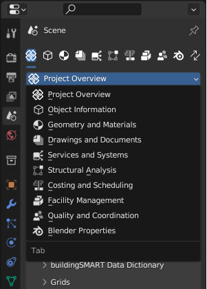

Property Editor Scene Properties
================================

.. container:: location-scene

   |location| Scene Properties

   .. |location| image:: /images/location-scene.svg

BlenderBIM adds new functionality to the `Property Editor` -> `Scene` tab.

.. figure:: images/interface_property-editor_project-overview_start-up.png
   :alt: Property editor on Blender start-up

   The property editor on Blender startup.

Most of these sub-tabs become available with a created or loaded IFC file.
Don't worry, the default Blender scene properties are still reachable under their own dedicated sub-tab.

.. figure:: images/interface_property-editor_icons.png
   :alt: Overview over the added property sub-tabs by BlenderBIM

   Overview over the added property sub-tabs by BlenderBIM.

1. Project Overview
2. Object Information
3. Geometry and Materials
4. Drawings and Documents
5. Services and Systems
6. Structural Analyses
7. Costing and Scheduling
8. Facility Management
9. Quality and Coordination
10. Blender Properties
11. Switch Tab

You can also select the needed panel via the drop-down menue.

   Switching between BlenderBIM property editor sub-tabs via the drop-down menue.

.. toctree::
   :hidden:
   :maxdepth: 1
   :caption: Contents:

   property_editor/scene_editor/project_overview/index
   property_editor/scene_editor/object_information/index
   property_editor/scene_editor/geometry_and_materials/index
   property_editor/scene_editor/drawings_and_documents/index
   property_editor/scene_editor/services_and_systems/index
   property_editor/scene_editor/structural_analysis/index
   property_editor/scene_editor/costing_and_scheduling/index
   property_editor/scene_editor/facility_management/index
   property_editor/scene_editor/quality_and_coordination/index
   property_editor/scene_editor/blender
   property_editor/scene_editor/switch_tab
