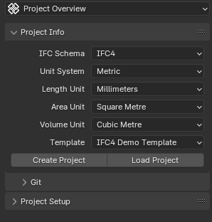

Project Info
============

.. container:: location-scene

   |location| Scene Properties |>| Project Overview |>| Project Info

   .. |location| image:: /images/location-scene.svg
   .. |>| image:: /images/location-breadcrumb.svg

Overview
--------

The "Project Info" panel in the "Project Overview" tab of "Scene Properties" of "Properties Editor"
provides an overview of the essential information about the currently loaded IFC file or allows users to create a new or load an existing IFC project.

The "Project Info" panel has four distinct states depending on the state of the IFC project:

1. Not Created or Loaded State
2. Not Saved State
3. Saved and Loaded State
4. Preloaded State (Advanced Mode)

There's also an edit toggle in some states that allows to modify the various metadata of the IFC file i.e. the IFC header section of the file.

Not Created or Loaded State
---------------------------

When no IFC file is loaded, the "Project Info" panel displays options to create a new IFC project or load an existing one.

Fields
^^^^^^

|FILE_CACHE| **IFC Schema**
  Choose between which IFC schema version to use when creating a new project. IFC4 is recommended for all new projects.
  
  The list of IFC specifications can be viewed on the `BuildingSMART website <https://technical.buildingsmart.org/standards/ifc/ifc-schema-specifications/>`__.
  
  Supported versions are `IFC2X3 <https://standards.buildingsmart.org/IFC/RELEASE/IFC2x3/FINAL/HTML/>`__ (2005), `IFC4 <https://standards.buildingsmart.org/IFC/RELEASE/IFC4/FINAL/HTML/>`__ (2013) and `IFC4X3 <https://standards.buildingsmart.org/IFC/RELEASE/IFC4_3/>`__ (2024).

  .. seealso::

    Use the `IFC Class search tool
    <https://blenderbim.org/search-ifc-class.html>`__ to help choose an **IFC
    Class** based on the IFC Schema version.

**Unit System**
  Choose between metric and imperial units of measurement when creating a project.

**Length Unit**
  Depending on the unit system, choose the default unit to be used for all length measurements. Lengths are used for moving objects around in the 3D scene, as well as lengths, widths, height, and depth quantity take-off data.

**Area Unit**
  Depending on the unit system, choose the default unit to be used for all area measurements. Areas are typically used for quantity take-off.

**Volume Unit**
  Depending on the unit system, choose the default unit to be used for all volume measurements. Volumes are typically used for quantity take-off.

**Template**
  Choose between starting a completely blank project with no objects, or with preloaded object assets (such as wall types, beam types, etc) that you can use immediately.

  The blank project is recommended for users who want to curate assets, whereas the IFC4 Demo Template is recommended for users wanting to experiment and learn with a basic set of objects.

  This also shows other larger object libraries for steel and countries available with the BlenderBIM Add-on. These contain hundreds of objects and are not recommended to be loaded as a template.

  .. seealso::

    You can start with a blank project and load in more assets later from a
    library using the IFC Project Library panel.

Buttons
^^^^^^^

**Create Project**
  Create a new project based on the selected settings and template.

  By default, your project will be created with a basic spatial tree with the structure ``IfcProject > IfcSite >
  IfcBuilding > IfcStorey``. Template might include additional colllections and classes, such as Types. You can see the tree of collections in the outliner when this is done.

**Load Project**
  Load an existing project from an IFC file. The IFC may come from any source, including exported from proprietary BIM software.

Not Saved State
---------------

Once a project is created, basic metadata about the project will be displayed.

The IFC header can be edited by clicking the pencil button (see `IFC Header Editing toggle`_).

Caveat: In this state you can't unload the IFC project and go back to the Not Created or Loaded State. You have to save the IFC file first and then unload the project.

Static text
^^^^^^^^^^^

Since the file is not yet saved, the "Project Info" panel displays the following messages: 

|FILE| **No File Found**

**File Not Saved**

This indicates that the current IFC project has not been saved to a file.

Fields
^^^^^^

|FILE_CACHE| **IFC Schema** (read-only)
  Indicates the version of the Industry Foundation Classes (IFC) schema used by the created file. This would usually be "IFC4".

|FILE_HIDDEN| **IFC MVD**
  Specifies the Model View Definition (MVD) used by the loaded IFC file. An MVD defines a subset of the IFC schema for a specific data exchange purpose. By default this is "DesignTransferView".

Buttons
^^^^^^^

|GREASEPENCIL| **Edit**
  Clicking this button switches the "Project Info" panel to `editing mode <IFC Header Editing toggle_>`_, allowing users to modify the IFC header fields.

Saved and Loaded State
----------------------

Fields
^^^^^^

|FILE| **Filename**
  Displays the name of the loaded IFC file. Example: "demo.ifc"

|FILE_CACHE| **IFC Schema** (read-only)
  Same as in `Not Saved State`_.

|FILE_HIDDEN| **IFC MVD**
  Same as in `Not Saved State`_.

|EXPORT| **Saved**
  Displays the last saved date and time of the loaded IFC file. Example: "2024-06-10 13:15"

**File path**
  Shows the location of the loaded IFC file on the user's file system. Example: "/home/user/Docum...lenderbim/demo.ifc"

Buttons
^^^^^^^

|GREASEPENCIL| **Edit**
  Same as in `Not Saved State`_, switches to `editing mode <IFC Header Editing toggle_>`_.

**Select a different IFC file**
  This button allows users to choose and load a different IFC file. Clicking the button will open a file browser dialog, enabling users to navigate to and select the desired IFC file.

**Unload the IFC project**
  This button allows users to unload the currently loaded IFC file from the Blender scene. Clicking the button will remove the IFC data and clear the "Project Info" panel, returning it to the Not Created or Loaded State.

IFC Header Editing toggle
-------------------------

.. figure:: images/interface_property-editor_project-overview_edit-header.png
   :alt: Project Info when edit header toggle is active

Clicking the pencil button (which doesn't exist when in the Not Created or Loaded State) switches the "Project Info" panel to editing mode, allowing users to modify the IFC header. The IFC Schema version can't be edited. You can upgrade the IFC schema when opening a file though.

Fields
^^^^^^

|FILE_CACHE| **IFC Schema** (read only)

  Indicates the version of the Industry Foundation Classes (IFC) schema used by the loaded file. Example: "IFC4"

**IFC MVD**
  Specifies the Model View Definition (MVD) used by the loaded IFC file. An MVD defines a subset of the IFC schema for a specific data exchange purpose. Example: "DesignTransferView"

**Author**
  Displays the author of the IFC file.

**Author Email**
  Shows the email address of the IFC file author.

**Organisation**
  Indicates the organization associated with the IFC file.

**OrganisationEmail**
  Displays the email address of the organization.

**Authoriser**
  Shows the authoriser of the IFC file, if available. Example: "Nobody"

Buttons
^^^^^^^

**Save header information (checkbox icon)**
  Saves the edited IFC header/metadata fields.

**Cancel unsaved header information (cross icon)**
  Discards the changes made to the IFC header/metadata fields and returns to the non-editing mode.

.. _Advanced: Advanced

.. _Project Info Advanced Mode:

Preloaded State (Advanced Mode)
-------------------------------

.. seealso::
  :ref:`users/dealing_with_large_models:Filtered model loading`.

The Preloaded State is an additional state that appears when loading an IFC file using the "Advanced Mode" checkbox.

This mode allows users to preload the model and filter elements, loading only a portion of the model.

The Advanced Mode Loading State provides users with extensive control over the loading process,
allowing them to customize which elements are loaded and how they are represented in the Blender scene.

This can be particularly helpful when working with large and complex IFC models, as it enables users to selectively load and optimize specific portions
of the model based on their requirements.

Once the desired settings have been configured, users can click on the "Load Project Elements" button to load the filtered and optimized IFC model into the Blender scene. After the model has been loaded using the Advanced Mode Loading State, the "Project Info" panel will transition to the "Saved and Loaded State", displaying the relevant metadata and options for the loaded IFC project.

To access this mode, click on "Advanced Mode" checkbox when loading a model.

.. image:: images/advanced-mode.png
   :alt: Open file dialog

In the Advanced Mode Loading State, the "Project Info" panel presents the following options:

.. image:: images/advanced-mode-settings.png
   :alt: Project Info when in Advanced Mode Loading State

Fields
^^^^^^

**Collection Mode**
  Options:

  - Decomposition
  - Spatial Decomposition
  - IFC Class
  - None

**Filter Mode**
  Options:

  - **Decomposition**: filter the IFC elements based on their decomposition within the building hierarchy, such as Level 1 or Building A.
  - **IFC Class**: Filter elements by their IFC class, such as "IfcWall", "IfcColumn", or "IfcDoor".
  - **IFC Type**: Filter elements by their IFC type, which represents the specific subtype or predefined type of an element, such as "IfcSlabType/100mmConcrete".
  - **Whitelist**: Filter elements based on a custom query, where only elements matching the query are included in the loaded model.
  - **Blacklist**: Filter elements based on a custom query, where elements matching the query are excluded from the loaded model.

  When "Whitelist" or "Blacklist" is chosen, users can input a custom query in the "Filter Query" field to define the specific criteria for filtering elements.

**Deflection Tolerance**

**Angular Tolerance**

**Void Limit**

**Distance Limit**

**False Origin**

**Element Range**
  Users can define a range of elements to load based on their index within the IFC file. This is useful for loading a specific subset of elements when dealing with large models.

Checkboxes
^^^^^^^^^^

- **Filter Spatial Elements**: Available when the Filter Mode option is selected.
- **CPU Multiprocessing**: Enables the use of multiple CPU cores to speed up the loading process.
- **Clean Meshes**: Automatically cleans and optimizes the geometry of the loaded elements.
- **Cache**: Caches the loaded elements to improve performance.
- **Load Geometry**:
- **Native Meshes**: Loads the native geometry of elements instead of using Blender's built-in representation.
- **Merge Materials by Color**: Merges materials with similar colors to reduce the number of unique materials in the model.
- **For Coordination Only**: Loads the model in a coordination-only mode, which may disable certain features or simplify the representation of elements.

Buttons
^^^^^^^

- **Load Project Elements**: Loads the IFC model with the selected filters, options, and element range applied.
- **Unload Project**: Unload the currently loaded IFC file from the Blender scene.

.. |FILE| image:: /images/icon-FILE.svg
   :class: icon

.. |FILE_CACHE| image:: /images/icon-FILE_CACHE.svg
   :class: icon

.. |FILE_HIDDEN| image:: /images/icon-FILE_HIDDEN.svg
   :class: icon

.. |EXPORT| image:: /images/icon-EXPORT.svg
   :class: icon

.. |GREASEPENCIL| image:: /images/icon-GREASEPENCIL.svg
   :class: icon