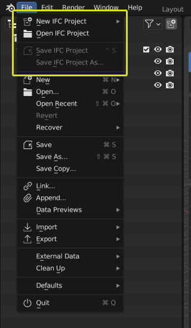
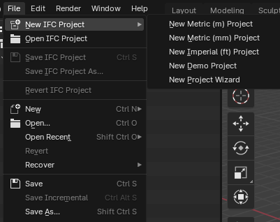

Topbar
======

For general informations about the Blender Topbar see the respective 
`Workspaces <https://docs.blender.org/manual/en/latest/interface/window_system/topbar.html>`__ section in Blender documentation.

Menus
-----

The `File` menu in the Topbar adds menu entries to Create/Open and Save an IFC project directly.

   
   Additional file menu options related to IFC projects.

New IFC Project
^^^^^^^^^^^^^^^

The New IFC Project submenu offers several options for creating a new IFC project:

   
   New IFC Project submenu options

- New Metric (m) Project: Creates a new IFC project using meters as the base unit.
- New Metric (mm) Project: Creates a new IFC project using millimeters as the base unit.
- New Imperial (ft) Project: Creates a new IFC project using feet as the base unit.
- New Demo Project: Creates a new IFC project with pre-populated demo content.
- New Project Wizard: Creates a default Blender project (including the default cube)
  and opens the Scene Properties > Project Overview > Project Info tab.
  This allows users to customize their project settings before creation.
  Clicking the "Create Project" button in this panel will delete the default cube and set up the new IFC project with the specified settings.

These options provide flexibility in setting up new IFC projects,
allowing users to choose between quick starts with predefined units
or a more customizable approach through the Project Wizard.

BIM Workspace
-------------

BlenderBIM adds the **BIM** Workspace to the Topbar Workspaces tabs.