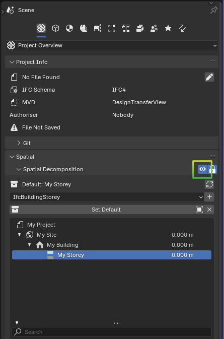
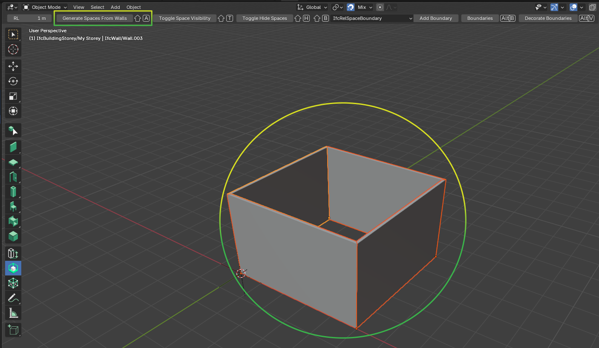
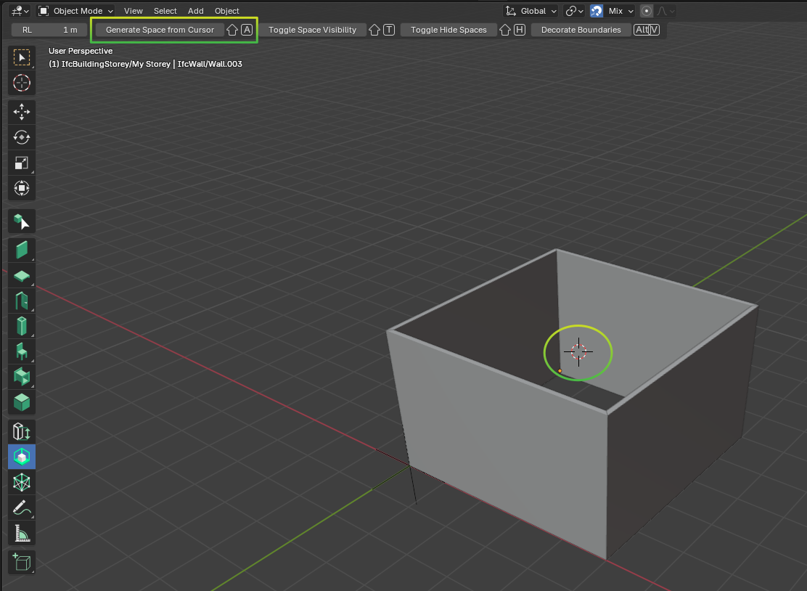
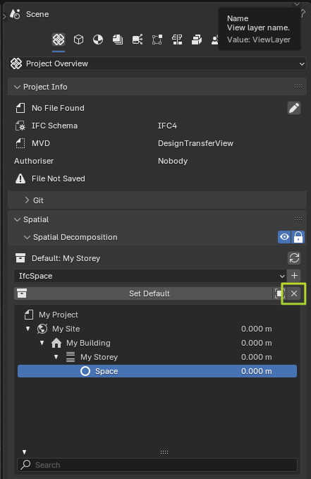

Defining Rooms and Spaces
=========================

.. include:: /_incomplete_message.rst

Displaying Spaces
^^^^^^^^^^^^^^^^^
To display spaces, you need to make the Spatial Elements visible.
To do so go to the Project Overview, in the Spacial section, make sure that the Spatial decomposition is visible:

Creating a Space from Walls
^^^^^^^^^^^^^^^^^^^^^^^^^^^
1. Select the Spatial Tool.
2. Select existing walls enclosing the space. (Shift to select multiple objects).
3. Click "Generate Space From Walls" (Shift+A) to create the space.

Creating a Space from Cursor Position
^^^^^^^^^^^^^^^^^^^^^^^^^^^^^^^^^^^^^
1. Select the Spatial Tool.
2. Place the 3D cursor in the desired space. (Shift+Right_Click to place the cursor)
3. Click "Generate Space from Cursor" (SHIFT+A) to create the space.

Renaming a Space
^^^^^^^^^^^^^^^^
To rename a space, simply go to the Spatial decomposition and double-click on the Space. Enter the new name.

Deleting a Space
^^^^^^^^^^^^^^^^
To delete a space Select it in the Spatial decomposition, and click on the cross above.

Creating Space Boundaries
^^^^^^^^^^^^^^^^^^^^^^^^^
To create space boundaries, first select the boundary type in the tool’s options, and click on Add Boundary (SHIFT+B).

.. tip::
   For Energy modeling purposes, make sure you use IfcRelSpaceBoundary2ndLevel.
   

Space Visibility Options
^^^^^^^^^^^^^^^^^^^^^^^^
- You can show or hide spaces using Toogle Hide Spaces (Shift+H).
- You can switch between solid and wireframe representation using Toggle Space Visibility (Shift+T).

