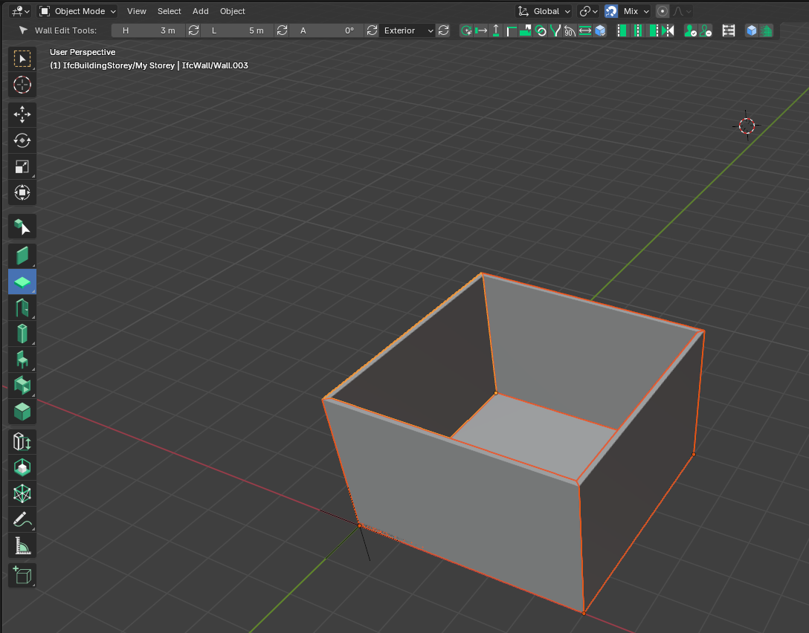
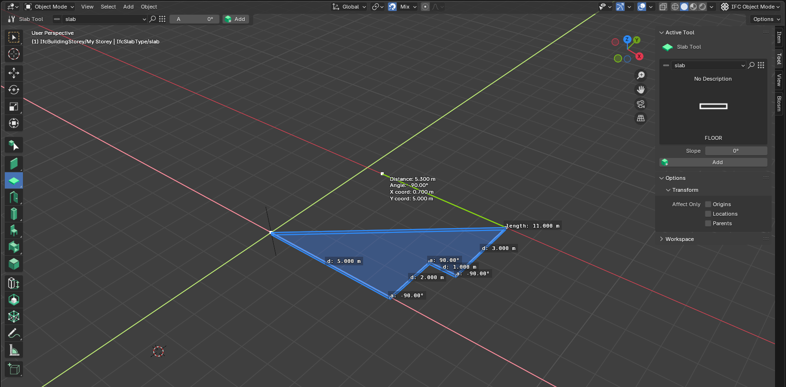
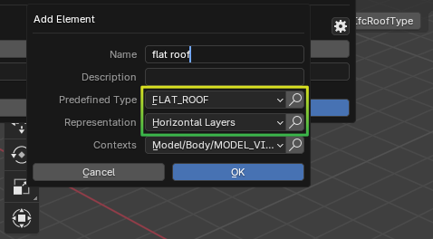
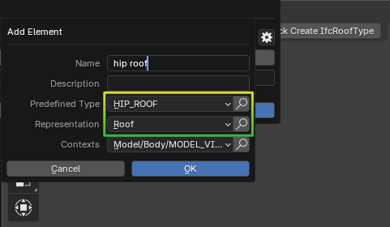
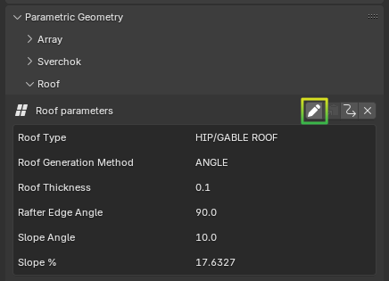
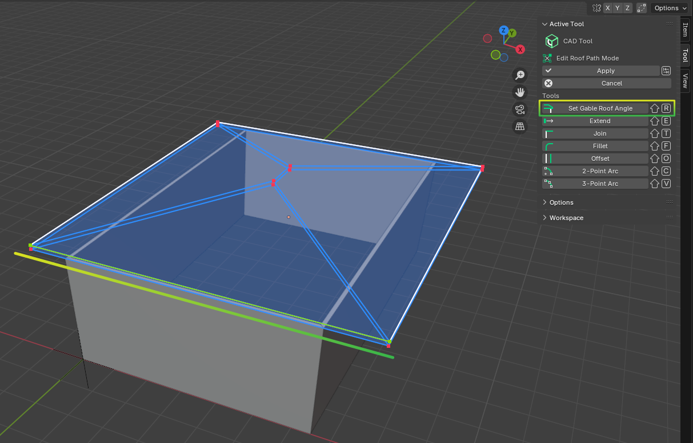

Modeling Slabs and Roofs
========================

.. include:: /_incomplete_message.rst

Creating a Slab from Walls
^^^^^^^^^^^^^^^^^^^^^^^^^^
To create a slab delimited by walls:

- Select the Slab tool
- Select the walls
- Press :kbd:`Shift+A`.

Creating a Slab by Drawing
^^^^^^^^^^^^^^^^^^^^^^^^^^
To draw geometry for a slab:

- Select the Slab tool.
- Click on **Add** (:kbd:`Shift+A`).
- Draw the geometry.
- Press enter to finish editing.

Flat Roof
^^^^^^^^^
Create a new ``IfcRoofType``, of predefined type ``FLAT_ROOF``.
Either create it from existing walls or by drawing the geometry yourself. See the Create a Slab section above.

Shed Roof
^^^^^^^^^
Create a new ``IfcRoofType``, of predefined type ``SHED_ROOF``.
Either create it from existing walls or by drawing the geometry yourself. See the Create a Slab section above.

To give it an angle, set the angle in the tool’s properties, and click the **Update** property symbol.
If you want to clamp walls to the roof’s geometry, select the wall, then the roof, and press :kbd:`Shift+E` (Extend)

Hip roof
^^^^^^^^
Create a new ``IfcRoofType``, of predefined type ``HIP_ROOF``. Set the representation to ``Roof``.

	 
Click **Add** (:kbd:`Shift+A`) to create the roof and place it approximatively on your model.
Press :kbd:`TAB` to go into Edit mode. You can now use Blender’s edit mode tools to set the baseline of the roof.
To change the slope of the roof, go to :menuselection:`Geometry and Materials --> Parametric Geometry --> Roof`, and change the parameters. Validate with **Finish Editing**.

Gable Roof
^^^^^^^^^^
Create a new ``IfcRoofType``, of predefined type ``GABLE_ROOF``. Set the representation to ``Roof``.
Click **Add** (:kbd:`Shift+A`) to create the roof and place it approximatively on your model.
The Gable roof is very similar to the Hip Roof, see above.
To set an edge to a Gable, go into Edit Mode (:kbd:`TAB`) select the desired edge, and click Set Gable Roof Angle in the tool’s properties.

.. tip::
   A small Pop-Up appears in the bottom right side of the viewport where you can change the **Gable Roof Edge Angle**.

Gambrel Roof
^^^^^^^^^^^^

Mansard Roof
^^^^^^^^^^^^

Barrel Roof
^^^^^^^^^^^

.. seealso::
   This list of roof types is not exhaustive, please see the `Reference <https://docs.bonsaibim.org/reference/toolbar/roof.html>`__ section for more informations.
