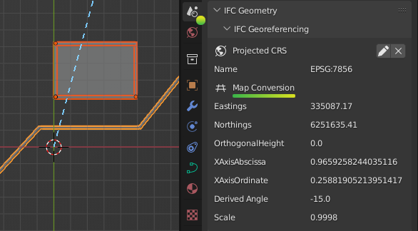
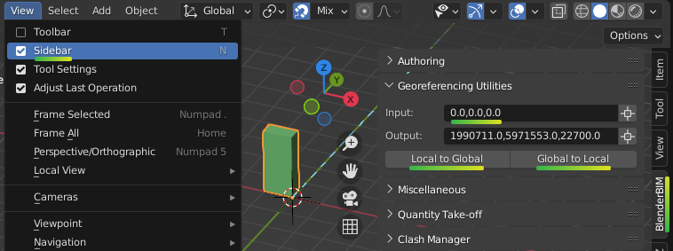

Georeferencing
==============

There are two types of construction: vertical construction (such as buildings
and sites) which deal with small distances typically under 1km, and horizontal
construction (such as transport, transmission, and subterranean networks) where
distances frequently exceed 1km. Blender and Bonsai focuses on vertical
construction, and will typically just work out of the box.

Coordinate reference systems
----------------------------

The minimum requirement for a georeferenced model is to specify the coordinate
reference system used. This is known as the **Projected CRS**, and is a feature
available in IFC4 onwards.

.. warning::

    IFC2X3 models cannot be georeferenced. There is a proposed convention to
    provide fallback support but this is not supported yet in any known vendor.
    Please consider upgrading to IFC4.

Most architects and engineers will know the name of the **Projected CRS**
typically chosen by the surveyor. For example in Sydney, Australia, you might
use GDA2020 / MGA Zone 56. In IFC a standardised code from the EPSG public
registry is used to refer to the **Projected CRS**. For example, GDA 2020 / MGA
Zone 56 will be named EPSG:7856.

You can check whether or not your model is georeferenced in the **IFC
Georeferencing** panel in the **Scene Properties** tab. You should see a section
for the **Projected CRS** with an EPSG code.

If you do not see this, your project is not georeferenced.

.. Note::

    Even if a model has large "real world coordinates", this does not mean the
    project is georeferenced. Without a **Projected CRS**, these coordinates are
    meaningless.

Map conversions
---------------

The coordinates for the nominated **Projected CRS** are known as **Map
Coordinates**. These **Map Coordinates** are typically large numbers and read as
Eastings and Northings.

In vertical construction, some disciplines (such as a civil engineer or
surveyor) will directly use **Map Coordinates** in their designs. Most others,
such as the architect, structural, and service engineers will instead use
**Local engineering coordinates**. A **Map Conversion** stores the parameters
for transforming **Local engineering coordinates** to **Map Coordinates**.

For example, a civil engineer will work directly in **Map Coordinates**. This
means that the model's coordinates correlate directly to Eastings and
Northings.  Similarly, the model's +Y axis will point to **Grid North**.  As
there is no **Map Conversion** involved, you will see a 0 in the Eastings,
Northings, and Orthogonal Height in the **IFC Georeferencing** panel.

When **Local engineering coordinates** are used, typically the architect will
nominate a local origin and model geometry will be drawn orthogonally (i.e.
along the X and Y axis). This local origin often correlates with a site boundary,
surveyed point, or grid intersection. This means that the model's coordinates
are typically smaller numbers and correlate to surface distance measurements,
not Eastings and Northings, and the model's +Y axis will point to **Project
North**. The surveyor will then provide the necessary **Map Conversion**
parameters to convert from **Local engineering coordinates** to Eastings,
Northings, Orthogonal Height, and **Grid North**.

.. warning::

    Coordinate systems are a technical topic. A common error is that disciplines
    may choose to use **Map Coordinates** without realising that map distances
    do not correlate with surface distances measured on the ground.  Unless you
    are trained to work in **Map Coordinates**, it is safer to work with local
    engineering coordinates and consult your surveyor for professional guidance.

**Map Conversions** contain six parameters.

**Eastings**, **Northings** and **Orthogonal Height** parameters define the
translation from the model's XYZ coordinates to map **Eastings**, **Northings**,
and **Heights**.  Your model's local engineering origin at 0, 0, 0, will always
convert exactly to the **Easting**, **Northing**, and **Orthogonal Height**
displayed in this panel.

The **X Axis Abcissa** and **X Axis Ordinate** define the rotation vector from
**Project North** to **Grid North**. These two numbers combine into a coordinate
vector pointing along the X axis (i.e. **Project East**). The default is an
abscissa of 1 and ordinate of 0. This default (1, 0) vector implies **Project
East** and **Grid East** coalign, which means there is no rotation between
**Project North** and **Grid North**.

.. tip::
    
   To save you the mental struggle of converting to degrees, a calculated
   rotation is always just below these values. Phew!

The distance measured on site, or the "surface distance" is actually not the
same as the distance measured between Eastings and Northings. This difference is
provided by the **Scale** parameter. The **Scale** defines the average combined
scale factor across the small 1km site that converts from the model's surface
distances to map grid distances. Note that the **Scale** is actually not a
constant. However, for the small sites dealt with in vertical construction, it
may be approximated to be a constant by your surveyor and will typically be a
value close to, but not exactly 1.

.. note::

    Always check that the surveyor provides a scale factor such that surface
    distance multiplied by **Scale** equals map grid distances (as opposed to
    the other way around).

Working with Map Coordinates
----------------------------

Bonsai is designed to work with small coordinates (under 1km), whereas map
coordinates are typically large. When you load an IFC which uses map
coordinates directly, or when you are working with IFC2X3 and you cannot use a
map conversion, Bonsai will autodetect a point on your model to use as a false
origin.

The XYZ offset used for the false origin will be shown in the **IFC
Georeferencing** panel under the **Blender Offset** header. It
is very similar to a **Map Conversion**, but it will not have a scale and only
temporarily affects your Blender session.

.. note::

    A Blender offset is simply a shift in coordinates to reduce large model
    coordinates to smaller coordinates. It should not be used as an indicator of
    whether georeferencing is done correctly. Always check the **Projected
    CRS**, **Map Conversion** and confirm the parameters with your surveyor.

This distance limit of 1km and autodetected false origin may not be appropriate
for your project. For example, your project may exceed the 1km limit, or you may
want to federate multiple files together and manually specify a consistent and
fixed false origin. You can customise these options by choosing
:ref:`Enable Advanced Mode <Project Info Advanced Loading Mode>`  when loading a project.
Then, set the **Distance Limit** (in meters) and the **False Origin** coordinate
before pressing **Load Project Elements**.

When a false origin is used, there are two possible methods to offset objects by
the false origin.

The first method is to offset the origin point of objects. We call this the
**Object Placement** method.  The second method is to offset the local
coordinates of geometry within the objects themselves. We call this the
**Cartesian Point** method. Sometimes, BIM applications combine both of these
methods in a single IFC project. To see which workaround was used on an object,
check the "Blender Offset" property in the **Transform** panel in the **Object
Properties**. This is an advanced property used by powerusers to debug
coordinate issues and may be safely ignored by most users.

Incorrect coordinate use
------------------------

Sometimes, a model may mix **Map Coordinates** and **Local engineering
coordinates**. For example, a surveyed pipe may have its placement use **Map
Coordinates** with large Eastings and Northings. However, the placement of the
site object may be still set at 0, 0, 0. Since this range of coordinates exceed
the default 1km distance limit, this creates a problem. Blender needs to choose
between displaying the pipe accurately and sacrificing precision at the site
placement, or vice versa, but it is impossible to satisfy both simultaneously in
the same Blender session.

.. warning::

    Many IFC viewers only show geometry, and don't show object placements. This may
    give users the false impression that their coordinates in their IFC project
    do not have such a large range. However, as a native IFC authoring platform,
    Bonsai will not accept this inconsistency.

At this point, it is the users responsibility to reconcile this inconsistency in
their coordinates. Either the user needs to fix their file to consistently
offset all coordinates, or the user needs to manually tell Bonsai the
coordinates of the desired false origin and accept the precision loss.

Converting local and map coordinates
------------------------------------

You can convert **Local engineering coordinates** to **Map coordinates** and
vice versa in the **Viewport** panel. First, enable ``View > Sidebar`` then type
in your coordinate in the **Input** field. Press either the **Local to Global**
or **Global to Local** button to convert the coordinate. You will see the result
of the calculation in the **Output** field.

True north
----------

When **Local engineering coordinates** are used, the model's +Y axis points to
**Project North** for the convenience of drafting. When **Map Coordinates** are
used, the model's +Y axis points to **Grid North** for the necessity of
surveying.

**Project North** and **Grid North** is different to **True North**. The angle
to **True North** is not a fixed angle. It will actually vary depending on the
Eastings and Northings you choose to calculate it from.

However, this variable **True North** is a great source of confusion to
architects, who typically just want to do a shadow study, solar study, or
similar and go out for an early lunch. IFC can store a fixed **True North**
value as a reference to be used for these types of usecases. If one is stored in
your project, you may see it under the **True North** section of the **IFC
Georeferencing** panel. Your surveyor will be able to provide the **True North**
vector, but it should be only used as a reference, never used as a way to
coordinate model rotations, and always with the understanding that it is not a
fixed value.

.. warning::

   Fun fact: **Magnetic North** is useless for the purposes of construction.

Coordinate precision limits
---------------------------

Bonsai focuses on vertical construction. Vertical construction typically uses
**Local engineering coordinates** on a small site. The buildingSMART
georeferencing technical experts panel have determined that a small site under
1km square can be assumed to have a constant **Map Conversion**.

Therefore, if your model is less than 1km square, you are within the coordinate
precision limits. This is where the 1km default distance limit is derived from.

If you want to exceed the 1km square surveying limitation, you will need to be
aware of software limitations that can result in precision loss when large
coordinate ranges are used.

Blender, and subsequently Bonsai, is not designed for **Map Coordinates**.
Blender internally uses single precision floating point calculations. A full
description of the precision implications are described in the `Blender working
limits documentation
<https://docs.blender.org/manual/en/latest/advanced/limits.html>`__.

This means that lengths greater than 5,000 meters start to accumulate software
precision errors that affect the nearest millimeter. Therefore, from a software
perspective, it is unwise to embark on a project with coordinates ranging
greater than +/- 5km.
