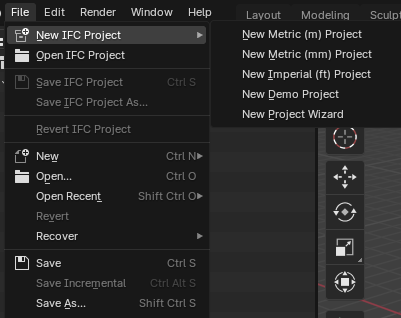
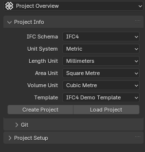
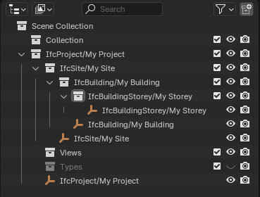

Starting a New IFC Project
==========================

To ensure the best start for your IFC project, follow these steps:

Start a New Blender Session
---------------------------

- Close any open Blender windows.
- Launch a fresh instance of Blender.

This ensures there are no lingering connections or data from previous projects.

Create a New IFC Project
------------------------

There are two main methods to create a new IFC project:

Using File Menu (Recommended)
^^^^^^^^^^^^^^^^^^^^^^^^^^^^^

   
   New IFC Project submenu options

1. Go to File > New IFC Project.
2. Choose from the following options:

   - New Metric (m) Project: Creates a project using meters as the base unit.
   - New Metric (mm) Project: Creates a project using millimeters as the base unit.
   - New Imperial (ft) Project: Creates a project using feet as the base unit.
   - New Demo Project: Creates a project with pre-populated demo content.
   - New Project Wizard: Opens the Project Info panel for customized setup.

3. If you chose one of the first four options, your project will be created immediately.
4. New Project Wizard is detailed below.

Using New Project Wizard / Scene Properties
^^^^^^^^^^^^^^^^^^^^^^^^^^^^^^^^^^^^^^^^^^^

   
   Project Wizard in `Scene Properties > Project Overview` subtab

1. You can access this method in two ways:

   - Go to `File > New IFC Project > New Project Wizard`
   - Navigate to Scene `Properties > Project Overview > Project Info`

2. In the Project Info panel:

   - Choose the IFC Schema (IFC2X3, IFC4, or IFC4X3).
   - Select the Unit System (Metric or Imperial).
   - Choose Length, Area, and Volume units.
   - Select a Template (Blank or IFC4 Demo Template).

3. Click the "Create Project" button.

Cleaning the scene
------------------

- After creating a new project, Bonsai considers the presence of three default Blender objects:
  a mesh (usually the default cube), a camera, and a light.
- If have scene setup like this, Bonsai will clean it up
- Any customizations you make to the Blender scene before finalizing the IFC project creation will be preserved.

If you like, you can delete the default cube, camera and light manually. Or create your own objects.
This is only recommended for users proficient in Blender. Otherwise, use the File menu or Create Project button in New Project Wizard.

Project Initialization
----------------------

   
   A basic spatial tree in the Outliner

- A basic spatial tree will be created with `IfcProject > IfcSite > IfcBuilding > IfcStorey`.
- You can view this structure in the Outliner.
- The Project Info panel will update to show details about your new IFC project.

Saving
------

.. figure:: images/project-info_unsaved.png
   :alt: Project Info in Unsaved Mode
   
   Project Info in Unsaved Mode

After creating a new project, Bonsai enters an Unsaved Mode. It's important to understand how saving works in Bonsai:

**Saving IFC Project**:
   - Using the keyboard shortcut `Ctrl+S` or `File > Save IFC Project` will save only the `.ifc` file.
   - The `.blend` file remains unsaved and unnamed after this operation.

**Initial Save**:
   - On your first save, you'll be prompted to choose a location and name for your `.ifc` file.
   - This does not automatically save a `.blend` file.

**Blend File Saving**:
   - To save the `.blend` file, you need to use Blender's standard `File > Save` or `File > Save As...` options.
   - This operation is separate from saving the IFC project.

**File Menu Options**:
   - `File > Save IFC Project` saves only the `.ifc` file.
   - `File > Save IFC Project As...` allows you to save the .ifc file to a new location or with a new name.
   - Standard Blender save options (`File > Save`, `File > Save As...`) only affect the .blend file.

**Opening Projects**:
   - `File > Open IFC Project` loads only the `.ifc` file. It does not automatically load a corresponding `.blend` file.
   - To open a `.blend` file associated with an IFC project, you need to open it separately using Blender's standard open options.

**Best Practices**:
   - Always use `File > Open IFC Project` to load your BIM data.
   - If you want to preserve Blender-specific settings or custom scene setups, save the `.blend` file separately.
   - Be aware that opening a `.blend` file directly will not load the associated IFC data.

**For BIM Workflows**:
   - Focus on the `.ifc` file as the primary source of truth for your BIM data.
   - Use `.blend` files if you need to preserve specific Blender setups or visual configurations, but remember these are secondary to the IFC data.

Remember, in Bonsai, the `.ifc` file contains the critical BIM information.
The `.blend` file is primarily for Blender-specific settings and visual representations.
Always ensure your IFC project is saved before closing Blender or starting a new session.
If you need to preserve Blender-specific configurations, save the `.blend` file separately.

Remember to save your work regularly using `File > Save IFC Project`.

Next Steps
----------

- Begin modeling your building elements (walls, slabs, etc.).
- Set up project properties and classifications.
- Start defining spaces and zones within your building.

.. seealso::
  - :doc:`/users/user_interface/property_editor/scene_editor/project_overview/project_info`
  - :doc:`/users/user_interface/topbar`
