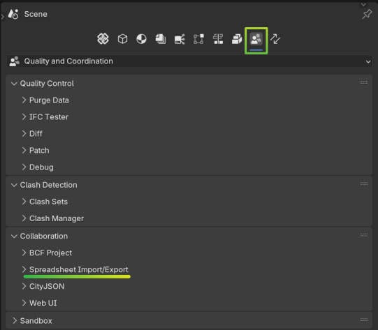

Spreadsheet Import and Export
==============
Under Properties panel, you can head to "Quality and Coordination" and select Spreadsheet Import/Export

Exporting to a spreadsheet
----------------------------

Exporting information from IFC files to spreadsheet is a proccess that involves the following steps:

1. Select the files you want to export. You can select multiple files.
2. Select the format you want your data to be exported to. You can choose between CSV, Excel (xlsx) and ODS or WEB which will generate a table in a webserver accesible locally.
3. Select the elements for the files that you want to export and from those elements the attributes that you want to export. Is is possible to load previously saved json templates with the queries to select elements and the output format for the attributes.
4. Export to files (one file per IFC file selected) or to a webserver (one web page for all the IFC files selected).

.. Note::

    The files generated are created in the same folder as the IFC files selected. The file names are the same as the IFC files but with a suffix of the form _YYYY-MM-DD-HH-MM.xxx where YYYY-MM-DD-HH-MM is the date and time of the export and xxx 
    is the file format selected (csv, xlsx, ods). Ex: File Testing.ifc will generate for example the file Testing_2025-04-16-14-02.csv if csv is selected.

Let's see in detail each of the steps:

1. Select the files you want to export.
   There are two major posibilities here. Either you chose to just process the current IFC file loaded in the scene or you can select multiple IFC files to process. 
   
   In the first case, you can just tick "Load from Memory" 

   .. image:: images/loadFromMemory.png

    
   In the second case, you untick  "Load from Memory" and two buttons will appear.

   .. image:: images/multipleFiles.png

    
   The "Add IFC Files" button will open a file browser where you can select the IFC files you want to proccess

   .. image:: images/addIFCFiles.png

    
   .. Note::

      Pay attention whether you want to add the file witha an absolute or relative path. Also note that this is the standard blender file browser so you can use the standard blender file browser shortcuts to navigate and select one or multiple files.
   
   
   The "Add Linked Files" will fetch the files you have in the Links subpanel in the projects panel.

   For example if we have these files linked in the project panel:

   .. image:: images/LinksPanel.png
     :width: 500

   And we press "Add Linked Files"

   .. image:: images/addLinkedFiles.png

   We will then get them populated in the list of files to be processed.

   .. image:: images/LinksPanelToExportPanel.png
     :width: 500
   
   
   Once the file(s) are selected, you can see the list of files to be processed in the panel below.

   .. image:: images/selectedFiles.png

   .. Tip::

      You can include in this list the current IFC file loaded in the scene. This is useful if you want to export the current IFC file and other IFC files at the same time.
   
   Each entry in the list has four fields:
   
   .. image:: images/listEntries.png

   From left to right this corresponds to:

   - The file path (absolute or relative) 
   - A tick mark that allows you to slect if the file will be processed or not, 
   - An "eye" icon that if you click it will span a new blender instance with the ifc file loaded. This is useful in case you want to do some adjustements (like performing quantity Take offs) before the file is proceesed. 
   - An X icon that if you click it will remove the file from the list.
            
2. Select the format you want your data to be exported to. For this you will need to click the gear icon in the top right corner of the panel. This will open a new panel with the options to select the format.

   .. image:: images/exportFormat.png

   You can choose the format and tailor the output with several parameters.

   .. Tip::

      When dealing with several files it is advisble to select the option "Include FileName and GlobalId" since that will help you to identify the elements in the spreadsheet. It will add two initial columns to the output with the file name and the GlobalId of the element.

3. Select the elements for the files that you want to export and from those elements the attributes that you want to export. The panel just below si divided into two parts:

   .. image:: images/selectionPanel.png

   - The first part is the "Element Selection" part. Here you need to define a query that will filter from all the elelments in the IFC files, the ones that you want to concentrate and gather information.
   - The second part is the "Attribute Selection" part. Here you can select the attributes you want to export. The first column is the attribute in the IFC file and the second column is the name of the attribute in the spreadsheet. That is the header of the column in the spreadsheet.

   .. Note::

      It is beyond the scope of this guide to provide details on how to create the queries for this panel. Please refer to the documentation `Selector syntax <https://docs.ifcopenshell.org/ifcopenshell-python/selector_syntax.html>`__
   
   In order to help you with the queries, you can load a previously saved json template with the queries to select elements and the output format for the attributes. 
   
   You have the posibility of either load or save search queries:
   
   .. image:: images/loadSaveSearch.png
   
   Or both load or save the search query plus the attribute selections:

   .. image:: images/loadSaveCSV.png

   .. Note::

      Between the search filter panel and the attribute selection panel you have a button called "Select". This will apply a selection to all the objects in the scene that match the query. 
      This is useful to check if the query is correct and if you are selecting the elements you want to export. It is just a visual feedback to check if the query is correct but selecting 
      or not selecting will not change the export process.

4. Export to files or to a webserver. Finaly we are ready to export our data. Depending on the format you selected in step two you will have "Export IFC to CSV", "Export IFC to XLSX", "Export IFC to ODS" or "Open Web UI"

   - In the case of "Open Web UI", After the button is clicked there will be a message in the bottom of the screen telling you the local address and port where to point your browser

   .. image:: images/webExport.png

   .. Warning::

      Typically the Web Broswer will be opened automatically. If not, you can copy the address and paste it in your browser. If you have forgotten the port, you can check it in the event log 
      in the SCRIPTING tab. See the tip below.

   Once the web page is opened, you will see a table with the data exported from the IFC files. You can filter the data by typing in the search box or by clicking on the column headers to sort the data. You can also 
   export the data to CSV format by clicking on the button at the top left of the table.

   .. image:: images/webUI.png

   
   - In the case of "Export IFC to CSV", "Export IFC to XLSX" or "Export IFC to ODS" you will see a message in the bottom of the screen telling you "Data is exported to ..." once finished. You can check the folder where the IFC files are located and you will see the files generated there.

   .. image:: images/csvExported.png

   .. Tip::

      The files that are proceesed (or the ones that have failed) will be reported to the event log in the SCRIPTING tab. You can check those messages there.

      Here an example for the case of output to the WEB. You can verify the http address and port where the web page is being served.

      .. image:: images/outputInfo.png

      Here an example for the case of output to CSV. You can verify the files that are being generated, their names and if there has been some error in the process.

      .. image:: images/outputInfo2.png

CONGRATULATIONS! and Happy Exporting.