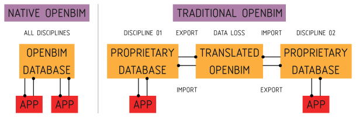
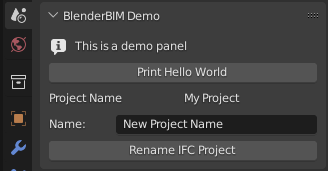
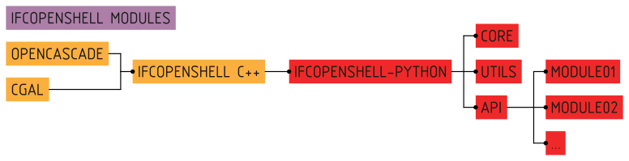

Hello, world!
=============

Bonsai takes a unique approach to authoring BIM data. Traditional BIM authoring
apps create features that are tailored for a single discipline's paradigm, such
as a 3D environment, or a spreadsheet view, and store their data structure in a
schema that is unique to their application. In order to interoperate with
others, there is an export or import process that translates between their
bespoke schema to and from open data standards. The most famous ISO standard
for BIM is IFC. After this translation, they then serialise it typically into a
format, which may be saved to disk.

Bonsai does things differently.

Bonsai does not have its own bespoke data structure and does not import or
export. Bonsai uses ISO open data standards directly in memory. Most commonly,
this is IFC data. We will place a focus on IFC on this guide, but the reader
should be aware that Bonsai also takes the same approach to dealing with other
open data standards, like Brickschema or BCF. The same concepts will apply. We
can call this Native OpenBIM authoring, which is a paradigm shift from
traditional BIM which relies on translated IFC data.

Every user operation reads or writes this data structure in memory, and the IFC
data becomes the source of truth for all data. There is no such thing as an
import or export. The data is always represented in IFC. When a BIM model is
opened or saved, it is simply a serialisation or deserialisation operation. This
also means that you are using Blender simply as an interface to interact with
IFC, and the ``.blend`` container is largely unnecessary, as nothing of
significance is stored in the Blender system, it is simply a snapshot of your
working session.

Due to this significant difference, hacking on Bonsai requires knowledge not
just about how Blender works, but also how open data standards like IFC works.

Just show me the code!
----------------------

Sometimes, the best way to learn how to hack on a project is to just start
hacking away. First, download the code. To keep things simple, you can download
the source as a zip file for now, but keep in mind that sooner or later you'll
need to :ref:`use Git to collaborate <submitting-code-to-git>`.

.. container:: blockbutton

    `Download Source
    <https://github.com/IfcOpenShell/IfcOpenShell/archive/refs/heads/v0.8.0.zip>`__

BIM authoring is a really big topic. As a result, the Bonsai code is separated
into modules. Each module focuses on a particular topic of BIM. Most modules
are self-contained, but sometimes they connect to one another, just like how
BIM works.

Modules are not arbitrary divisions. They tend to reflect how portions of BIM
data are segregated in the IFC international standard. This allows us to
minimise the overlap between modules, so that developers can work on a single
portion of the code with relative certainty that their actions will not affects
other developers.

- `Bonsai modules <https://github.com/IfcOpenShell/IfcOpenShell/tree/v0.8.0/src/bonsai/bonsai/bim/module>`__
- `IFC modules <https://github.com/IfcOpenShell/IfcOpenShell/tree/v0.8.0/src/ifcopenshell-python/ifcopenshell/api>`__

Bonsai comes with a secret **demo module** which is basically a hello world
coding tutorial which teaches you about all the moving parts. It's far more
interesting to read this code rather than 15 pages of abstract software
architecture flow charts and diagrams. The code and its comments will guide you
through the process.

Before playing with the demo module, you may want to switch to using a source
installation. See `bonsai/installation <./installation.html>`_ for details.

To see the demo module in action, you'll need to enable it. In
``src/bonsai/bonsai/bim/__init__.py``, uncomment the line for the demo
module. When you restart Blender, you will see a new demo panel in your scene
properties interface tab. Have fun!

Now you're ready to learn how to code! Here are all the files associated with
the demo module. Feel free to read them in any order. Each file is heavily
commented with explanations about what each line of code does. Change some of
the code, reload Blender, and see what happens!

::

    src/bonsai/bonsai/bim/module/demo/__init__.py
    src/bonsai/bonsai/bim/module/demo/operator.py
    src/bonsai/bonsai/bim/module/demo/prop.py
    src/bonsai/bonsai/bim/module/demo/ui.py
    src/bonsai/bonsai/bim/module/demo/data.py
    src/bonsai/bonsai/core/demo.py
    src/bonsai/bonsai/tool/demo.py

Wow! That's a lot of files needed for a hello world! Don't worry, it's mostly
tutorial comments and it's there to teach you the basics from how Blender's
add-on system works, how interfaces work, to how Bonsai works, and how to test
and structure it so that you can build incredibly complex features in a
maintainable way.

Tests for quality checking also exist. The system is designed so that you can
do "Test Driven Development". For reference on how to run these tests, see `bonsai/running_tests <./running_tests.html>`_
for details. You can find the tests here:

::

    src/bonsai/test/bim/feature/demo.feature
    src/bonsai/test/core/test_demo.py
    src/bonsai/test/tool/test_demo.py

Not all developers, especially those learning how to code, are familiar with
testing and how to write tests. That's OK! Feel free to ignore the tests at
first until you get a bit more comfortable with coding, and others can help
guide you when you're ready to make the leap. Don't let this stop you from
building things, others can also help write tests for you and clean your code.
It's a great way to learn!

Once you're through, you should be able to understand how most of Bonsai is
built and where to find things.

There are many Blender Python tutorials out there. A good place to start is the
`Start coding for Blender
<https://wiki.osarch.org/index.php?title=Start_coding_for_Blender>`__ from the
OSArch Wiki. In addition, the Blender text editor comes with a menu called
``Templates > Python`` which gives you a whole list of example code of how to
create an add-on which creates objects, creates gizmos, new buttons, interfaces,
and so on. This is a great way to try out how to build different extensions.

Naturally, if you just want to tweak Bonsai or build a small feature just for
yourself, you're free to ignore this advice, skip all the tests, and just write
half the code in a single file and it'll get the job done.

Software architecture
---------------------

If code isn't good enough for you and you want to learn more about why the code
is structured the way it is, here is a list of design principles we follow:

1.  Big systems are hard to maintain. Break big systems into small systems.
2.  Separate abstract code from concrete code. Start with abstract code, and
    deal with the details later.
3.  Good code reads like poetry. Every usecase should have a poem.
4.  Separate UI code from domain logic. UI code should be as dumb as possible.
5.  Follow the Unix philosophy. We're dealing with a big industry problem here.
    Building a shared ecosystem of tools is better than one behemoth.
6.  Everything should be testable. You should be able to test first.
7.  Have different types of tests. Inversely correlate test speed and scope.
8.  Community first. Allow beginner programmers to join in the fun! Code should
    feel easy, not like a course in design pattern jargon.
9.  Incremental change, not waterfall. Don't trash and rebuild. Refactor and
    redesign one commit at a time. With each commit, ask if you're making the
    code nicer.
10. Perfect is the enemy of the good. Half broken is better than completely
    broken.

The rest of this contains nasty software architecture jargon. If that's not your
thing, stop reading now.

Bonsai code may be understood in three separate layers: **Delivery**,
**Domain**, and **Data**. The Bonsai architecture separates these three layers
from one another. Because they are separate, they can be tested and built
separately.

.. image:: images/architecture.png

The **Delivery** mechanism is how the application is delivered to
the user and handles user interactions. It covers the interface and triggering
events as inputs into the application, and rendering responses.

As advertised in the name, the **Delivery** mechanism is based on **Blender**.
**Blender** is a well established 3D platform. Out of the box, it provides an
incredibly advanced interface to allow users to interact with geometry. The
delivery mechanism code extends Blender extensively, including new *Operations*
that users can perform, new *Properties* to store custom data, and new *UI*
layouts to display information.

When an event such as an *Operation* is triggered, the **Delivery** mechanism
executes the **Domain** layer through dependency injection. The **Domain** layer
will then decide how to process this input.

The **Domain** layer is divided into two halves: an abstract *Core* and concrete
*Tools*. The *Core* describes abstract, high-level application logic flow for
every single possible usecase in application. The *Tools* actually implement
this abstract logic, and figure out how things actually work, whether it is
manipulating the Blender scene, writing and reading files, building new IFC
graph relationships, and so on. The **Domain** layer also has interface classes
to describe what it needs.

Whenever the application needs to remember or store information, it does so
using a **Data** repository. The data ensures that stored information confirms
to a defined schema and is valid, and can be retrieved later. Some data is
stored in Blender, such as information about your working session and active
scene. Other data is stored in IFC, such as all the relationships in your BIM
model. We mention **Data** specifically because OpenBIM data authoring is such
a big aspect of Bonsai. In fact, it's so big that most of it is completely
separated from the Bonsai code and lives elsewhere.

For example, all the code that handles IFC data, which you can think of as a
graph database, is in a completely separate codebase, even under a different
software license. You can find it in the IfcOpenShell-python API module. Many of
the various data processing functions are built as separate Unix-like utilities,
even with their own CLI. This **Data** layer isn't a single folder of code we
can point to, it's an ecosystem of libraries and utilities that we want to share
with the entire industry.

IfcOpenShell Architecture
-------------------------

A large part of Bonsai is understanding how IFC data is modified.  This code is
not technically part of the Bonsai codebase, but it is vital to understand. You
will need to be familiar with the IfcOpenShell Python module.

Manipulating IFC data is not simple. IFC may be serialised into multiple
formats, multiple schema versions must be supported, and geometry may be defined
in a highly parametric or implicit manner, which geometry kernels do not
natively support. All this heavy lifting is performed by the IfcOpenShell
library.

The IfcOpenShell library consists of a C++ based core. Its geometry processing
is done using OpenCascade, and optionally CGAL as an experimental option. By the
time Bonsai interacts with IFC, it uses the IfcOpenShell Python bindings, so
all IFC data is already deserialised into Python objects. The inner workings of
the C++ base is out of scope.

IfcOpenShell offers a core set of low-level functionality to read and write this
data. An example of the core functionality would be:

.. code-block:: python

    import ifcopenshell
    model = ifcopenshell.open("foo.ifc")
    wall = model.create_entity("IfcWall")
    wall.Name = "Foobar"

Core functions are simple read and write operations with no post processing.
Core functions also include geometry processing, which converts IFC geometry
into OpenCascade objects.

Sometimes, there are repetitive actions that need to be performed. These
functions are grouped into a ``util`` module. These include utility functions
for coordinate calculations, date conversions, filtering elements, unit
conversions, and more. Utility functions make no assumption about the context in
which they are used, and so perform highly specific tasks and nothing else.
Here's an example of utility functionality:

.. code-block:: python

    import ifcopenshell
    import ifcopenshell.util.date
    import ifcopenshell.util.geolocation
    start = ifcopenshell.util.date.ifc2datetime(task_time.ScheduleStart)
    coordinates = ifcopenshell.util.geolocation.local2global(matrix, eastings, ...)

When authoring, core and utility functions are usually too low-level. To cater
for this, a high level API is provided. The API is divided into mostly isolated
modules, each module representing a distinct set of concepts in the IFC schema.
Unlike the util module, these API modules are highly context-sensitive, and
assume that you intend to be authoring native IFC.

This context-sensitive assumption means that the functions within the modules
are designed around typical usecases in an authoring environment. It performs
all the necessary manipulations to achieve a domain-specific usecase. Authoring
is complex and requires a deep knowledge of IFC to perform correctly and ensure
that the IFC graph state is well maintained. Typically, any authoring operation
that does not use the API is likely to contain mistakes.

Here's an example of it in action:

.. code-block:: python

    import ifcopenshell.api
    ifcopenshell.api.run("grid.create_grid_axis", model, ...)
    ifcopenshell.api.run("structural.add_structural_load", model, ...)

Because the API performs all the IFC manipulations to achieve a usecase, no
further interaction is required in a typical native IFC authoring environment.
For this reason, Bonsai only interacts with the API for its authoring
capabilities.

The code for IfcOpenShell's various systems can be found here:

- `ifcopenshell (core) <https://github.com/IfcOpenShell/IfcOpenShell/tree/v0.8.0/src/ifcopenshell-python/ifcopenshell>`__
- `ifcopenshell.util <https://github.com/IfcOpenShell/IfcOpenShell/tree/v0.8.0/src/ifcopenshell-python/ifcopenshell/util>`__
- `ifcopenshell.api <https://github.com/IfcOpenShell/IfcOpenShell/tree/v0.8.0/src/ifcopenshell-python/ifcopenshell/api>`__

.. _submitting-code-to-git:

Submitting code to Git
----------------------

So, you've written some code, fixed a bug, made an improvement, and would like
to get your code added to the Git repository? If your change is relatively
small, you can submit your changes just using the Github website. Browse to the
`IfcOpenShell repository <https://github.com/ifcopenshell/ifcopenshell>`__ and
navigate to the file you want to edit the code of. Then just press the edit icon
to begin editing. When you're done, you'll be prompted to submit your changes.

.. image:: images/github-editing.png

If you're making a large change, you'll need to create a **Pull Request**.
Github has an excellent comprehensive guide on `how to contribute to projects
<https://docs.github.com/en/get-started/quickstart/contributing-to-projects>`__
which you can follow.

If you make regular contributions, you are also welcome to officially join the
IfcOpenShell developer team, where you'll be able to make changes without
waiting for code reviews and approvals.

Asking for help
---------------

It's no fun to code alone! It's encouraged to reach out if there are any issues,
if you'd like to code together with another developer, need a code review, or
need further testing. Here are some places to reach out:

- `Github issues <https://github.com/IfcOpenShell/IfcOpenShell/issues>`__
- `OSArch live chat <https://osarch.org/chat>`__
- `OSArch community forum <https://community.osarch.org>`__
