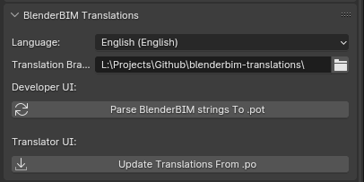

Translations
============

Bonsai supports translations to all languages that Blender supports. We'll
describe how you can help translate the add-on as a translator, or how you can
ensure your strings are translatable as a developer.  Translations are managed
using a separate add-on built for this purpose.

1. Clone the `bonsai-translations
   <https://github.com/IfcOpenShell/bonsai-translations>`_ repository. This
   repository holds all the core translation strings in ``.po`` format.
2. Download the `bonsai-translations add-on
   <https://github.com/IfcOpenShell/IfcOpenShell/blob/v0.8.0/src/bonsai/scripts/bbim_translations.py>`_
   and install it as a Blender add-on. This add-on lets you convert translation
   data to and from the ``.po`` files for Bonsai.
3. In the **Render Properties** tab, find the **Bonsai Translations**
   panel, and browse to where you have closed the ``bonsai-translations``
   repository, and click on **Setup Translation UI**.

You should now see a new interface with two buttons.

How to translate the add-on
---------------------------

Before beginning, look inside the ``bonsai-translations`` repository for a
``.po`` file for the language you want to translate to (e.g. ``de_DE.po`` for
German). If this file does not yet exist, congratulations! You are the first
person to translate to this language! Create a folder in
``bonsai-translations`` with your language code and copy the
``bonsai.pot`` language template file to that folder and rename it
according to your language (e.g. for German you would copy ``bonsai.pot`` to
``de_DE/de_DE.po``).

Supported language codes are:

.. code-block::

    'ca_AD', 'en_US', 'es', 'fr_FR', 'ja_JP', 'sk_SK', 'cs_CZ', 'de_DE',
    'it_IT', 'ka', 'ko_KR', 'pt_BR', 'pt_PT', 'ru_RU', 'uk_UA', 'vi_VN',
    'zh_HANS', 'zh_HANT', 'ab', 'ar_EG', 'bg_BG', 'el_GR', 'eo', 'eu_EU',
    'fa_IR', 'fi_FI', 'ha', 'he_IL', 'hi_IN', 'hr_HR', 'hu_HU', 'id_ID',
    'ky_KG', 'ne_NP', 'nl_NL', 'pl_PL', 'sr_RS', 'sr_RS@latin', 'sv_SE', 'sw',
    'ta', 'th_TH', 'tr_TR'.

As a translator, it is recommended to translate text in bulk by modifying the
``.po`` files directly. We recommend installing software such as `Poedit
<https://poedit.net/>`_. These translation software offer features such as auto
translation, suggestions, and tracking. Alternatively, you may edit the ``.po``
file as a text file.

Once you have edited the relevant language's ``.po`` file, click on the
**Update Translations From .po** button in the **Bonsai Translations**
panel.

How to add new translation strings
----------------------------------

When you have new strings to translate, press the **Parse Bonsai strings to
.pot** button. This detects strings in the source code using regex patterns and
writes out to the ``bonsai.pot`` language template file. You may then diff
this file and propagate changes manually to all translated ``.po`` files.

The ``.pot`` file is only used as a blank template for users to create or
compare ``.po`` files. The ``.po`` files are the source of truth for
translation strings. Blender does not read from the ``.pot`` or ``.po`` files.
Instead, Blender reads from ``bonsai/translations.py`` which contains a
dictionary of strings formatted specifically for Blender. The
``translations.py`` file is generated from the ``.po`` files. This is generated
when we distribute installable packages, or when translators manually press the
**Update Translations From .po** button.

.. warning::

   Do not commit the ``translations.py`` file as it is auto-generated.
