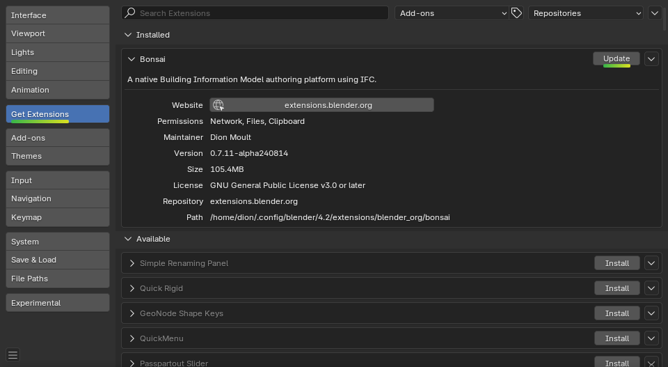
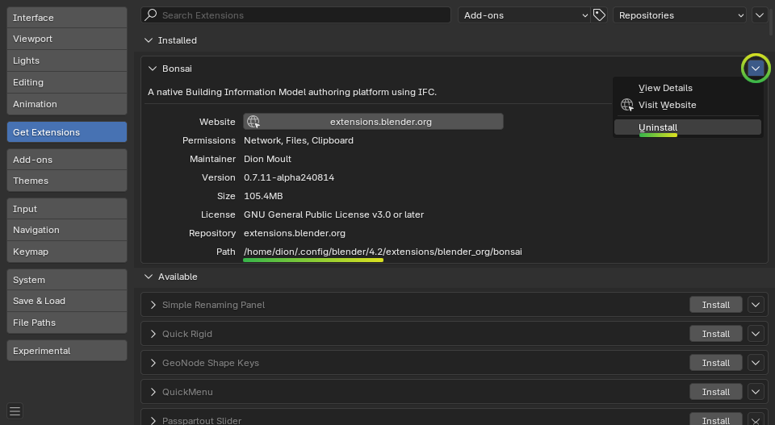

Troubleshooting
===============

Bonsai is alpha software. There are many bugs! When something goes wrong, you
may see some computer code flash up on your screen. You may also see an error
message:

.. image:: images/error-message.png

**Don't panic!** Click on the button that says **Copy Error Message To
Clipboard**. You will need to paste this text in a bug report.

If you do not have a GitHub account, you will need to sign up to report a bug.
In addition to pasting the error message text, please also describe what you
were doing, and attach your IFC file or screenshots if relevant.

.. container:: blockbutton

    `Report a bug <https://github.com/IfcOpenShell/IfcOpenShell/issues/new>`__

If your issue is particularly complex, you can also chat live with developers
or other powerusers.

.. container:: blockbutton

    `Chat live with a developer <https://osarch.org/chat>`_

Updating
--------

We always recommend to use the latest version.

Open up Blender, click on :menuselection:`Topbar --> Edit --> Preferences -->
Get Extensions`. If an update is available, you will see a button next to the
**Bonsai** add-on.

Updates are typically available every 2 months. If you need something more
frequent, check out :ref:`guides/development/installation:Unstable
installation` which is updated every day.

Installation issues
-------------------

If you are unable to install Bonsai, make sure you are using **Blender 4.2**
installed from https://blender.org/.

Other common solutions are listed below. If none of these fix the problem, you
can `report a bug <https://github.com/ifcopenshell/ifcopenshell/issues>`_ or
`live chat with a developer <https://osarch.org/chat/>`_.

1. **Some other error prevents me from installing or doing basic functions with
   the add-on. Is it specific to my environment?**

   Try installing and using Bonsai on a "clean environment". A clean
   environment is a fresh Blender installation with no other add-ons enabled
   with factory settings.

   To quickly test in a clean environment, first :ref:`find your Blender
   configuration folder<guides/troubleshooting:Where is the add-on
   installed?>`.  Rename the folder from ``X.XX`` to something else like
   ``X.XX_backup``, then restart Blender and try follow the :doc:`installation
   instructions</quickstart/installation>` again.

   If this fixes your issue, consider disabling other add-ons one by one until
   you find a conflict as a next step to isolating the issue.

2. **I am on Ubuntu and get an error similar to "ImportError:
   /lib/x86_64-linux-gnu/libm.so.6: version GLIBC_2.29 not found"**

   Our latest package which uses IfcOpenShell v0.8.0 is built using Ubuntu 20 LTS.
   If you have an older Ubuntu version, you can either upgrade to 19.10 or above,
   or you'll need to compile IfcOpenShell yourself.

3. **I get an error saying "ModuleNotFoundError: No module named 'numpy'"**"

   If you have installed Blender from another source instead of from
   `Blender.org <https://www.blender.org/download/>`__, such as from your
   distro's package repositories, then you may be missing some modules like
   ``numpy``. Try installing it manually like ``apt install python-numpy``.

4. **I get an error saying "Bonsai installed for wrong Python version."**"

   If you have Python >=3.12 then installation from the Blender extensions platform
   is not supported and you need to download and install Python 3.12 build from
   `Github Releases <https://github.com/IfcOpenShell/IfcOpenShell/releases>`__.

   If you have Python 3.11, then you probably downloaded build for wrong Python
   version by accident. To fix it uninstall it and download Python 3.11 build
   from `Github Releases <https://github.com/IfcOpenShell/IfcOpenShell/releases>`__ 
   or from Blender extensions platform.

Saving and loading blend files
------------------------------

Bonsai transforms Blender into a native IFC authoring platform.  This means
that you can open and save IFC files directly without using Blender's
``.blend`` format.

All data about your model is saved in your IFC. No data is stored in the
``.blend`` format. This means that if you save or open a ``.blend`` file, you
are **not** saving and loading your model. At best, you are saving and loading
Blender geometry that represents what the model might've looked at at some
point. At worst, you might be looking at a completely wrong model.

If you continue to open and save ``.blend`` files, you will run the risk of
editing something that doesn't actually exist in your IFC model (e.g you can
meet an error similar to "RuntimeError: Instance #1234 not found"). This will
create unpredictable, and sometimes unrecoverable errors.

To avoid this issue, only open and save IFCs.

Incompatible Blender features
-----------------------------

Blender offers features such as animation, sculpting, modifiers, and more that
are not available in IFC. As :ref:`Bonsai uses IFC as its native data
store<guides/troubleshooting:Saving and loading blend files>`, using these
incompatible features may result in data loss.

1. **Manual geometry editing**. Manually changing the mode to Edit or Object
   mode in the :menuselection:`3D Viewport` top left dropdown menu. This
   changes the Blender mesh editing mode, but any changes may be incompatible
   with the IFC geometry. This is because IFC geometry may not be a mesh, or
   have parametric constraints. Any changes made in this manner may have
   unpredictable effects and changes may be discarded. Instead, always use the
   :kbd:`Tab` key to toggle object editing, or use the IFC Object / Edit mode
   toggle in the top right of the :menuselection:`3D Viewport`.
2. **Object scaling**. Bonsai does not support scaled objects in IFC. Any
   objects that have been scaled in object mode will have their scale reset to
   1, and scaling an object may result in unpredictable operations. Instead,
   scale objects within edit mode.

Where is the add-on installed?
------------------------------

Upon installation, Bonsai is stored in Blender configuration folder. However,
the location of your Blender configuration folder depends on how you have
installed Blender.

If you downloaded Blender as a ``.zip`` file without running an installer,
Bonsai will be installed in the following directory, where ``X.XX`` is the
Blender version:

::

    /path/to/blender/X.XX/

Otherwise, if you installed Blender using an installation package, the Blender
configuration folder depends on which operating system you use.

On Linux, if you are installing the add-on as a user:

::

    ~/.config/blender/X.XX/

On Linux, if you are deploying the add-on system-wide (this may also depend on
your Linux distribution):

::

    /usr/share/blender/X.XX/

On Mac, if you are installing the add-on as a user:

::

    /Users/{YOUR_USER}/Library/Application Support/Blender/X.XX/

On Mac, if you are deploying the add-on system-wide:

::

    /Library/Application Support/Blender/X.XX/

On Windows:

::

    C:\Users\{YOUR_USER}\AppData\Roaming\Blender Foundation\X.XX\

Inside the Blender configuration folder, Bonsai is stored in two different
locations. The extension itself is stored in
``extensions/blender_org/bonsai`` whereas the Python packages are installed
into ``extensions/.local/lib/pythonX.XX/site-packages/``.

Uninstalling
------------

Open up Blender, click on ``Edit > Preferences``, and select the **Get
Extensions** tab. In the dropdown menu to the right of the **Bonsai** add-on,
click on **Uninstall**.

Alternatively, you may start from a fresh setup by renaming or deleting the
Blender version folder, found in the add-on path. In the screenshot above, this
is ``/home/dion/.config/blender/4.2``.

