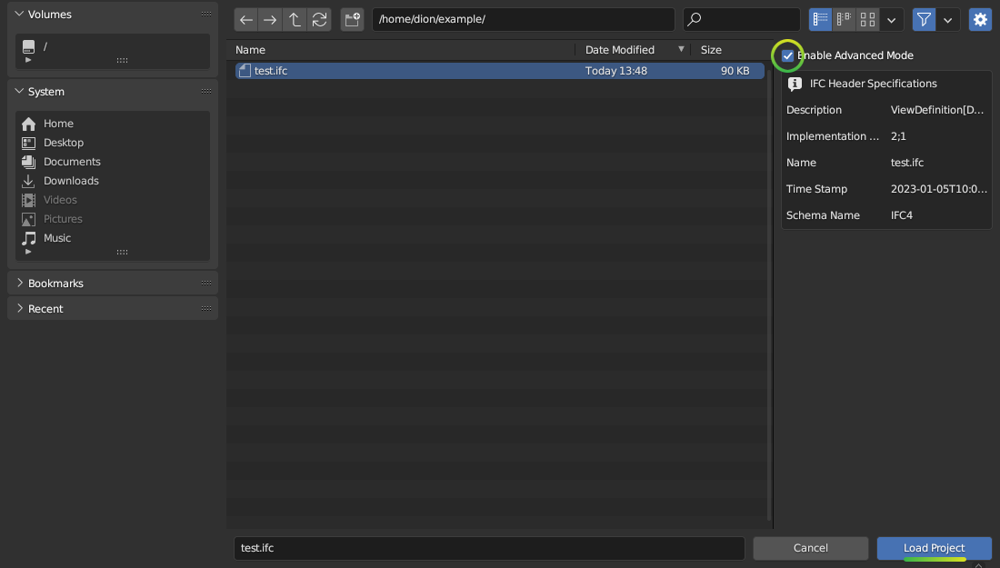

Dealing with large models
=========================

Bonsai can handle large models, or federated collections of models where the
combined total IFCs may be many gigabytes or object counts may be in the
hundreds of thousands.

Models may be large in terms of different metrics, such as:

- Filesizes over 750MB, which may cause memory issues
- Individual object polygon counts over 100k, which may cause unreasonable
  loading times
- Objects having excessive or low quality booleans, which may cause
  unreasonable loading times
- Number of elements exceeding 50,000 loaded in the scene, which may cause
  unreasonable loading times, selection glitches, and viewport lagging

There are always solutions to all of these, but an understanding of the type of
size limitation you are up against will always help.

Linking in models
-----------------

Bonsai defaults to authoring IFCs. This allows full editing and inspection of
all element properties and relationships. However, sometimes only geometry and
basic attributes such as names are sufficient. Example usecases include CG
visualisation, overall federated model coordination, or pure geometric checks.

For these usecases, it's much more efficient to link a model rather than to
open a model. In the **Links Panel**, click on **Link IFC**, and browse to your
IFC. You can also bulk select multiple IFCs.

You will not be able to directly edit geometry or data in a linked model, but
you will be able to efficiently load multiple huge models easily and navigate
it with a reasonable FPS.

Activate the **Explore Tool** to quickly navigate these linked models. You can
**Enable Culling** to improve FPS speeds further, and use the :kbd:`RMB` to query
data about a selected object.

Once loaded, the linked model is cached as a ``.cache.blend`` file for
subsequent loads in the same folder as the ``.ifc``. The data is cached in a
``.cache.sqlite`` file.

Large filesizes
---------------

The first priority is to ensure you do not have a prohibitively large filesize.

- Use IFC4. It can handle geometry much more efficiently and expect your
  filesize to drop significantly.
- When coming from other software, ensure you are exporting solids, not faceted
  BReps or tessellations where appropriate. Choosing the wrong export setting
  can easily double or triple your filesize and export times. Choose **Design
  Transfer View** instead of **Coordination View** or **Reference View**. Look
  for export settings that use the keywords like "surface", "solid", "brep",
  "tessellation", or "extrusion".
- Improve your model breakdown strategy (see below)
- Identify objects with large polygon counts and improve the modeling (see below)

Model breakdown strategies
--------------------------

A good general strategy is to never have a large model to begin with. Breaking
down models is critical for usability during design and coordination. Where full
models are needed, such as during clash detection, review meetings, or client
handover, many small models may be federated. Model breakdown strategies
include:

- **By discipline**, you probably already do this, so let's move on
- **By location**, such as by building, floor, zone, mid-rise, high-rise, core
  podium, underground, plant rooms, facade orientation, or similar.
- **By object type**, such as by primary structural elements vs accessories
  (plates, bolts, etc), furniture vs general arrangement, facade vs interiors,
  distribution system elements (equipment, pipes, fittings) vs accessories (pipe
  clamps, hangers, etc) or similar.
- **By coordination task**, many people get into the habit of exchanging the
  entire building when a task only requires a tiny portion of it. Think of the
  workflow of exchanging traditional drawings. A large project would have
  thousands of drawings with a few drawings exchanged for a single coordination
  task. This strategy can be used with models: exchange hundreds of tiny models
  (some maybe even only 1MB!), scoped to the task at hand. Keep exchanges small
  and frequent (like code commits, for the geeks reading this).

Filtered model loading
----------------------

You may filter elements and only load a portion of the model. Click on 
:ref:`Enable Advanced Mode <Project Info Advanced Loading Mode>` checkbox when loading a model.

This will preload the model and present you with model loading options in the
:doc:`Project Info </users/user_interface/property_editor/scene_editor/project_overview/project_info>`
panel.

.. image:: images/advanced-mode-settings.png

**Filter Modes** include:

- **Decomposition**, filter by location in the building, such as **Level 1** or
  **Building A**.
- **IFC Class**, filter by IFC class, such as **Wall**, **Column**, or **Pipe
  Segments**
- **IFC Type**, filter by IFC construction type, such as **Copper pipes** and
  **200mm thick concrete slabs**
- **Whitelist** or **Blacklist**, filter by a custom query

When **Whitelist** or **Blacklist** is chosen, you may type a custom query to
filter by attributes, properties, location, and so on.

Large polygon counts
--------------------

If objects with large polygon counts are blocking you from importing, consider
enabling **Native Meshes** in the :ref:`Advanced Loading Mode <Project Info Advanced Loading Mode>` when loading projects.

The **Debug Panel** allows you to **Select High Polygon Meshes** or **Select
Highest Polygon Meshes** to isolate geometrically complex objects by a polygon
number threshold or a percentage.

After selecting these elements, you can view them in edit mode to see a polygon
count and where the offending polygons are. Often, fixing a single object may
cut out 50MB.

Excessive or low quality booleans
---------------------------------

In some cases, elements may be generated from external software with an
excessive (over 50) number of boolean operations or with high polygon, complex
booleans.

The **IFC Debug** panel has a **Test All Shapes** feature which generates
geometry for every element one by one and outputs the processing time to the
console. When you see it stuck on an element, make a note of the element ID. You
may then use the **IFC Debug** panel's **Inspector** to determine the nature of
the boolean, or create a **Blacklist Filter Mode** to exclude the element from
import.

These types of errors are usually problems with external software (i.e. not
intentionally by the end-user) and typically do not affect critical geometry
and can be worked around.

Fully resolving boolean issues is a complex case by case topic and not covered
here.

High number of elements
-----------------------

Click on :ref:`Enable Advanced Mode <Project Info Advanced Loading Mode>`  when loading a model and you will be presented
with model loading options in the **Project Info** panel.

You may specify an **Element Range** to process. The **Element Offset** says the
first element to start processing at, and the **Element Limit** says how many
elements should be processed. For example, in a model with 100,000 objects, an
**Element Start** of 30,000 and an **Element Limit** of 20,000 will process the
elements starting at item number 30,000 and ending at item number 50,000. This
allows you to arbitrarily break down large models into submodels. This can be
combined with other filters.

Using Blender 3.3 and above will result in a faster load time (~50%) compared to
older Blender versions.

Processing models headlessly
----------------------------

You can automate model processing using this command (~5% speedup):

.. code-block:: bash

    blender -b -P headless_import.py

The ``headless_import.py`` script contains instructions on how to configure
model loading settings.
