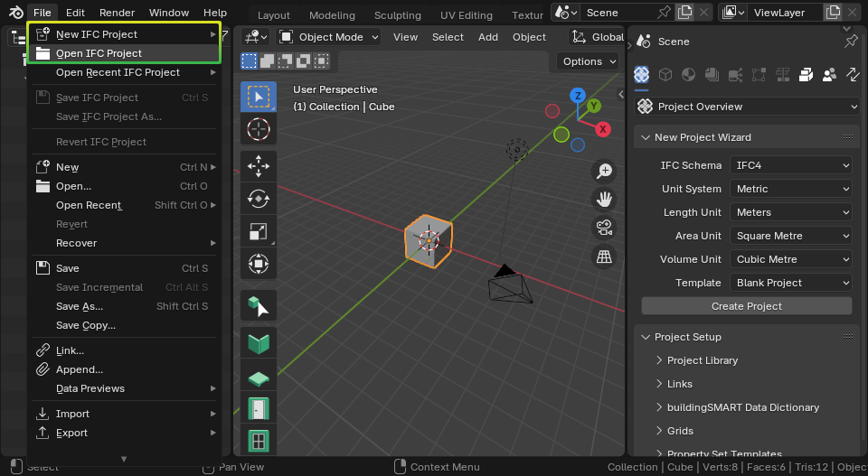

Installation
============

1. **Download and install Blender**

   Blender is a free and open-source program for 3D authoring. It works on
   Linux, Mac, and Windows. It is developed by the Blender community.

.. container:: blockbutton

    `Download Blender <https://www.blender.org/download/>`__

.. tip::

    No administrator rights on Windows? Choose the "Portable .zip" option when
    downloading from the Blender website.

2. Open up Blender, and click on ``Edit > Preferences``.

   .. image:: images/install-bonsai-1.png

3. Select the **Get Extensions** tab, and press **Allow Online Access**.

   .. image:: images/install-bonsai-2.png

4. Search for **Bonsai** in the top left search bar, then press the **Install** button.

   .. image:: images/install-bonsai-3.png

5. You should now see **Bonsai** available in your add-ons list. You're done!

   .. image:: images/install-bonsai-4.png

Your interface will now look similar to below. If you check the ``File`` menu you should also see an option to ``Open IFC Project``.

You can enable add-ons permanently by using ``Save User Settings`` from the Addons menu.

.. seealso::

    If you are a poweruser, you may be interested in the :ref:`guides/development/installation:Unstable installation` to help with testing.
