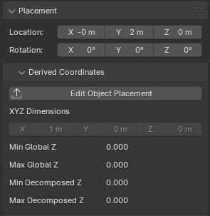
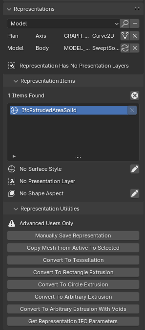
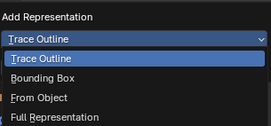
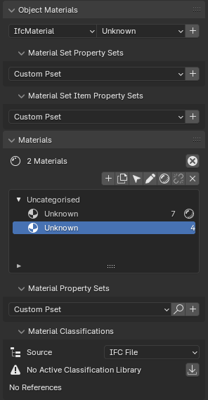

Geometry and Materials
======================

.. figure:: images/interface_property-editor_geometry-materials.png
   :alt: property editor geometry and materials sub-tab

   Geometry and Materials sub-tab.

The Geometry and Materials sub-tab in the Property Editor provides access to various aspects of an IFC element's
geometric representation and material properties.

This section is crucial for viewing and editing the physical and visual characteristics of IFC elements.

Placement
---------

   Placement panel in the Geometry and Materials sub-tab

The Placement panel allows you to view and edit the spatial position and orientation of the IFC element within the project.

Location
^^^^^^^^
The Location fields display and allow editing of the element's position in 3D space:

- X: The position along the X-axis (left/right)
- Y: The position along the Y-axis (front/back)
- Z: The position along the Z-axis (up/down)

These values are typically measured in the project's chosen unit of measurement.

Rotation
^^^^^^^^
The Rotation fields show and allow modification of the element's orientation:

- X: Rotation around the X-axis (pitch)
- Y: Rotation around the Y-axis (roll)
- Z: Rotation around the Z-axis (yaw)

Rotation values are measured in degrees.

Derived Coordinates
^^^^^^^^^^^^^^^^^^^
This section provides additional information about the element's placement:

**Edit Object Placement**
   A button that allows you to manually edit the object's placement.

**XYZ Dimensions**
   Displays the absolute bounding box dimensions of the object.

**Min Global Z and Max Global Z**
   Shows the lowest and highest points of the object in the global Z coordinate system.

**Min Decomposed Z and Max Decomposed Z**
   Indicates the lowest and highest points of the object when considering its decomposed parts or components.

Note: The specific units used may depend on your project settings. Always ensure you're working in the correct units when adjusting placement values.

For more detailed information about Object Placements in IFC,
including how they are represented mathematically and how to create them programmatically,
please refer to the `IfcOpenShell documentation on Object Placements <https://docs.ifcopenshell.org/ifcopenshell-python/geometry_creation.html#object-placements>`_.

Representations
---------------

   Representations panel in the Geometry and Materials sub-tab

The Representations panel allows you to view and manage the geometric representations of an IFC element.
In IFC, an element can have multiple representations for different purposes or contexts.

Adding Representations
^^^^^^^^^^^^^^^^^^^^^^
At the top of the panel, you can add new representations to the element:

1. Select the desired representation context from the dropdown menu (e.g., Model, Plan).
2. Click the "+" button next to the dropdown.
3. A dialog box will appear, allowing you to choose the type of representation to add (e.g., Trace Outline, Bounding Box).
4. Depending on the chosen type, you may be prompted to select an object as the basis for the new representation.

This feature allows you to create multiple representations for different purposes, such as simplified views, detailed 3D models, or 2D symbols.

   Add Representation dialog

Representation List
^^^^^^^^^^^^^^^^^^^
Below the add representation controls, you can see a list of representations.
Each row shows the context (e.g., Model, Plan) and type (e.g., Axis, Body) of a representation.

Two buttons are available for each representation in the list:

1. View/Edit button: This button allows you to switch to the selected representation and view or edit it in the 3D view.
   It's useful for inspecting or modifying specific representations of the element.

   - When a representation is not active, this button appears as a standard "switch/geometry" icon.
   - When a representation is active (i.e., currently being viewed/edited), the button changes to a "reload" icon.
     This visual cue helps you identify which representation is currently active in the 3D view.

2. Delete button: This button allows you to remove the selected representation from the element.
   Use this with caution, as deleting a representation can affect how the element is displayed or used in different contexts.

The ability to switch between representations and visually identify the active one allows for efficient management of multiple geometric
representations for a single IFC element.

Representation Items
^^^^^^^^^^^^^^^^^^^^
This section lists the items that make up the current representation. In the example, there is one item of type "IfcExtrudedAreaSolid".

- You can select items to view or edit their properties.
- The "x" button allows you to remove items from the representation.

Surface Style
~~~~~~~~~~~~~

Indicates whether a surface style is applied to the representation. You can assign a style using the pencil icon.

Presentation Layer
~~~~~~~~~~~~~~~~~~

Shows if the representation is assigned to a presentation layer. This can be useful for organizing and displaying elements in CAD or BIM software.

Shape Aspect
~~~~~~~~~~~~

Displays any shape aspects associated with the representation. Shape aspects can define specific parts or features of the geometry.

Representation Utilities
^^^^^^^^^^^^^^^^^^^^^^^^
This section provides advanced tools for manipulating representations:

- Manually Save Representation: Allows direct saving of representation data.
- Copy Mesh From Active To Selected: Copies mesh data between representations.
- Convert To Tessellation: Transforms the representation into a tessellated form.
- Convert To Rectangle Extrusion: Changes the representation to a simple rectangular extrusion.
- Convert To Circle Extrusion: Changes the representation to a circular extrusion.
- Convert To Arbitrary Extrusion: Allows for custom extrusion shapes.
- Convert To Arbitrary Extrusion With Voids: Similar to above, but includes the ability to add voids.
- Get Representation IFC Parameters: Retrieves the IFC-specific parameters of the representation.

Note: These utilities are marked as "Advanced Users Only" and should be used with caution,
as they can significantly alter the element's geometry and IFC data.

For more detailed information about IFC Representations and how they are handled in IfcOpenShell,
refer to the `IfcOpenShell documentation on Representations <https://docs.ifcopenshell.org/ifcopenshell-python/geometry_creation.html#representations>`_.

Geometric Relationships
-----------------------

.. figure:: images/geometric_relationships.png
   :alt: Geometric Relationships panel in the Geometry and Materials sub-tab

   Geometric Relationships panel in the Geometry and Materials sub-tab

The Geometric Relationships panel provides tools and information about how the current IFC element relates geometrically to other elements in the model.

Vendor Workarounds
^^^^^^^^^^^^^^^^^^
This section contains options to force certain geometric behaviors:

- Force Faceted Breps: Converts curved surfaces to faceted representations.
- Force Triangulation: Ensures all polygonal faces are triangulated.
- Force Presentation Style Assignment: Applies presentation styles to all geometric items.

These options can be useful when working with software that has specific geometric requirements or limitations.

Presentation Layers
^^^^^^^^^^^^^^^^^^^
Displays and manages the presentation layers associated with the element. The pencil icon allows you to add or manage presentation layers.

Note: There are known bugs an limitations with using presentation layers.

.. tip::
   While layers are supported for compatibility with CAD environments,
   consider using IFC properties, groups, or model views for more advanced data organization in BIM workflows.

Voids
^^^^^
Lists the voids (openings) associated with the element. Each void has an associated element.

The "x" button allows you to remove a void from the element.

Booleans
^^^^^^^^
Shows boolean operations applied to the element's geometry. The panel displays the number of booleans found and how many are manual (user-defined) versus automatic.

- The "+" button allows you to add a new boolean operation.
- The dropdown menu lets you choose the type of boolean operation.
- The "x" button removes the selected boolean operation.

Connections
^^^^^^^^^^^
Lists other elements that are geometrically connected to the current element. In this example, "Wall.006" is connected "AT_START" to the current element.

- The connection type (e.g., AT_START) indicates how the elements are related.
- The arrow button likely allows you to navigate to the connected element.

This panel is crucial for understanding and managing the geometric relationships between different elements in your IFC model,
including openings, boolean operations, and connections to other building components.

Parametric Geometry
-------------------

.. figure:: images/geometric_relationships.png
   :alt: Parametric Geometry panel in the Geometry and Materials sub-tab

   Parametric Geometry panel in the Geometry and Materials sub-tab

For elements with parametric definitions,
this panel allows you to view and edit the parameters that control the element's geometry.
This is particularly useful for elements like doors, windows, stairs, etc.

Parametric geometry allows for efficient modeling and updating of BIM elements while maintaining IFC compatibility.
Experiment with the available options to find parametric workflows that suit your modeling needs.

Materials
---------

  Materials panel in the Geometry and Materials sub-tab

The Materials panel allows you to manage material assignments for IFC elements.
You can assign materials to elements, create and edit material definitions, and manage material layers for layered elements (e.g., walls).

Styles
------

The Styles panel is used to manage presentation styles for elements, including surface styles (color, texture, etc.),
curve styles (line color, thickness, etc.), and fill area styles. These styles control how elements are visually represented in various contexts,
such as in 2D drawings or 3D views.

Profiles
--------

The Profiles panel is used to manage cross-sectional profiles for elements such as beams, columns, or railings.
You can create new profiles, edit existing ones, or assign profiles to elements.
