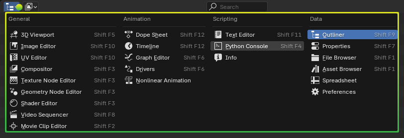
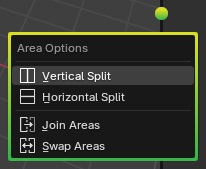
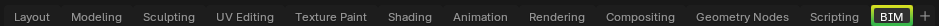
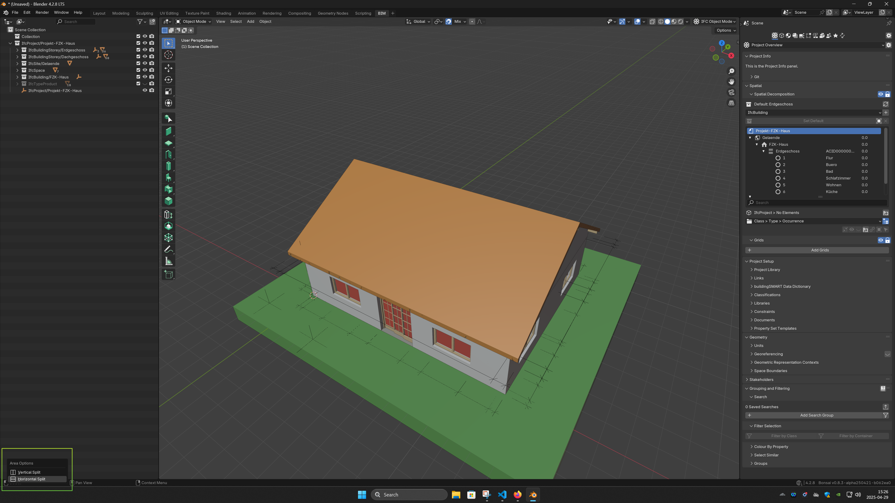
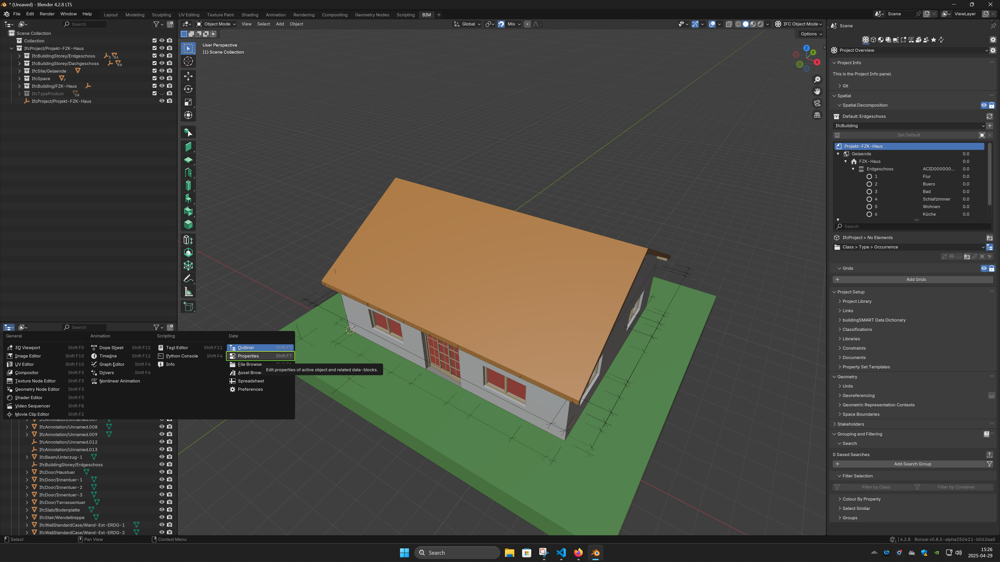
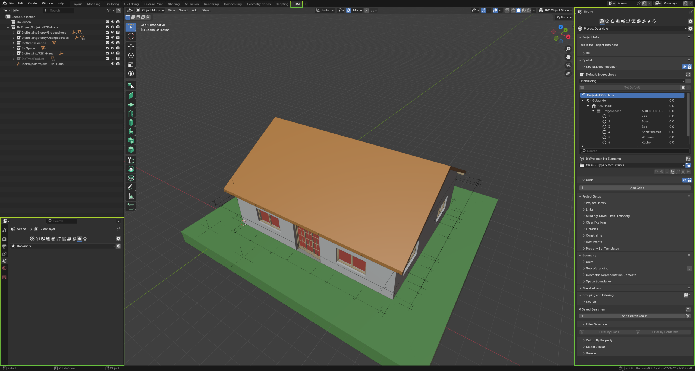
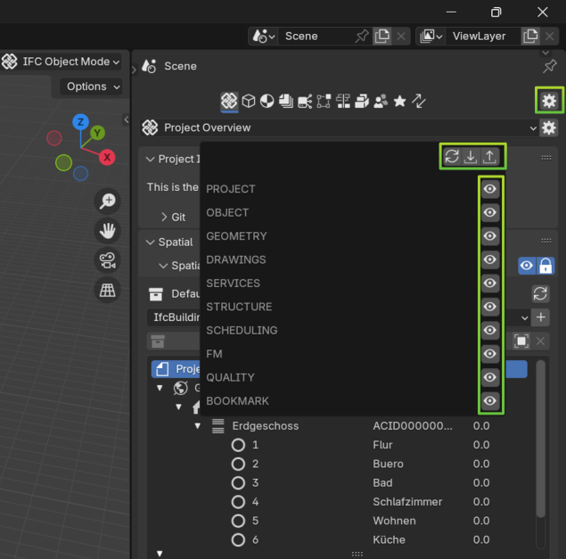
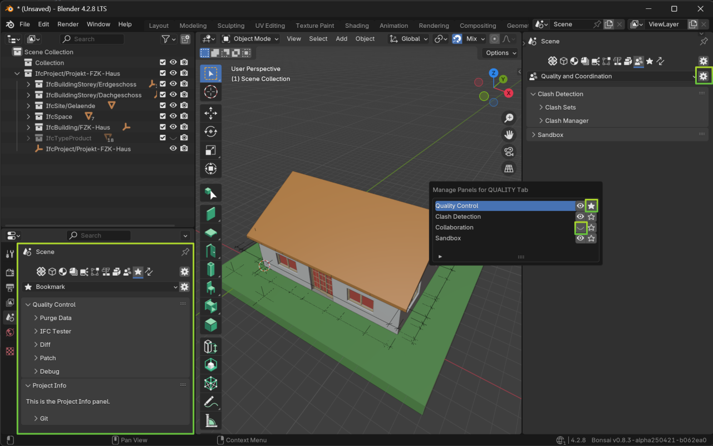

Interface
=========

.. container:: location-scene

   |location| Interface

   .. |location| image:: /images/location-scene.svg

The Bonsai interface is split into 5 main sections.

.. image:: images/Bonsai_interface.png

1. :doc:`Topbar </reference/topbar>` - shows main application menus to open and save IFCs, import IFCs, as well as tabs to save and load customised panel layouts.
2. :doc:`Outliner Panel </reference/outliner>` - shows a list of all geometric objects loaded into your 3D view. Objects can be organised into collections for any purpose.
3. :doc:`3D Viewport Panel </reference/3d_viewport>` - shows a 3D view of your geometric objects.
4. :doc:`Properties Panel </reference/properties>` - shows properties about your project, non-geometric objects, and selected objects from the 3D view.
5. :doc:`Status Bar </reference/status_bar>` - shows useful hotkeys when a tool is active, statistics, and version information.

Panels, such as the :doc:`/reference/outliner`, :doc:`/reference/3d_viewport`, and :doc:`/reference/properties` can be customised. You can click the top left icon of any panel to change the type of panel.

You can split, merge, or create new panels by clicking :kbd:`RMB` in-between panels.

You can save panel layouts, or switch to another customised panel layout by clicking the tabs in the :doc:`/reference/topbar`. Bonsai's default layout is stored in the **BIM** tab.

.. tip::

   Depending on your screen size, you may need to use the mouse wheel to scroll through the workspaces or, if you press the mouse wheel, you can drag the workspaces to see them all.

The :doc:`Topbar </reference/topbar>` and :doc:`/reference/status_bar` cannot be customised.

.. seealso::

    Bonsai's interface is a customised version of the default Blender
    interface. Read more about `Blender Workspaces
    <https://docs.blender.org/manual/en/latest/interface/window_system/workspaces.html>`__.

As an example on how to customize the interface. Go to the **BIM** Workspace and right click :kbd:`RMB` in-between the outliner panel and the bottom of the window.

Select **horizontal split** to create a new panel and dragge it upwards to the desired size. Next select the new panel and change it to **Properties**. 
You can do this by clicking the top left icon of the panel and selecting **Properties**.

Then select scene and click the start icon (bookmark). Now you have a customized layout for Bonsai BIM.

You can further customize the layout of your BIM workspace to suit better your workflow.

By clicking the gear icon in the top right corner of the TABs panel

A Popup window will appear with a list of the available TABs. If you click in any "eye" icon, the corresponding TAB will be toggled between hidden and visible.

At the top right of the pop up window, you can also see the option to reset the UI customization, to download a json file with a customization or to store the current customization in a json file.

The next thing you can do is to select a TAB and configure what panels you want to be visible in that tab or optionally transfer a panel to the BOOKMARK TAB. 

In the example below we have selected the gear icon in the Quality and Coordination TAB and then selected the "star" icon for "Quality control" and the "eye" icon for "Collaboration". 

As you can see the "Quality control" panel is now visible in BOOKMARK TAB and the "Collaboration" panel is now hidden. 

Additionally we have also "bookmarked" the "Project info" panel from the "Project Overview" TAB

.. note::

   Keep in mid that the reset icon will reset all the UI customizations, so after cliking it. All TABS and panels are visible and the BOOKMARK TAB is empty.