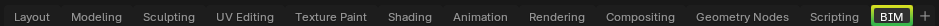

Interface
=========

.. container:: location-scene

   |location| Interface

   .. |location| image:: /images/location-scene.svg

The Bonsai interface is split into 5 main sections.

1. :doc:`Topbar </reference/topbar>` - shows main application menus to open and save IFCs, import IFCs, as well as tabs to save and load customised panel layouts.
2. :doc:`Outliner Panel </reference/outliner>` - shows a list of all geometric objects loaded into your 3D view. Objects can be organised into collections for any purpose.
3. :doc:`3D Viewport Panel </reference/3d_viewport>` - shows a 3D view of your geometric objects.
4. :doc:`Properties Panel </reference/properties>` - shows properties about your project, non-geometric objects, and selected objects from the 3D view.
5. :doc:`Status Bar </reference/status_bar>` - shows useful hotkeys when a tool is active, statistics, and version information.

Panels, such as the :doc:`/reference/outliner`, :doc:`/reference/3d_viewport`, and :doc:`/reference/properties` can be customised. You can click the top left icon of any panel to change the type of panel.

You can split, merge, or create new panels by clicking :kbd:`RMB` in-between panels.

You can save panel layouts, or switch to another customised panel layout by clicking the tabs in the :doc:`/reference/topbar`. Bonsai's default layout is stored in the **BIM** tab.

.. tip::

   Depending on your screen size, you may need to use the mouse wheel to scroll through the workspaces or, if you press the mouse wheel, you can drag the workspaces to see them all.

The :doc:`Topbar </reference/topbar>` and :doc:`/reference/status_bar` cannot be customised.

.. seealso::

    Bonsai's interface is a customised version of the default Blender
    interface. Read more about `Blender Workspaces
    <https://docs.blender.org/manual/en/latest/interface/window_system/workspaces.html>`__.
