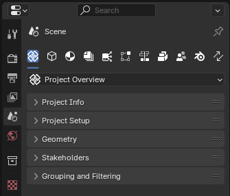

Project Overview
================

.. container:: location-scene

   |location| Scene Properties |>| Project Overview

   .. |location| image:: /images/location-scene.svg
   .. |>| image:: /images/location-breadcrumb.svg

The Project Overview sub-tab in the Bonsai interface provides a central hub
for accessing and managing essential information and settings related to an IFC project.
Located within the Scene Properties tab of Property Editor, this sub-tab is organized into several panels, each focusing on a specific aspect of the project.

   Project Overview sub-tab with subsection panels.

The primary subsection panel is **Project Info** which displays crucial metadata about the loaded IFC file, such as
the IFC schema version, model view definition (MVD), authoring information, and file location.
It also provides options to create new IFC projects, load existing ones, and unload the current project.

In addition to **Project Info**, the Project Overview sub-tab includes several other panels that cover various aspects of project management, such as:

- Project Setup
- Geometry
- Stakeholders
- Grouping and Filtering

Project Info
^^^^^^^^^^^^

The Project Info subsection adapts to the state of the IFC project, presenting relevant options and information based on whether a project is loaded,
saved, or in the process of being created.

Project Setup
^^^^^^^^^^^^^

Project Setup subsection allows users to configure project-specific settings, libraries, and templates.

Geometry
^^^^^^^^

The Geometry panel provides access to geometry-related settings and tools, such as units, georeferencing, and geometric representation contexts.

Stakeholders
^^^^^^^^^^^^

The Stakeholders panel enables users to manage project stakeholders, including people, organizations, and roles.

Grouping and Filtering
^^^^^^^^^^^^^^^^^^^^^^

Grouping and Filtering panel offers tools for organizing and filtering project data based on specific criteria.

.. toctree::
   :hidden:
   :maxdepth: 1
   :caption: Contents:

   project_info
