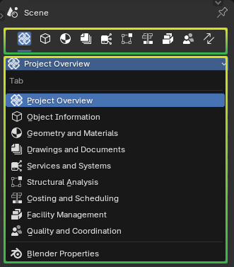

Properties
==========

.. container:: location-scene

   |location| Properties

   .. |location| image:: /images/location-scene.svg

The properties panel shows information about the IFC model and the actively
selected IFC object in the 3D Viewport.

Tab bar
-------

A horizontal row of icons are provided to switch between what type of
properties are shown. Alternatively, a dropdown list may also be used.

- **Project Overview**: Overall project information.
- **Object Information**: Simple properties and relationships about the actively selected object.
- **Geometry and Materials**: Geometric, material, and style data.
- **Drawings and Documents**: Drawings, sheets, schedules, and other documents.
- **Services and Systems**: Mechanical, electrical, hydraulic, fire systems, and building physics.
- **Structural Analysis**: Structural analytical models and analysis.
- **Costing and Scheduling**: Project staging, quantity take-off, cost schedules, work schedules and animation, and resource management.
- **Facility Management**: Facility management integration, Brickschema integration.
- **Quality and Coordination**: Model auditing and fixing, clash detection, BCF collaboration, and debugging.
- **Blender Properties**: (Only visible at the bottom of the dropdown menu) Shows default Blender panels for Blender users who do not want to see IFC information.
- **Switch Tab** (:kbd:`Ctrl` + :kbd:`Tab`): (Only visible at the end of the tab icons) Toggles between the two last active tabs.
