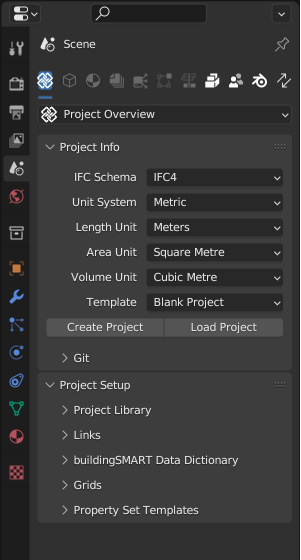
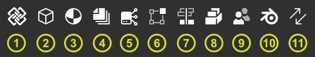

Properties
==========

.. container:: location-scene

   |location| Scene Properties

   .. |location| image:: /images/location-scene.svg

Bonsai adds new functionality to the `Property Editor` -> `Scene` tab.

   The property editor on Blender startup.

Most of these sub-tabs become available with a created or loaded IFC file.
Don't worry, the default Blender scene properties are still reachable under their own dedicated sub-tab.

   Overview over the added property sub-tabs by Bonsai.

1. Project Overview
2. Object Information
3. Geometry and Materials
4. Drawings and Documents
5. Services and Systems
6. Structural Analyses
7. Costing and Scheduling
8. Facility Management
9. Quality and Coordination
10. Blender Properties
11. Switch Tab

You can also select the needed panel via the drop-down menue.

.. figure:: images/interface_property-editor_panel-dropdown.png
   :alt: Bonsai property editor sub-tabs drop-down menue

   Switching between Bonsai property editor sub-tabs via the drop-down menue.

.. toctree::
   :hidden:
   :maxdepth: 1
   :caption: Contents:

   project_overview/index
   object_information/index
   geometry_and_materials/index
   drawings_and_documents/index
   services_and_systems/index
   structural_analysis/index
   costing_and_scheduling/index
   facility_management/index
   quality_and_coordination/index
   blender
   switch_tab
