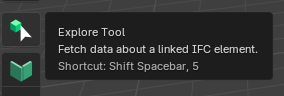
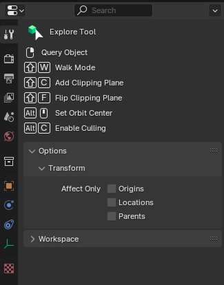

Explore Tool
============

The Explore Tool is a powerful feature in Bonsai that enhances your ability to navigate and inspect IFC models.
It introduces functionality commonly found in dedicated IFC viewers,
making Bonsai a more comprehensive native IFC authoring and viewing tool.

Shortcut
--------

:kbd:`Shift` + :kbd:`Spacebar`, :kbd:`5`

Toolbar Icon
------------

Tool Options
------------

Key Features
------------

- **Walk Mode** (Shortcut: :kbd:`Shift` + :kbd:`W`): Navigate through your model in a first-person perspective.
   - Use :kbd:`W`, :kbd:`A`, :kbd:`S`, :kbd:`D` keys or arrow keys for movement.
   - Provides a game-like experience for exploring interiors.

- **Add Clipping Plane** (Shortcut: :kbd:`Shift` + :kbd:`C`): Create a cutting plane to view cross-sections of your model.
   - Drag the plane to adjust its position.
   - Add multiple clipping planes simultaneously for complex views.

- **Flip Clipping Plane** (Shortcut: :kbd:`Shift` + :kbd:`F`): Reverse the direction of the active clipping plane.

Usage
-----

1. Activate the tool from the toolbar or use the shortcut.
2. Select the element you want to interact with.
3. Select the desired option by pressing the corresponding shortcut.
4. Interact with your model in the 3D viewport:

   * For Walk Mode, use WASD or arrow keys to move through the model.
   * For Clipping Plane, drag the plane to desired position and use Shift+F to flip if needed.

The Explore Tool significantly enhances the model navigation and inspection capabilities of Bonsai.
It's particularly useful for understanding spatial relationships, inspecting building cross-sections, and navigating through complex interiors.
These features make Bonsai more comparable to dedicated IFC viewers while retaining its powerful authoring capabilities.
