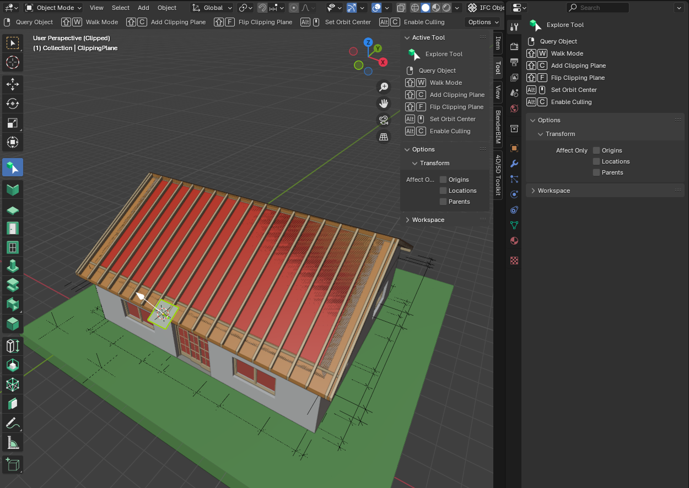
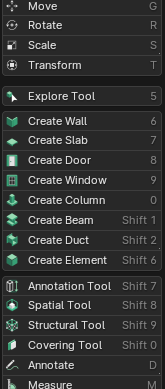

=======
Toolbar
=======

Tool System Overview
====================

Bonsai extends Blender's tool system, which provides a consistent way to interact with the 3D viewport. Here are some key points about the tool system:

- Tools are accessed from the Toolbar, typically located on the left side of the 3D viewport.
- Only one tool can be active per Workspace and mode.
- Most tools are controlled using the Left Mouse Button (LMB), though some use modifier keys.
- Press :kbd:`Shift` + :kbd:`Spacebar` to open the tool shortcut menu for quick access.
- The Quick Favorites menu (:kbd:`Q`) allows you to gather your most-used tools for easy access.

Bonsai integrates its tools seamlessly into this system, adding BIM-specific functionality while maintaining consistency with Blender's interface.

Tool Settings Access
--------------------

Tool settings can be accessed in three different locations within the Blender interface:

1. **3D Viewport**: The active tool's settings appear in the header of the 3D Viewport, providing quick access to essential options.

2. **Sidebar (N panel)**: Tool settings can also be found in the Active Tool tab of the Sidebar. Access the Sidebar by pressing :kbd:`N` in the 3D Viewport.

3. **Properties Editor**: The Tool tab in the Properties editor offers another place for viewing settings of the active tool.

These multiple access points allow you to choose the most convenient location based on your workflow and screen layout.

Tool Tab in Property Editor
---------------------------

Each tool has its own set of options and settings,
which can be found in the Tool tab of the Properties editor.
This tab dynamically updates based on the currently active tool,
providing context-specific controls and parameters.

.. seealso::
   For more detailed information on Blender's tool system,
   refer to the `Blender Manual <https://docs.blender.org/manual/en/latest/interface/tool_system.html>`_.

Bonsai Tools
============

The Bonsai toolbar extends Blender's built-in toolbar with additional tools specific to BIM modeling.
These tools are positioned between the Transform and Annotate sections of the standard Blender toolbar.

.. tip::
  Press :kbd:`Shift` + :kbd:`Spacebar` to open the tool shortcut menu.
  From there, you can quickly select any tool using its corresponding number or letter key.

.. seealso::

   For more information on standard Blender toolbar,
   see the `Toolbar section in Blender Manual <https://docs.blender.org/manual/en/latest/scene_layout/object/tools/toolbar.html>`_.

.. container:: toc-cards

   .. container:: card

      :doc:`explore`
         Navigate and inspect your BIM model with advanced viewing options.

   .. container:: card

      :doc:`wall`
         Add and manipulate wall elements in your floor plan.

   .. container:: card

      :doc:`slab`
         Create floor and roof slabs in your BIM model.

   .. container:: card

      :doc:`door`
         Insert and customize door elements in your walls.

   .. container:: card

      :doc:`window`
         Add and adjust window elements in your walls.

   .. container:: card

      :doc:`column`
         Place and modify structural column elements.

   .. container:: card

      :doc:`beam`
         Add and customize beam elements in your structure.

   .. container:: card

      :doc:`duct`
         Design and place HVAC ductwork in your model.

   .. container:: card

      :doc:`element`
         Add custom IFC elements to your BIM project.

   .. container:: card

      :doc:`annotation`
         Add various types of annotations to your model and drawings.

   .. container:: card

      :doc:`spatial`
         Define and manage spatial structures within your BIM model.

   .. container:: card

      :doc:`structural`
         Create and edit structural elements and relationships.

   .. container:: card

      :doc:`covering`
         Add surface coverings to elements in your model.

Click on a tool to learn more about its features and how to use it effectively in your BIM workflow.

Using the Toolbar
=================

To use any of these tools, simply select the desired tool from the toolbar.
The options and parameters for each tool will appear in the toolbar options panel at the bottom of the toolbar.
Adjust these settings as needed before applying the tool in your 3D viewport.

Remember that many of these tools interact with the IFC data structure underlying your BIM model.
Always ensure you're working within the correct IFC context when using these tools.

.. toctree::
   :hidden:
   :maxdepth: 1

   explore
   wall
   slab
   door
   window
   column
   beam
   duct
   element
   annotation
   spatial
   structural
   covering

