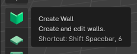
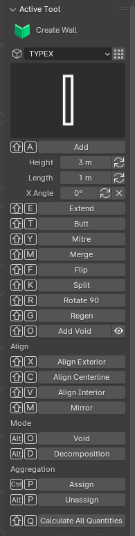

Create Wall
===========

The Create Wall tool in Bonsai allows you to add and manipulate wall elements in your floor plan.
It provides options for specifying wall element properties and adjusting their alignment and orientation.

Toolbar Icon
------------

Tool Options
------------

Shortcut
~~~~~~~~

To access the Create Wall tool, you can use the following keyboard shortcut sequence:

 :kbd:`Shift` + :kbd:`Spacebar`, ???

Key Features
~~~~~~~~~~~~

Add Wall
^^^^^^^^

- **Shortcut**: :kbd:`Shift` + :kbd:`A`
- Adds a new wall segment at the 3D cursor location.

Add or Modify Wall
^^^^^^^^^^^^^^^^^^

- **Height**: Set the wall height.
- **Length**: Set the wall length.
- **X Angle**: Adjust the angle of the wall.

Modify Wall
^^^^^^^^^^^

- **Extend** (Shortcut: :kbd:`Shift` + :kbd:`E`): Extend an existing wall to another face.
- **Butt** (Shortcut: :kbd:`Shift` + :kbd:`T`): Join wall segments end-to-end.
- **Mitre** (Shortcut: :kbd:`Shift` + :kbd:`Y`): Create a mitre joint between two wall segments.
- **Merge** (Shortcut: :kbd:`Shift` + :kbd:`M`): Merge two wall segments into one.
- **Flip** (Shortcut: :kbd:`Shift` + :kbd:`F`): Flip the direction of the wall segment.
- **Split** (Shortcut: :kbd:`Shift` + :kbd:`K`): Split a wall segment into two parts.
- **Rotate 90** (Shortcut: :kbd:`Shift` + :kbd:`R`): Rotate the wall by 90 degrees.
- **Regen** (Shortcut: :kbd:`Shift` + :kbd:`G`): Regenerate the wall geometry.
- **Add Void** (Shortcut: :kbd:`Shift` + :kbd:`O`): Create an opening in the wall for doors, windows, or other elements.

Change walls alignment or move walls
^^^^^^^^^^^^^^^^^^^^^^^^^^^^^^^^^^^^

- **Align Exterior** (Shortcut: :kbd:`Shift` + :kbd:`X`): Align wall to the exterior face.
- **Align Centerline** (Shortcut: :kbd:`Shift` + :kbd:`C`): Align wall to the centerline.
- **Align Interior** (Shortcut: :kbd:`Shift` + :kbd:`V`): Align wall to the interior face.
- **Mirror** (Shortcut: :kbd:`Shift` + :kbd:`M`): Mirror wall.

Wall Mode
^^^^^^^^^

- **Void** (Shortcut: :kbd:`Alt` + :kbd:`O`): Create voids in the walls.
- **Decomposition** (Shortcut: :kbd:`Alt` + :kbd:`D`): Decompose wall elements.

Aggregation
^^^^^^^^^^^

- **Assign** (Shortcut: :kbd:`Ctrl` + :kbd:`P`): Assign wall elements to a specific group.
- **Unassign** (Shortcut: :kbd:`Alt` + :kbd:`P`): Remove wall elements from a group.

Calculate Quantities
^^^^^^^^^^^^^^^^^^^^

- **Calculate All Quantities** (Shortcut: :kbd:`Q`): Calculate all quantities related to the walls (e.g., area, volume).

Usage
~~~~~

To use the Create Wall tool:

1. **Activate the tool** from the toolbar or use the shortcut :kbd:`A`.
2. **Select the wall type** from the dropdown menu, or create a new wall type (which represents the wall thickness) and set other desired parameters.
3. **Set the 3D cursor** to the desired starting location for the wall by holding :kbd:`Shift` and left-clicking in the 3D viewport.
4. **Add the wall** by pressing :kbd:`Shift` + :kbd:`A`.
5. **Adjust the length** of the wall segment by dragging the "Length" parameter or entering a numeric value.
6. **Set the 3D cursor** to the new location for the next wall segment, enabling snapping to ensure the segments butt together properly.
7. **Add the next wall segment** by pressing :kbd:`Shift` + :kbd:`A` again.
8. **Rotate** the new wall segment if needed by pressing :kbd:`Shift` + :kbd:`R` and adjusting the angle.
9. **Adjust the length** of the new segment as required.
10. **Repeat steps 6-9**, setting the 3D cursor to the desired location, adding new wall segments, rotating, and adjusting lengths, until the complete wall perimeter is created.
11. **Modify wall segments** using the various shortcuts (e.g., extend, butt, mitre, merge, flip, split, rotate) as needed to refine the wall layout.
12. **Align and adjust** walls using the alignment options.
13. **Add voids** by clicking "Add Void" and placing openings where necessary.
14. **Calculate quantities** by pressing :kbd:`Q` to ensure accurate measurements.

The Create Wall tool in Bonsai enables precise and flexible wall creation and management,
enhancing your ability to develop detailed floor plans efficiently.
