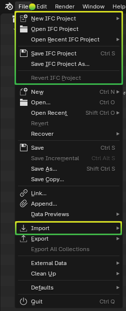
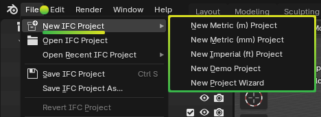
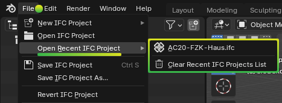
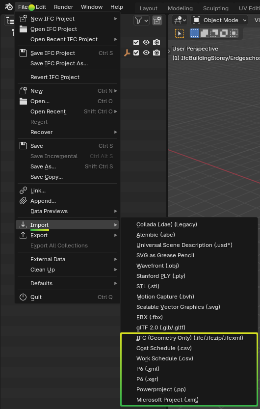

Topbar
======

.. container:: location-scene

   |location| Topbar

   .. |location| image:: /images/location-scene.svg

.. seealso::

    See more documentation about the `Blender Topbar <https://docs.blender.org/manual/en/latest/interface/window_system/topbar.html>`__.

File
----

.. container:: location-scene

   |location| Topbar |>| File

   .. |location| image:: /images/location-scene.svg
   .. |>| image:: /images/location-breadcrumb.svg

Access new, open, save, and import functionality.

- :ref:`reference/topbar:new ifc project` (:kbd:`Ctrl` + :kbd:`N`): Provides convenient presets to create new IFC projects.
- **Open IFC Project**: Launches a file browser to open an IFC model for viewing and authoring.
- :ref:`reference/topbar:open recent ifc project`: See recently opened IFC models.
- **Save IFC Project** (:kbd:`Shift` + :kbd:`S`): saves the ``.ifc`` file, optionally launching a file browse dialog if the file has not yet been saved.
- **Save IFC Project As**: launches a file browse dialog to save the ``.ifc``. This location is remembered for future saves.
- **Revert IFC Project**: Discards all unsaved changes and reloads the currently loaded IFC model.
- :ref:`reference/topbar:import`: Imports data from external sources into the Blender session or IFC model.

.. warning::

    Other menu items, such as ``New`` or ``Open...`` are part of Blender. These
    create, open, save, and interact with Blender files, not IFC models. If you
    are using Bonsai to work with IFC natively, using these functions may
    damage your IFC model. For more information, see
    :ref:`guides/troubleshooting:saving and loading blend files`.

New IFC Project
---------------

.. container:: location-scene

   |location| Topbar |>| File |>| New IFC Project (:kbd:`Shift` + :kbd:`N`)

   .. |location| image:: /images/location-scene.svg
   .. |>| image:: /images/location-breadcrumb.svg

Provides convenient presets to create new IFC projects.

- **New Metric (m) Project**: Creates a new IFC4 project using meters as the length unit.
- **New Metric (mm) Project**: Creates a new IFC4 project using millimeters as the length unit.
- **New Imperial (ft) Project**: Creates a new IFC4 project using feet as the length unit.
- **New Demo Project**: Creates a new IFC4 project with pre-populated demo types and content. Useful for experimenting and learning.
- **New Project Wizard**: Resets the Blender session and shows the :ref:`viewing/project_overview:new project wizard` panel to customise project creation settings such as schema version.

Open Recent IFC Project
-----------------------

.. container:: location-scene

   |location| Topbar |>| File |>| Open Recent IFC Project

   .. |location| image:: /images/location-scene.svg
   .. |>| image:: /images/location-breadcrumb.svg

Shows a list of recently opened IFC models.

- **Clear Recent IFC Projects List**: Clears the list of recently opened IFC models.

Import
------

.. container:: location-scene

   |location| Topbar |>| File |>| Import

   .. |location| image:: /images/location-scene.svg
   .. |>| image:: /images/location-breadcrumb.svg

Imports data from external sources into the Blender session or IFC model.

- **IFC (Geometry Only) (.ifc/.ifczip/.ifcxml)**: Imports only the geometry from an IFC model into the current Blender session. This can not be used for editing the IFC model. Typically used by CG artists.
- **Cost Schedule (.csv)**: Imports a CSV containing a cost schedule into the active IFC model.
- **Work Schedule (.csv)**: Imports a CSV containing a work schedule into the active IFC model.
- **P6 (.xml)**: Imports a P6 XML file containing a work schedule into the active IFC model.
- **P6 (.xer)**: Imports a P6 XER file containing a work schedule into the active IFC model.
- **Powerproject (.pp)**: Imports a Powerproject file containing a work schedule into the active IFC model.
- **Microsoft Project (.xml)**: Imports a Microsoft Project XML file containing a work schedule into the active IFC model.
