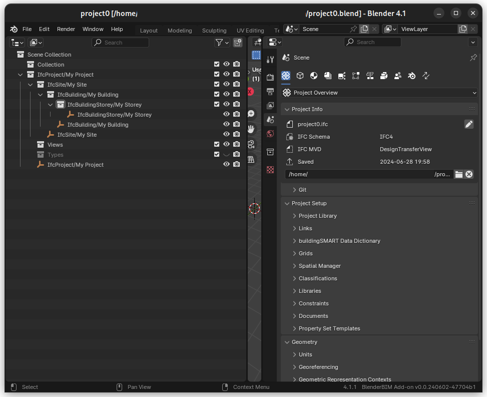
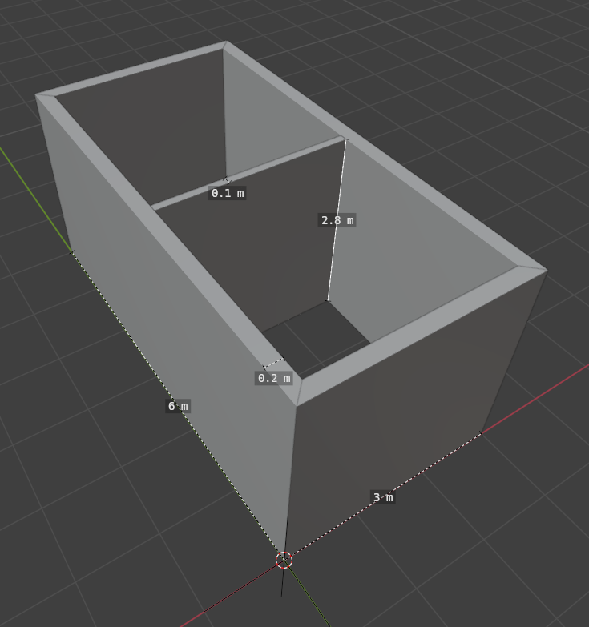
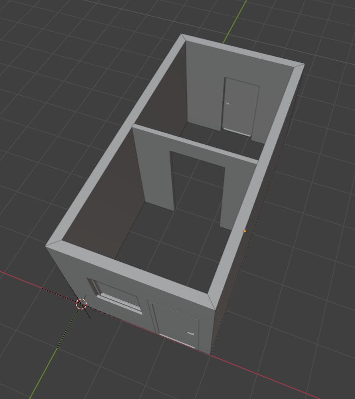

===========================
Project 0: Designing a Room
===========================

In this introductory project, you'll learn the basics of using Bonsai to design a simple room.
By the end of this tutorial, you'll have created a basic 3D model and a 2D floor plan drawing.

Prerequisites
=============

- Basic knowledge of Blender interface
- Bonsai installed and activated

Learning Objectives
===================

- Create basic walls and openings
- Add a floor slab
- Incorporate basic MEP elements
- Place basic furniture
- Generate a simple floor plan drawing

Tutorial Steps
==============

1. Setting Up the Project
-------------------------

  Setup the `project0` project.

1. Open Blender and switch to the Bonsai workspace.
2. Create a new IFC project. Use Metric.
3. Save it as `project0.ifc` file.
4. (optional) Save the `project0.blend` file.

.. note:: See :doc:`/users/modeling/starting_new_project` for detailed instructions.

2. Creating Walls
-----------------

   Creating Walls in Bonsai

1. Use the "Create Wall" tool to draw the room's perimeter of a room 6m by 3m. Use mitre join.
2. Add an interior wall across the room in the middle. Use butt join.
3. Adjust walls height to be 2.8m.
4. Set the thicknesses of 0.2m for the exterior walls.
5. Set the thickness of 0.1m  for the partition wall.
6. Use a Measure tool to ensure proper dimensions.
   The interior lenghts of the walls should be 2.8m, 2.7m and 2.6m.

.. note:: Refer to :doc:`/users/modeling/basic_modeling/creating_walls` for step-by-step guidance on wall creation.

If you still struggling, here's what you should get:

.. container:: blockbutton

  `Download project0-walls.ifc <files/project0-walls.ifc>`__

3. Adding Openings
------------------

   Adding Openings in Bonsai

1. Create two door openings:

   - Use the "Create Door" tool for each door
   - Set the width to 0.9m and height to 2.1m for both doors
   - Position the front door 0.1m from the corner on one of the 3m walls
   - Position the back door at the center of the 3m wall

2. Add two window openings beside the front door:

   - Use the "Create Window" tool to create a window beside the front door
   - Set the width to 1m and height to 1m
   - Position the window 0.1m to the side of the front door

3. Adjust the sill height for the windows:

   - Set the sill height to 1m from the floor level

4. Create an arch opening in the interior partition wall:

   - Use the "Create Door" tool to create a door in the partition wall
   - Use a dedicated DoorType for this opening that we'll discard
   - Set the width to 1.2m and height to 2.4m
   - Position it in the center of the partition wall
   - Click on the "eye" icon near "Add Void" to display the void
   - Remove the Door and the Door type in the outliner
   - Click checkbox near "Add Void".

5. Use the Measure tool to verify the positions and dimensions of all openings.

6. Ensure that the openings do not intersect with corners or other openings.

.. note:: Refer to :doc:`/users/modeling/basic_modeling/openings/index` for detailed instructions
   on creating and modifying openings, including how to create openings without fillings.

If you're having difficulties, you can download the sample file:

.. container:: blockbutton

  `Download project0-openings.ifc <files/project0-openings.ifc>`__

4. Creating the Floor Slab
--------------------------

1. Use the "Create Slab" tool to add a floor
2. Adjust slab thickness and elevation

5. Basic MEP Elements
---------------------

1. Add electrical outlets using IFC Electric Terminal
2. Place a light fixture using IFC Lighting Fixture
3. Add a simple HVAC vent using IFC Flow Terminal

6. Placing Furniture
--------------------

1. Import basic furniture from the Bonsai library
2. Position and rotate furniture items
3. Adjust furniture properties if needed

7. Generating a Floor Plan
--------------------------

1. Set up a plan view using the Bonsai drawing tools
2. Add dimensions to the floor plan
3. Include basic annotations and labels

8. Finish
---------

1. Review IFC properties for all elements
2. Generate a PDF of the floor plan drawing

Conclusion
==========

Congratulations! You've completed your first room design using Bonsai. You should now have a basic understanding of creating walls, openings, slabs, and simple MEP elements, as well as generating a basic floor plan.

Next Steps
==========

- Experiment with different room layouts and furniture arrangements
- Try creating a more complex room shape
- Explore additional MEP elements and their properties

In the next project, we'll build upon these skills to design a complete flat, introducing more advanced concepts and techniques.
