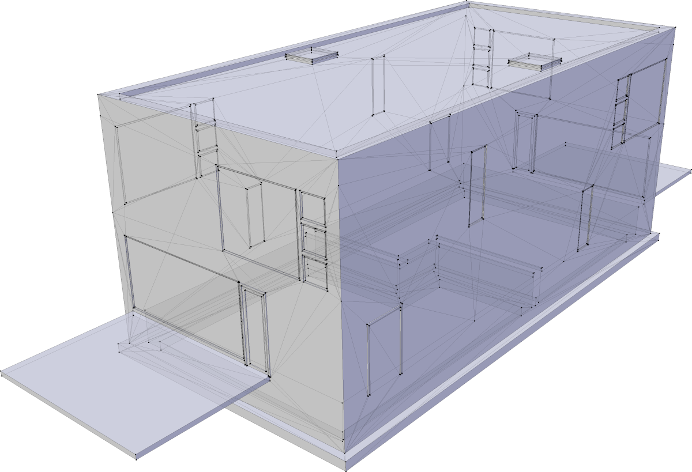

# Exterior shell extractor

Extract a near-optimal manifold shell of a complete building model exterior in IFC.

Original triangulated geometry. **14 166** unique vertex positions.

Post-processed geometry using this tool. **627** unique vertex positions. Note that it's not only a subset of the elements, but also the thickness of the elements which is eliminated, yielding an exact and optimal representation of the building volume.

# Background

Contemporary challenges in our built-environment require multi-disciplinary and multi-scale knowledge. Interoperability is at the hard of a good functioning industry. Even though BIM is all about collaboration, the model data often stays in file silos. This is because of formats, technical challenges, but also due to inconsistent modelling approaches and fragmented applications. 

BIM and GIS information are fundamentally different. In BIM (Building Information Modeling) and its main open source exchange standard (IFC), elements are modeled as individual solid volumes that form a database; with modeling constructs such as decomposition and planning and costing information for the execution of the built work.

For geospatial usage, people represent information as captured features with attributes and use post-hoc spatial queries for relationships.

A manifold representation of the entire outer shell enables geospatial queries, is much lighter to visualize and can be better geometrically simplified.

# Solution

This tool provides an approach to unify BIM and GIS data by means of an IFC conversion pipeline with extensive geometric post-processing in order to provide up to date and consistent multi-scale data environments. The tool uses IfcOpenShell and CGAL to turn the individual solid volumes into a continuous representation of the outer shell.

It relies on CGAL's exact computation paradigm and arbitrarily precise coordinates to decompose every element into convex parts, which are then described as a set of halfspace plane equations. These halfspace plane equations are aligned using an angular and linear tolerance, by clustering the plane equations and rewriting them with their cluster's average.
