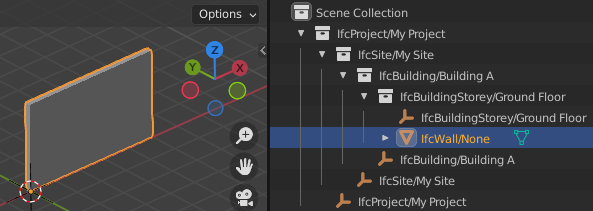
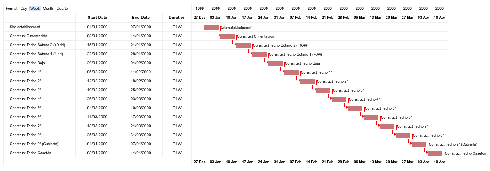

Code examples
=============

Examples for common basic tasks are shown here. In all examples, it is assumed
that you have a IFC model loaded into model variable like so:

.. code-block:: python

    import ifcopenshell

    model = ifcopenshell.open('model.ifc')

This is only a small sample of common tasks. To view the full list of available
functions, check out the API Reference.

Get all wall types
------------------

.. code-block:: python

    for wall_type in model.by_type("IfcWallType"):
        print("The wall type element is", wall_type)
        print("The name of the wall type is", wall_type.Name)

Get all door occurrences of a type
----------------------------------

.. code-block:: python

    import ifcopenshell.util.element

    for door_type in model.by_type("IfcDoorType"):
        print("The door type is", door_type.Name)
        doors = ifcopenshell.util.element.get_types(door_type)
        print(f"There are {len(doors)} of this type")
        for door in doors:
            print("The door name is", door.Name)

Get the type of a wall
----------------------

.. code-block:: python

    import ifcopenshell.util.element

    wall = model.by_type("IfcWall")[0]
    wall_type = ifcopenshell.util.element.get_type(wall)
    print(f"The wall type of {wall.Name} is {wall_type.Name}")

Get the properties of a wall type
---------------------------------

.. code-block:: python

    import ifcopenshell.util.element

    wall = model.by_type("IfcWall")[0]
    wall_type = ifcopenshell.util.element.get_type(wall)

    # Get all properties and quantities as a dictionary
    # returns {"Pset_WallCommon": {"id": 123, "FireRating": "2HR", ...}}
    psets = ifcopenshell.util.element.get_psets(wall_type)
    print(psets)

    # Get all properties and quantities of the wall, including inherited type properties
    psets = ifcopenshell.util.element.get_psets(wall)
    print(psets)

    # Get only properties and not quantities
    print(ifcopenshell.util.element.get_psets(wall, psets_only=True))

    # Get only quantities and not properties
    print(ifcopenshell.util.element.get_psets(wall, qtos_only=True))

Find the spatial container of an element
----------------------------------------

.. code-block:: python

    import ifcopenshell.util.element

    wall = model.by_type("IfcWall")[0]
    # Walls are typically located on a storey, equipment might be located in spaces, etc
    container = ifcopenshell.util.element.get_container(wall)
    # The wall is located on Level 01
    print(f"The wall is located on {container.Name}")

Get all elements in a container
-------------------------------

.. code-block:: python

    import ifcopenshell.util.element

    for storey in model.by_type("IfcBuildingStorey"):
        elements = ifcopenshell.util.element.get_decomposition(storey)
        print(f"There are {len(elements)} located on storey {storey.Name}, they are:")
        for element in elements:
            print(element.Name)

Get the XYZ coordinates of a element
------------------------------------

.. code-block:: python

    import ifcopenshell.util.placement

    wall = model.by_type("IfcWall")[0]
    # This returns a 4x4 matrix, including the location and rotation. For example:
    # array([[ 1.00000000e+00,  0.00000000e+00,  0.00000000e+00, 2.00000000e+00],
    #        [ 0.00000000e+00,  1.00000000e+00,  0.00000000e+00, 3.00000000e+00],
    #        [ 0.00000000e+00,  0.00000000e+00,  1.00000000e+00, 5.00000000e+00],
    #        [ 0.00000000e+00,  0.00000000e+00,  0.00000000e+00, 1.00000000e+00]])
    matrix = ifcopenshell.util.placement.get_local_placement(wall.ObjectPlacement)
    # The last column holds the XYZ values, such as:
    # array([ 2.00000000e+00,  3.00000000e+00,  5.00000000e+00])
    print(matrix[:,3][:3])

Get the geometry of an element
------------------------------

See :doc:`Geometry processing<geometry_processing>` for details.

Get the classification of an element
------------------------------------

.. code-block:: python

    import ifcopenshell.util.classification

    wall = model.by_type("IfcWall")[0]
    # Elements may have multiple classification references assigned
    references = ifcopenshell.util.classification.get_references(wall)
    for reference in references:
        # A reference code might be Pr_30_59_99_02
        print("The wall has a classification reference of", reference[1])
        # A system might be Uniclass 2015
        system = ifcopenshell.util.classification.get_classification(reference)
        print("This reference is part of the system", system.Name)

Convert to and from SI units and project units
----------------------------------------------

.. code-block:: python

    import ifcopenshell.util.unit

    # Note: ifc_project_length is a value you have extracted from the project,
    # just as from a quantity set.
    unit_scale = ifcopenshell.util.unit.calculate_unit_scale(model)
    # Convert to SI unit:
    si_meters = ifc_project_length * unit_scale
    # Convert from SI unit:
    ifc_project_length = si_meters / unit_scale

Get the distribution system of an element
-----------------------------------------

.. code-block:: python

    import ifcopenshell.util.classification

    pipe = model.by_type("IfcPipeSegment")[0]
    # Elements may be assigned to multiple systems simultaneously, such as electrical, hydraulic, etc
    systems = ifcopenshell.util.system.get_element_systems(pipe)
    for system in systems:
        # For example, it might be part of a Chilled Water system
        print("This pipe is part of the system", system.Name)

Copy an entity instance
-----------------------------------------

Copy an entity instance is possible in different ways, depending on the task.

.. code-block:: python

    import ifcopenshell.api.root

    wall_copy_class = ifcopenshell.api.root.copy_class(model, product = wall)

This is high level and makes sensible assumptions about copying things like properties and quantities. It does not copy the element's representation, however.

.. code-block:: python

    import ifcopenshell.util.element

    wall_shallow_copy = ifcopenshell.util.element.copy(model, wall)

This is for shallow copies.  That is, associated things like the element's type, materials, and properties are not copied.  The new element, however, has the same representation and placement as the original.

.. code-block:: python

    import ifcopenshell.util.element

    wall_deepgraph_copy = ifcopenshell.util.element.copy_deep(model, wall, exclude = None)

This is for deep graph copy.  Like shallow copy, it does not copy over things like associated type/properties/quantities, but it does copy the representation and placement.

Also note that ifcopenshell.file.add() can be used to copy instances from one file to the other.

.. code-block:: python

    f = ifcopenshell.open(...)
    g = ifcopenshell.file(schema=f.schema)
    g.add(f.by_type(...)[0])

Note that, in this case, it does copy over recursively, however, it does not make any other attempts at resulting in a valid file. Factor in things like length unit conversion if both files (f and g) have project length unit defined.

Create a simple model from scratch
----------------------------------

.. code-block:: python

    import ifcopenshell.api.root
    import ifcopenshell.api.unit
    import ifcopenshell.api.context
    import ifcopenshell.api.project
    import ifcopenshell.api.spatial
    import ifcopenshell.api.geometry
    import ifcopenshell.api.aggregate

    # Create a blank model
    model = ifcopenshell.api.project.create_file()

    # All projects must have one IFC Project element
    project = ifcopenshell.api.root.create_entity(model, ifc_class="IfcProject", name="My Project")

    # Geometry is optional in IFC, but because we want to use geometry in this example, let's define units
    # Assigning without arguments defaults to metric units
    ifcopenshell.api.unit.assign_unit(model)

    # Let's create a modeling geometry context, so we can store 3D geometry (note: IFC supports 2D too!)
    context = ifcopenshell.api.context.add_context(model, context_type="Model")

    # In particular, in this example we want to store the 3D "body" geometry of objects, i.e. the body shape
    body = ifcopenshell.api.context.add_context(model, context_type="Model",
        context_identifier="Body", target_view="MODEL_VIEW", parent=context)

    # Create a site, building, and storey. Many hierarchies are possible.
    site = ifcopenshell.api.root.create_entity(model, ifc_class="IfcSite", name="My Site")
    building = ifcopenshell.api.root.create_entity(model, ifc_class="IfcBuilding", name="Building A")
    storey = ifcopenshell.api.root.create_entity(model, ifc_class="IfcBuildingStorey", name="Ground Floor")

    # Since the site is our top level location, assign it to the project
    # Then place our building on the site, and our storey in the building
    ifcopenshell.api.aggregate.assign_object(model, relating_object=project, products=[site])
    ifcopenshell.api.aggregate.assign_object(model, relating_object=site, products=[building])
    ifcopenshell.api.aggregate.assign_object(model, relating_object=building, products=[storey])

    # Let's create a new wall
    wall = ifcopenshell.api.root.create_entity(model, ifc_class="IfcWall")

    # Give our wall a local origin at (0, 0, 0)
    ifcopenshell.api.geometry.edit_object_placement(model, product=wall)

    # Add a new wall-like body geometry, 5 meters long, 3 meters high, and 200mm thick
    representation = ifcopenshell.api.geometry.add_wall_representation(model, context=body, length=5, height=3, thickness=0.2)
    # Assign our new body geometry back to our wall
    ifcopenshell.api.geometry.assign_representation(model, product=wall, representation=representation)

    # Place our wall in the ground floor
    ifcopenshell.api.spatial.assign_container(model, relating_structure=storey, products=[wall])

    # Write out to a file
    model.write("/home/dion/model.ifc")

Here is the result:

Create a work schedule constructing a building floor by floor
-------------------------------------------------------------

.. code-block:: python

    import datetime
    import ifcopenshell.api.sequence
    from ifcopenshell.util.element import get_decomposition
    from ifcopenshell.util.placement import get_storey_elevation

    # Define a convenience function to add a task chained to a predecessor
    def add_task(model, name, predecessor, work_schedule):
        # Add a construction task
        task = ifcopenshell.api.sequence.add_task(model,
            work_schedule=work_schedule, name=name, predefined_type="CONSTRUCTION")

        # Give it a time
        task_time = ifcopenshell.api.sequence.add_task_time(model, task=task)

        # Arbitrarily set the task's scheduled time duration to be 1 week
        ifcopenshell.api.sequence.edit_task_time(model, task_time=task_time,
            attributes={"ScheduleStart": datetime.date(2000, 1, 1), "ScheduleDuration": "P1W"})

        # If a predecessor exists, create a finish to start relationship
        if predecessor:
            ifcopenshell.api.sequence.assign_sequence(model, relating_process=predecessor, related_process=task)

        return task

    # Open an existing IFC4 model you have of a building
    model = ifcopenshell.open("/path/to/existing/model.ifc")

    # Create a new construction schedule
    schedule = ifcopenshell.api.sequence.add_work_schedule(model, name="Construction")

    # Let's imagine a starting task for site establishment.
    task = add_task(model, "Site establishment", None, schedule)
    start_task = task

    # Get all our storeys sorted by elevation ascending.
    storeys = sorted(model.by_type("IfcBuildingStorey"), key=lambda s: get_storey_elevation(s))

    # For each storey ...
    for storey in storeys:

        # Add a construction task to construct that storey, using our convenience function
        task = add_task(model, f"Construct {storey.Name}", task, schedule)

        # Assign all the products in that storey to the task as construction outputs.
        for product in get_decomposition(storey):
            ifcopenshell.api.sequence.assign_product(model, relating_product=product, related_object=task)

    # Ask the computer to calculate all the dates for us from the start task.
    # For example, if the first task started on the 1st of January and took a
    # week, the next task will start on the 8th of January. This saves us
    # manually doing date calculations.
    ifcopenshell.api.sequence.cascade_schedule(model, task=start_task)

    # Calculate the critical path and floats.
    ifcopenshell.api.sequence.recalculate_schedule(model, work_schedule=schedule)

    # Write out to a file
    model.write("/home/dion/model.ifc")

Here is the result:

