Geometry creation
=================

Walls, doors, slabs, and other physical products in IFC can be represented with
2D or 3D geometry. Most commonly, this geometry is created using graphical
frontends, like the BlenderBIM Add-on. IfcOpenShell can create and edit
geometry with code.

.. note::

   Geometry is optional in IFC. For many usecases, geometry is not required,
   such as in facility management.

General concepts
----------------

Any IFC element may have a location in the 3D world known as the **Object
Placement**. The **Object Placement** is the "local origin" of the object. This
is sometimes known as the object's center or insertion point in other software.
The **Object Placement** is typically somewhere at a corner, center, or
midpoint of the object. The **Object Placement** may be used to identify a
rough "coordinate" location of the object's start / center, and used as a
center of transformation when moving or rotating the object's geometry. The
object's geometry is always relative to the **Object Placement**.

.. note::

   **Object Placements** are optional if the object has no geometry.  However,
   any object with a geometry must have an **Object Placement**.

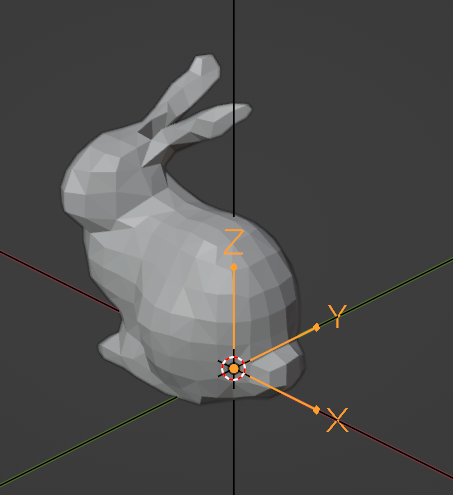

IFC products may have multiple geometric representations, positioned relative
to the **Object Placement**. For example, a door might have a 3D body of a
"closed door" as one geometric representation, a 2D linework of an "open door"
intended to be shown in a plan, a 3D box showing the clearance of the door for
disabled access, and 3D dashed linework showing the hinge and swing of a door
in an elevation or section.  Of course, you might not want to see all this
geometry at the same time. What you see depends on the context you are viewing
the door in.

For this reason, each one of these geometric representations is called a
**Representation**. Each **Representation** belongs to a **Representation
Context**. The **Representation Context** determines how the **Representation**
is intended to be viewed. For example, a "2D Plan View" might be a
**Representation Context**. This allows the user to choose to see the
appropriate **Representation**.

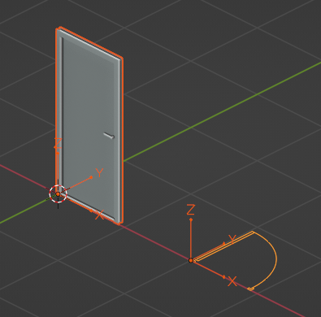

A **Representation** contains one or more **Representation Items**. Each
**Representation Item** could be an extrusion, a mesh, a surface, a curve, and
so on depending on the type of geometric modeling technique. Techniques cannot
be mixed, so a single **Representation** may be made out of multiple extrusion
**Items** but cannot have both extrusions and meshes.

Objects may also have the concept of **Types** and **Material Sets** that
inform their shape. For example, if a light fixture **Type** has a
**Representation**, all occurrences of that light fixture must have the exact
same **Representation**. This is called a **Mapped Representation**. Similarly,
if a wall **Type** has a **Material Set** defining layers and their
thicknesses, all wall occurrences of that wall **Type** must have the same
thickness (although the length of the wall may vary).  Alternatively, if a
column **Type** has a **Material Set** defining a cross sectional profile, then
all occurrences of that column type must have the same cross section (although
the height of the column may vary).

.. seealso::

    The vast majority of objects in the built environment use **Types** and
    **Material Sets**, such as slabs, walls, columns, beams, doors, windows,
    and furniture. For this reason, it is highly recommended to not just create
    **Representations** for individual objects, but first consider creating a
    **Type**. After you get a general understanding of **Representations**,
    please read the section on `Types and mapped representations`_, `Material
    layer sets`_, and `Material profile sets`_.

Project units
-------------

All coordinates in IFC are stored using project units. This means that prior to
creating **Object Placements** or **Representations** you have to define a
project length unit as a minimum.

Assuming you are creating a project from scratch with code, here is how you
might define units:

.. code-block:: python

    # You need a project before you can assign units.
    run("root.create_entity", model, ifc_class="IfcProject")

    # Let's say we want coordinates to be in millimeters.
    length = run("unit.add_si_unit", model, unit_type="LENGTHUNIT", prefix="MILLI")
    run("unit.assign_unit", model, units=[length])

    # Alternatively, you may specify without any arguments to automatically
    # create millimeters, square meters, and cubic meters as a convenience for
    # testing purposes. Sorry imperial folks, we prioritise metric here.
    run("unit.assign_unit", model)

Object placements
-----------------

The **Object Placement** describes **Location** and **Rotation**. The
**Location** is given as an XYZ coordinate, and the **Rotation** is given as
two vectors: a local X axis and a local Z axis vector. The local Y axis vector
is derived via a right-handed coordinate system. This means that the global X
axis points to "Project East", the global Y axis points to "Project North", and
the global Z axis points up (i.e. to the sky). This coordinate system is the
same system used in Blender.

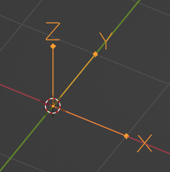

The recommended way to set an **Object Placement** is to specify the placement
as a 4x4 matrix. You can use the ``numpy`` library to create and edit matrices.
A 4x4 matrix looks like this:

.. code-block::

    1, 0, 0, 0
    0, 1, 0, 0
    0, 0, 1, 0
    0, 0, 0, 1

This type of matrix is known as the **Identity Matrix**. It represents no
translation (i.e. a location at the origin of ``0, 0, 0``) and no rotation
(i.e. the X axis is ``1, 0, 0``, the Y axis is ``0, 1, 0``, and the Z axis is
``0, 0, 1``). The numbers in the matrix correlate to the location and rotation
axes as follows:

.. code-block::

    XAxis_X, YAxis_X, ZAxis_X, X
    XAxis_Y, YAxis_Y, ZAxis_Y, Y
    XAxis_Z, YAxis_Z, ZAxis_Z, Z
    0,       0,       0,       1

Notice how the last line is always fixed to ``0, 0, 0, 1``. For example, here
is another matrix of an object at ``2, 3, 5`` that is rotated anti-clockwise by
90 degrees.

.. code-block::

    0, -1, 0, 2
    1,  0, 0, 3
    0,  0, 1, 5
    0,  0, 0, 1

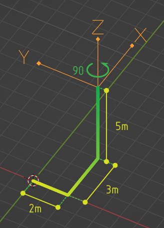

Here's how we might do the same operation with Python code:

.. code-block:: python

    import numpy

    # Create a wall. Our wall currently has no object placement or representations.
    wall = run("root.create_entity", model, ifc_class="IfcWall")

    # Create a 4x4 identity matrix. This matrix is at the origin with no rotation.
    matrix = numpy.eye(4)

    # Rotate the matix 90 degrees anti-clockwise around the Z axis (i.e. in plan).
    # Anti-clockwise is positive. Clockwise is negative.
    matrix = ifcopenshell.util.placement.rotation(90, "Z") @ matrix

    # Set the X, Y, Z coordinates. Notice how we rotate first then translate.
    # This is because the rotation origin is always at 0, 0, 0.
    matrix[:,3][0:3] = (2, 3, 5)

    # Set our wall's Object Placement using our matrix.
    # `is_si=True` states that we are using SI units instead of project units.
    run("geometry.edit_object_placement", model, product=wall, matrix=matrix, is_si=True)

Representation contexts
-----------------------

As an object may have multiple **Representations**, we need to use
**Representation Contexts** to distinguish the purpose and intended context of
each **Representation**.

A **Representation Context** is defined in terms of X paramters:

1. **Context Type**: 3D Model or 2D Plan
2. **Context Identifier**: The purpose of the **Representation**
3. **Target View**: The drafting convention of the **Representation**
4. **Target Scale**: The scale for the **representation** to be shown at

The **Context Type** must either be set to **Model** for 3D **Representations**
or **Plan** for 2D **Representations**.

The most common **Context Identifiers** you might use are:

- Body: for the actual physical shape of the object
- Box: the bounding box of the object (useful for shape analytics)
- Axis: the parametric line determining the shape of the object
- Profile: the elevation silhouette of the object, useful for cutting out holes
  for the object to fit into host elements
- Footprint: the plan view silhouette of the object, useful for certain
  quantity take-off rules
- Clearance: the clearance zone of the object
- Annotation: symbolic annotations typically used in diagrams or drawings

The most common **Target Views** you might use are:

- MODEL_VIEW: for general 3D geometry you might see in a BIM viewer or any
  generic fallback representation
- PLAN_VIEW: for 2D geometry you might see in a plan representation
- ELEVATION_VIEW: for 2D geometry you might see in an elevation representation
- SECTION_VIEW: for 2D geometry you might see in a section representation
- GRAPH_VIEW: for 2D or 3D line or frame or path connectivity diagrams you
  might use for structural frame analysis, axis-based parametric modeling
- SKETCH_VIEW: for viewing abstract high-level representations such as in
  bubble diagrams of spatial topology

The vast majority of the time, you will only be interested in using a 3D Body
MODEL_VIEW **Representation Context**.

.. code-block:: python

    # If we plan to store 3D geometry in our IFC model, we have to setup
    # a "Model" context.
    model3d = run("context.add_context", model, context_type="Model")

    # And/Or, if we plan to store 2D geometry, we need a "Plan" context
    plan = run("context.add_context", model, context_type="Plan")

    # Now we setup the subcontexts with each of the geometric "purposes"
    # we plan to store in our model. "Body" is by far the most important
    # and common context, as most IFC models are assumed to be viewable
    # in 3D.
    body = run("context.add_context", model,
        context_type="Model", context_identifier="Body", target_view="MODEL_VIEW", parent=model3d)

    # The 3D Axis subcontext is important if any "axis-based" parametric
    # geometry is going to be created. For example, a beam, or column
    # may be drawn using a single 3D axis line, and for this we need an
    # Axis subcontext.
    run("context.add_context", model,
        context_type="Model", context_identifier="Axis", target_view="GRAPH_VIEW", parent=model3d)

    # It's also important to have a 2D Axis subcontext for things like
    # walls and claddings which can be drawn using a 2D axis line.
    run("context.add_context", model,
        context_type="Plan", context_identifier="Axis", target_view="GRAPH_VIEW", parent=plan)

    # The 3D Box subcontext is useful for clash detection or shape
    # analysis, or even lazy-loading of large models.
    run("context.add_context", model,
        context_type="Model", context_identifier="Box", target_view="MODEL_VIEW", parent=model3d)

    # A 2D annotation subcontext for plan views are important for door
    # swings, window cuts, and symbols for equipment like GPOs, fire
    # extinguishers, and so on.
    run("context.add_context", model,
        context_type="Plan", context_identifier="Annotation", target_view="PLAN_VIEW", parent=plan)

    # You may also create 2D annotation subcontexts for sections and
    # elevation views.
    run("context.add_context", model,
        context_type="Plan", context_identifier="Annotation", target_view="SECTION_VIEW", parent=plan)
    run("context.add_context", model,
        context_type="Plan", context_identifier="Annotation", target_view="ELEVATION_VIEW", parent=plan)

Representations
---------------

Once you have an **Object Placement** and a **Representation Context**, you can
now create a **Representation**.

Each **Representations** must choose a geometry modeling technique. For
example, you may specify a mesh-like geometry, which uses vertices, edges, and
faces. Alternatively, you may specify 2D profiles extruded into solid shapes
and potentially having boolean voids and subtractions. You may even specify
single edges and linework without any surfaces or solids.  Representations may
even be single points, such as for survey points or structual point
connections.

After the **Representation** is created, you will need to assign the
**Representation** to the IFC object (e.g. wall, door, slab, etc). Here's the
general pattern in code:

.. code-block:: python

    # Let's create a new project using millimeters with a single furniture element at the origin.
    model = run("project.create_file")
    run("root.create_entity", model, ifc_class="IfcProject")
    run("unit.assign_unit", model)

    # We want our representation to be the 3D body of the element.
    # This representation context is only created once per project.
    # You must reuse the same body context every time you create a new representation.
    model3d = run("context.add_context", model, context_type="Model")
    body = run("context.add_context", model,
        context_type="Model", context_identifier="Body", target_view="MODEL_VIEW", parent=model3d)

    # Create our element with an object placement.
    element = run("root.create_entity", model, ifc_class="IfcFurniture")
    run("geometry.edit_object_placement", model, product=element)

    # Let's create our representation!
    # See below sections for examples on how to create representations.
    representation = ...

    # Assign our new body representation back to our element
    run("geometry.assign_representation", model, product=element, representation=representation)

Mesh representations
--------------------

Mesh **Representations** are specified in terms of a list of vertices, edges,
and faces. The faces may be triangles, quads, or n-gons. Faces may also contain
inner loops, or holes. Mesh **Representations** are most appropriately used for
complex shapes that only need to approximately represent physical products,
such as furniture or equipment, or flat, panellised design (e.g. triangulated
facade elements). Mesh **Representations** are also suitable for box-like
shapes that have bespoke indents, protrusions, TINs, textured, or as-built
geometry.

In IFC, meshes may be stored as **Faceted BReps**, **Tessellations**, or
**Triangulations** (specifically only for triangles).

.. code-block:: python

    # These vertices and faces represent a 2m square 1m high pyramid in SI units.
    # Note how they are nested lists. Each nested list represents a "mesh". There may be multiple meshes.
    vertices = [[(0.,0.,0.), (0.,2.,0.), (2.,2.,0.), (2.,0.,0.), (1.,1.,1.)]]
    faces = [[(0,1,2,3), (0,4,1), (1,4,2), (2,4,3), (3,4,0)]]
    representation = run("geometry.add_mesh_representation", model, context=body, vertices=vertices, faces=faces)

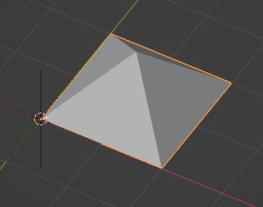

Wall representations
--------------------

Wall-like **Representations** are simple blocks with a length, height, and
thickness. They are most appropriately used for walls, insulation, bulkhead
ends, cladding, and other uniformly thick blocks that extend along an imaginary
2D line in the XY plane.

.. note::

    Even though the function is named ``add_wall_representation``, you may use
    this geometry for any element, not just walls.

.. code-block:: python

    # A wall-like representation, 5 meters long, 3 meters high, and 200mm thick
    representation = run("geometry.add_wall_representation", model,
        context=body, length=5, height=3, thickness=0.2)

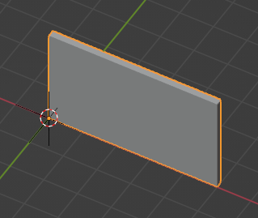

A wall-like **Representation** always starts at the **Object Placement** and
runs along the local +X axis. The thickness is always along the local Y axis.
This means that if you want the wall-like object to start and end at a
particular point, you have to set the **Object Placement** location and
rotation as appropriate. This can be done using the API:

.. code-block:: python

    # A wall-like representation starting and ending at a particular 2D point
    representation = run("geometry.create_2pt_wall", model,
        element=element, context=body, p1=(1., 1.), p2=(3., 2.), elevation=0, height=3, thickness=0.2)

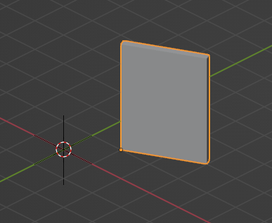

Profile representations
-----------------------

Profile-based **Representations** are defined by a 2D profile in the XY plane
which is then extruded in the +Z direction. They are most appropriately used
for slabs, columns, beams, and other structural members.

The 2D profile may be defined as an arbitrary curve, or as a parameterised
shape (e.g. a circle defined by a center and a radius). Arbitrary curves are
typically used for objects like slabs, cornices, or country-specific
cold-rolled steel, whereas parameterised shapes (circles, rectangles, I-shapes,
C-shapes, Z-shapes) are typically used for objects like columns and beams and
hot-rolled steel.

Where possible, it is recommended to use parameterised profiles that are named
after the structural cross section naming standard (e.g. structural steel
standard names) in your country.

.. code-block:: python

    # Rectangles (or squares) are typically used for concrete columns and beams
    profile = model.create_entity("IfcRectangleProfileDef", ProfileName="600x300", ProfileType="AREA",
        XDim=600, YDim=300)

    # Rectangle profiles may be rounded
    profile = model.create_entity("IfcRoundedRectangleProfileDef", ProfileName="600x300r100", ProfileType="AREA",
        XDim=600, YDim=300, RoundingRadius=100)

    # Rectangle profiles may be hollow and optionally rounded as well. The radius parameters are optional.
    # These are typically used for rectangular or square hollow steel sections.
    profile = model.create_entity("IfcRectangleHollowProfileDef", ProfileName="200x100RHS", ProfileType="AREA",
        XDim=200, YDim=100, WallThickness=5, InnerFilletRadius=5, OuterFilletRadius=10)

    # Circles are typically used for concrete columns
    profile = model.create_entity("IfcCircleProfileDef", ProfileName="300C", ProfileType="AREA",
        Radius=300)

    # Hollow circular profiles are typically used for steel members
    profile = model.create_entity("IfcCircleHollowProfileDef", ProfileName="300CHS", ProfileType="AREA",
        Radius=150, WallThickness=5)

    # Ellipses aren't common but may be used.
    profile = model.create_entity("IfcEllipseProfileDef", ProfileName="300E", ProfileType="AREA",
        SemiAxis1=300, SemiAxis2=200)

    # I-shapes are typically used in hot-rolled or welded steel. FilletRadius onwards is optional.
    profile = model.create_entity("IfcIShapeProfileDef", ProfileName="I-EXAMPLE", ProfileType="AREA",
        OverallWidth=100, OverallDepth=200, WebThickness=10, FlangeThickness=15, FilletRadius=10)

    # L-shapes are typically used in hot rolled steel. FilletRadius onwards is optional.
    profile = model.create_entity("IfcLShapeProfileDef", ProfileName="L-EXAMPLE", ProfileType="AREA",
        Depth=75, Width=75, Thickness=10, FilletRadius=10, EdgeRadius=5, LegSlope=0)

    # T-shapes are typically used in hot rolled steel. FilletRadius onwards is optional.
    profile = model.create_entity("IfcTShapeProfileDef", ProfileName="T-EXAMPLE", ProfileType="AREA",
        Depth=150, FlangeWidth=100, WebThickness=10, FlangeThickness=15, FilletRadius=10,
        FlangeEdgeRadius=5, WebEdgeRadius=5, WebSlope=0, FlangeSlope=0)

    # U-shapes are typically used in hot rolled steel. FilletRadius onwards is optional.
    profile = model.create_entity("IfcUShapeProfileDef", ProfileName="U-EXAMPLE", ProfileType="AREA",
        Depth=200, FlangeWidth=100, WebThickness=5, FlangeThickness=10,
        FilletRadius=5, EdgeRadius=5, FlangeSlope=0)

    # Z-shapes are typically used in hot rolled steel. FilletRadius onwards is optional.
    profile = model.create_entity("IfcZShapeProfileDef", ProfileName="Z-EXAMPLE", ProfileType="AREA",
        Depth=100, FlangeWidth=50, WebThickness=5, FlangeThickness=10, FilletRadius=5, EdgeRadius=5)

    # C-shapes are typically used in cold rolled steel
    profile = model.create_entity("IfcCShapeProfileDef", ProfileName="C-EXAMPLE", ProfileType="AREA",
        Depth=150, Width=75, WallThickness=1.5, Girth=30, InternalFilletRadius=5)

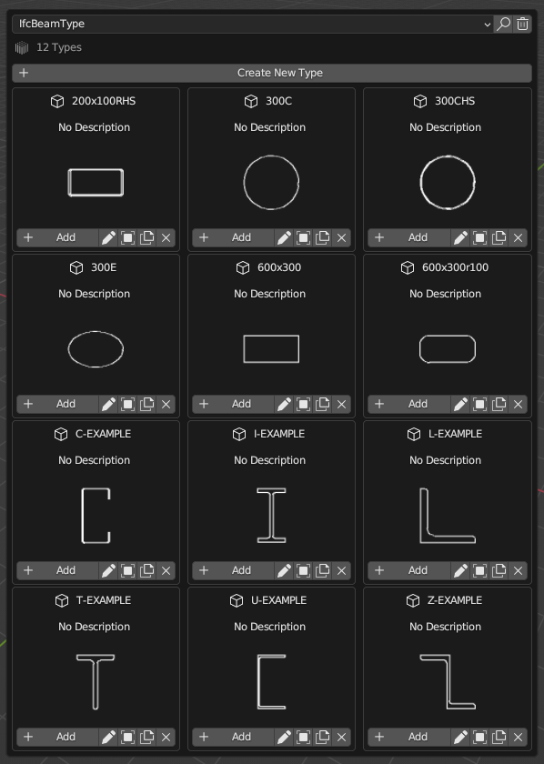

Alternatively, you may specify a custom arbitrary profile. Arbitrary profile
curves are most easily defined using a polyline. The polyline may have straight
segments and arc segments. Arcs are defined as 3-point arcs (start, mid, and
end). The arc points define the starting index (counting from 1) of any
optional arcs. Profiles may also have inner curves to represent voids.

.. code-block:: python

    builder = ifcopenshell.util.shape_builder.ShapeBuilder(model)
    outer_curve = builder.polyline([(0.,0.), (100.,0.), (100.,50.), (51.2,98.7), (18.5,105.3), (0.,77.5)],
        arc_points=[4], closed=True)
    inner_curve = builder.circle((50.,50.), radius=10.)
    profile = builder.profile(outer_curve, inner_curves=[inner_curve], name="Arbitrary")

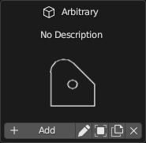

Once you have created your profile, you can add a representation which uses
that profile as its cross section. Profiles are always extruded in the +Z
direction. So if you want to have a beam, you will need to rotate the **Object
Placement** to place the element on its side.

.. code-block:: python

    # A profile-based representation, 1 meter long
    representation = run("geometry.add_profile_representation", model, context=body, profile=profile, depth=1)

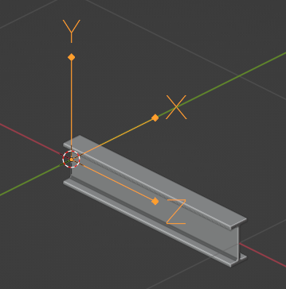

Custom representations
----------------------

You may also create your own solid by creating multiple custom profiles,
extruding them into solids, then combining the solids into your own shapes. For
example, a table may be formed by 5 rectangular extrusions: one for the table
top, and 4 table legs. This can be done using the shape builder utility module.

The standard approach is:

1. Define at least one 2D outer curve and optional inner curves (for holes).
2. Optionally convert your outer and optional inner curves into a profile. This
   is only necessary if you want to give your profile a name (so that you may
   reuse it and manage it in a profile library) or if you have inner curves.
3. Optionally extrude your profile into a solid. If you are creating 2D
   representations, then extrusion is not necessary.
4. Optionally move your extruded solid into your desired location through
   translation, rotation, or mirroring.
5. Convert all your extruded solids (or just curves, if 2D) into a
   **Representation** with a **Representation Context**.

Here is an example which generates a parametric table.

.. code-block:: python

    # The shape_builder module depends on mathutils
    from ifcopenshell.util.shape_builder import V

    builder = ifcopenshell.util.shape_builder.ShapeBuilder(model)

    # Parameters to define our table
    width = 1200
    depth = 700
    height = 750
    leg_size = 50.0
    thickness = 50.0

    # Extrude a rectangle profile for the tabletop
    rectangle = builder.rectangle(size=V(width, depth))
    tabletop = builder.extrude(builder.profile(rectangle), thickness, V(0, 0, height - thickness))

    # Create a table leg curve, mirror it along two axes, and extrude.
    leg_curve = builder.rectangle(size=V(leg_size, leg_size))
    legs_curves = [leg_curve] + builder.mirror(
        leg_curve,
        mirror_axes=[V(1, 0), V(0, 1), V(1, 1)],
        mirror_point=V(width / 2, depth / 2),
        create_copy=True,
    )
    legs_profiles = [builder.profile(leg) for leg in legs_curves]
    legs = [builder.extrude(leg, height - thickness) for leg in legs_profiles]

    # Shift our table such that the object origin is in the center.
    items = [tabletop] + legs
    shift_to_center = V(-width / 2, -depth / 2)
    builder.translate(items, shift_to_center.to_3d())

    # Create a body representation
    body = ifcopenshell.util.representation.get_context(model, "Model", "Body", "MODEL_VIEW")
    representation = builder.get_representation(context=body, items=items)

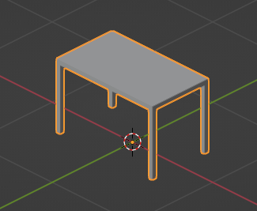

Another really common case for using the shape builder is when creating
**Representations** of reinforcement bars, cables, or circular railings. IFC
has a special type of extrusion specifically for extruding a disk (i.e. circle)
along a path. This should almost always be used for usecases like reinforcement
bar.

.. code-block:: python

    builder = ifcopenshell.util.shape_builder.ShapeBuilder(model)

    # Sweep a 10mm radius disk along a polyline with a couple of straight segments and an arc.
    curve = builder.polyline(
        [(0., 0., 0.), (100., 0., 0.), (171., 29., 0.), (200., 100., 0.), (200., 200., 0.)],
        arc_points=[2])
    swept_curve = builder.create_swept_disk_solid(curve, 10)

    # Create a body representation
    body = ifcopenshell.util.representation.get_context(model, "Model", "Body", "MODEL_VIEW")
    representation = builder.get_representation(body, swept_curve)

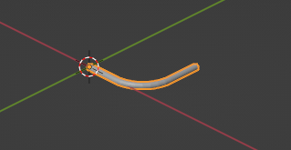

For more information, consult the :doc:`shape builder documentation
<autoapi/ifcopenshell/util/shape_builder/index>`.

Manual representations
----------------------

Although IfcOpenShell provides many convenience functions and utility modules,
you may wish to disregard this and manually create each IFC class yourself.
This is generally not recommended but is useful as an educational exercise or
if you want to create a particularly bespoke shape that IfcOpenShell does not
have a convenience function for yet. You will be required to have a detailed
understanding of IFC geometry which is explained in the IFC documentation.

Here is an example of manually creating a simple extruded rectangle.

.. code-block:: python

    rectangle = model.createIfcRectangleProfileDef(ProfileType="AREA", XDim=500, YDim=250)
    direction = model.createIfcDirection((0., 0., 1.))
    extrusion = model.createIfcExtrudedAreaSolid(SweptArea=rectangle, ExtrudedDirection=direction, Depth=1000)
    body = ifcopenshell.util.representation.get_context(model, "Model", "Body", "MODEL_VIEW")
    representation = model.createIfcShapeRepresentation(
        ContextOfItems=body, RepresentationIdentifier="Body", RepresentationType="SweptSolid", Items=[extrusion])

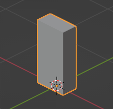

Types and mapped representations
--------------------------------

Very often, the **Representation** of a type is exactly the same for all of its
occurrences. For example, all furniture, equipment (pumps, valves, dampers,
etc) occurrences will be exactly the same.

In this scenario, the **Representation** should be assigned to the type. Each
of the occurrences will then use a **Mapped Representation**. This is both
efficient and implies that the type is interchangable (e.g. for maintenance).

.. code-block:: python

    # Create our element type. Types do not have an object placement.
    element_type = run("root.create_entity", model, ifc_class="IfcFurnitureType")

    # Let's create our representation!
    # See above sections for examples on how to create representations.
    representation = ...

    # Assign our representation to the element type.
    run("geometry.assign_representation", model, product=element_type, representation=representation)

    # Create our element occurrence with an object placement.
    element = run("root.create_entity", model, ifc_class="IfcFurniture")
    run("geometry.edit_object_placement", model, product=element)

    # Assign our furniture occurrence to the type.
    # That's it! The representation will automatically be mapped!
    run("type.assign_type", model, related_object=element, relating_type=element_type)

Material layer sets
-------------------

If a type has a material layer set, it implies that all occurrences of that
type must use the same material layer set. For example, if a wall type has
multiple material layers adding up to a thickness of 100mm, then all walls of
that wall type must be exactly 100mm thick. The height, length, angle or
curvature of the wall may vary, but the thickness may not.

Because only the thickness is fixed, you are still responsible for creating the
representation of walls yourself. IfcOpenShell will not check whether or not
your representation complies with the thickness constraint, so it is your
responsibility to make sure the geometry is correct.

.. code-block:: python

    # Let's imagine a wall type called WAL01 using a material layer set.
    wall_type = ifcopenshell.api.run("root.create_entity", model, ifc_class="IfcWallType", name="WAL01")

    # First, let's create a material set. This will later be assigned to our wall type element.
    material_set = ifcopenshell.api.run("material.add_material_set", model,
        name="GYP-ST-GYP", set_type="IfcMaterialLayerSet")

    # Let's create a few materials.
    gypsum = ifcopenshell.api.run("material.add_material", model, name="PB01", category="gypsum")
    steel = ifcopenshell.api.run("material.add_material", model, name="ST01", category="steel")

    # Create 3 layers for a steel studded plasterboard wall.
    layer = ifcopenshell.api.run("material.add_layer", model, layer_set=material_set, material=gypsum)
    ifcopenshell.api.run("material.edit_layer", model, layer=layer, attributes={"LayerThickness": 13})
    layer = ifcopenshell.api.run("material.add_layer", model, layer_set=material_set, material=steel)
    ifcopenshell.api.run("material.edit_layer", model, layer=layer, attributes={"LayerThickness": 92})
    layer = ifcopenshell.api.run("material.add_layer", model, layer_set=material_set, material=gypsum)
    ifcopenshell.api.run("material.edit_layer", model, layer=layer, attributes={"LayerThickness": 13})

    # Great! Let's assign our material set to our wall type.
    ifcopenshell.api.run("material.assign_material", model, product=wall_type, material=material_set)

    # Now, let's create a wall at the origin.
    wall = ifcopenshell.api.run("root.create_entity", model, ifc_class="IfcWall")
    ifcopenshell.api.run("geometry.edit_object_placement", model, product=wall)

    # The wall is a WAL01 wall type. The material layer set is inherited.
    ifcopenshell.api.run("type.assign_type", model, related_object=wall, relating_type=wall_type)

    # It's now our responsibility to create a compatible representation.
    # Notice how our thickness of 0.118 must equal .013 + .092 + .013 from our type
    body = ifcopenshell.util.representation.get_representation(element, "Model", "Body")
    representation = ifcopenshell.api.run("geometry.add_wall_representation", model,
        context=body, length=5, height=3, thickness=0.118)

    # Assign our new body geometry back to our wall
    ifcopenshell.api.run("geometry.assign_representation", model, product=wall, representation=representation)

Material profile sets
---------------------

If a type has a material profile set, it implies that all occurrences of that
type must use the same material profile set. For example, if a beam type has a
material profile of an "I-shape", then all beams of that beam type must use
that exact same I-shape profile. The length, angle or curvature of the beam may
vary, but the cross sectional profile may not.

Because only the profile is fixed, you are still responsible for creating the
representation of walls yourself. IfcOpenShell will not check whether or not
your representation complies with the profile constraint, so it is your
responsibility to make sure the geometry is correct.

.. code-block:: python

    # Let's imagine we have a steel I-beam type called B1.
    beam_type = ifcopenshell.api.run("root.create_entity", model, ifc_class="IfcBeamType", name="B1")

    # First, let's create a material set. This will later be assigned to our beam type element.
    material_set = ifcopenshell.api.run("material.add_material_set", model,
        name="B1", set_type="IfcMaterialProfileSet")

    # Create a steel material.
    steel = ifcopenshell.api.run("material.add_material", model, name="ST01", category="steel")

    # Create an I-beam profile curve. Notice how we use standardised steel profile names.
    hea100 = model.create_entity(
        "IfcIShapeProfileDef", ProfileName="HEA100", ProfileType="AREA",
        OverallWidth=100, OverallDepth=96, WebThickness=5, FlangeThickness=8, FilletRadius=12,
    )

    # Define that steel material and cross section as a single profile item. If
    # this were a composite beam, we might add multiple profile items instead,
    # but this is rarely the case in most construction.
    ifcopenshell.api.run("material.add_profile", model, profile_set=material_set, material=steel, profile=hea100)

    # Great! Let's assign our material set to our beam type.
    ifcopenshell.api.run("material.assign_material", model, product=beam_type, material=material_set)

    # Now, let's create a beam at the origin.
    beam = ifcopenshell.api.run("root.create_entity", model, ifc_class="IfcBeam")
    ifcopenshell.api.run("geometry.edit_object_placement", model, product=beam)

    # The beam is a B1 beam type. The material profile set is inherited.
    ifcopenshell.api.run("type.assign_type", model, related_object=beam, relating_type=beam_type)

    # It's now our responsibility to create a compatible representation.
    # Notice how we reuse our profile instead of creating a new profile.
    body = ifcopenshell.util.representation.get_representation(element, "Model", "Body")
    representation = run("geometry.add_profile_representation", model, context=body, profile=hea100, depth=1)

    # Assign our new body geometry back to our beam
    ifcopenshell.api.run("geometry.assign_representation", model, product=beam, representation=representation)
