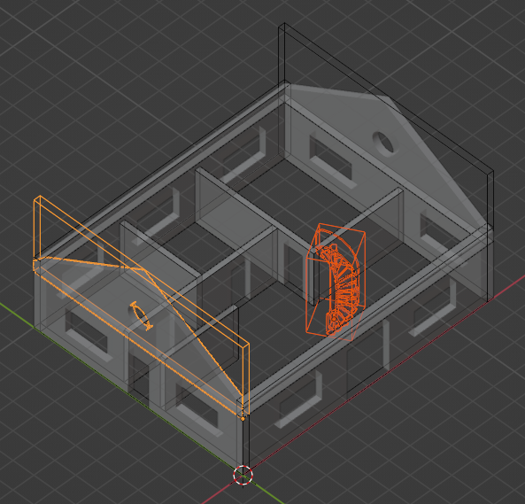

Geometry tree
=============

IfcOpenShell includes a utility to build trees of geometry and their bounding
boxes. Geometry trees can be used to efficiently select geometry or collide
geometry with one another.

The most efficient way to build a tree is by using the iterator. If the native
OpenCASCADE shape is added to the tree, a **UB Tree** is built.  Alternatively,
if triangulation is added to the tree, a **BVH Tree** is built. The type of
tree determines the type of operation you can perform.

.. code-block:: python

    import multiprocessing
    import ifcopenshell
    import ifcopenshell.geom

    tree = ifcopenshell.geom.tree()
    settings = ifcopenshell.geom.settings()
    iterator = ifcopenshell.geom.iterator(settings, ifc_file, multiprocessing.cpu_count())
    if iterator.initialize():
        while True:
            # Use triangulation to build a BVH tree
            tree.add_element(iterator.get())

            # Alternatively, use this code to build an unbalanced binary tree
            # tree.add_element(iterator.get_native())

            if not iterator.next():
                break

Clashing or selecting geometry from a geometry tree
---------------------------------------------------

With a **BVH Tree**, you can efficiently clash sets of elements with other
elements.  You can find elements that intersect, collide, or are within a
clearance distance threshold of one another. There are three methods you can
use to clash elements in the tree. Each function collides one set of elements
with another set of elements.

- `Detecting intersection clashes between elements`_ detects when an element intersects with another
  element. This is the most common type of clash detection used when
  coordinating designs. For example, you might want to know if any pipes go
  through structural columns or beams.
- `Detecting collision clashes between elements`_ detects when an element
  touches another element. It is the fastest type of clash detection but does
  not consider the distance that an element goes inside another element. This
  considers surfaces only so it works on non-manifold geometry but will not
  detect if an element is completely within another element.
- `Detecting clearance clashes between elements`_ detects when an element comes
  near to another element within a clearance threshold. This is the slowest
  type of clash detection. It works on non-manifold geometry and does not
  consider inside vs outside. Elements like pipe and ducts with insulation,
  structural openings, and equipment will typically require clearance checks.

With a **UB Tree**, you can efficiently select geometry by specifying a point,
radius, or bounding box. There are three methods you can use to select elements
in the tree.

- `Selecting elements using bounding boxes`_ lets you query for elements that
  contain a point or another element. However, it only checks the bounding box
  of elements instead of their exact geometry. This is the fastest approach and
  is recommended if you don't need precise geometry selection.
- `Selecting elements using precise geometry`_ lets you query for elements that
  contain a point, a sphere, or another element. This is similar to selecting
  using bounding boxes, but additionally considers the actual geometry of the
  element. This is slower but more precise.
- `Selecting elements using a ray`_ lets you query for elements that intersect
  with a ray.

Detecting intersection clashes between elements
-----------------------------------------------

``clash_intersection_many`` detects when an element intersects with or is
contained within another element.

.. code-block:: python

    clashes = tree.clash_intersection_many(
        group_a_elements, # e.g. from model.by_type("IfcWall")
        group_b_elements, # Group b can be the same as group a if you want to clash within a single set
        tolerance=0.002, # Any protrusions less than 2mm are ignored
        check_all=True, # Keep on checking all potential intersections to find a worst case protrusion distance
    )

    for clash in clashes:
        # Get the two elements that clash and their metadata
        element1 = clash.a
        element2 = clash.b
        a_global_id = element1.get_argument(0)
        b_global_id = element2.get_argument(0)
        a_ifc_class = element1.is_a()
        b_ifc_class = element2.is_a()
        a_name = element1.get_argument(2)
        b_name = element2.get_argument(2)

        # Potential clash types that can be detected are protrusions, pierces, and collisions
        clash_type = ["protrusion", "pierce", "collision", "clearance"][clash.clash_type],

        # P1 and P2 represents two XYZ coordinates. The meaning of the coordinate depends on the clash type.
        p1 = list(clash.p1)
        p2 = list(clash.p2)

        # This represents the protrusion or piercing distance in meters.
        # It is also the distance between P1 and P2.
        distance = clash.distance

If you specify a ``tolerance`` value, intersections with a protrusion distance
smaller than this tolerance are excluded. It is recommended to specify a
non-zero tolerance to distinguish between when elements merely touch (e.g. a
GPO on a wall) versus if they are truly intersecting (e.g. a pipe going through
a beam).

If ``check_all`` is ``False``, the clash check will return as soon as an
intersection is found. This is faster but may not return the worst-case
protrusion distance. If you are not interested in the protrusion distance, it
is recommended to set this to ``False``. If you want the protrusion distance,
such as to prioritise which clashes are more severe, set this to ``True``.

This includes:

1. When an element X protrudes inside element Y, where element Y is manifold.
   In this case, a protrusion distance is calculated as the deepest point of
   element X to the closest surface of element Y. ``P1`` is defined as the XYZ
   coordinate on element X, and ``P2`` is defined as the nearest point on the
   surface of element Y.
2. When an element X pierces element Y, such that an edge of element X enters
   element Y and leaves through another face. In this case, a piercing distance
   is calculated as the distance where that edge is inside element Y. ``P1`` is
   defined as the point on an edge of element X which enters element Y, and
   ``P2`` is the point where that edge leaves element Y.
3. When neither X or Y is manifold, we cannot detect protrusion or piercing, so
   instead when X and Y have any touching face. This is the same as the
   ``clash_collision_many`` check below. The distance is considered to be zero
   and ignores your specified tolerance. ``P1`` and ``P2`` are equal and
   represent an arbitrary XYZ point where the two elements touch.

Detecting collision clashes between elements
--------------------------------------------

``clash_collision_many`` detects when the surface of an element collides with
another element. The surfaces may either merely touch (e.g. are coplanar) or
intersect.

.. code-block:: python

    clashes = tree.clash_collision_many(
        group_a_elements, # e.g. from model.by_type("IfcWall")
        group_b_elements, # Group b can be the same as group a if you want to clash within a single set
        allow_touching=True, # Include results where faces merely touch but do not intersect
    )

    for clash in clashes:
        # Get the two elements that clash and their metadata
        element1 = clash.a
        element2 = clash.b
        a_global_id = element1.get_argument(0)
        b_global_id = element2.get_argument(0)
        a_ifc_class = element1.is_a()
        b_ifc_class = element2.is_a()
        a_name = element1.get_argument(2)
        b_name = element2.get_argument(2)

        # P1 and P2 represents two possible arbitrary points where a collision is found.
        # P1 may or may not be equal to P2.
        p1 = list(clash.p1)
        p2 = list(clash.p2)

A collision between two surface triangles may be "touching" or "intersecting".
Two touching triangles may be coplanar or merely have a single edge or vertex
touching the other triangle. An intersecting triangle will have at least one
edge that goes through the other triangle.

Detecting clearance clashes between elements
--------------------------------------------

``clash_clearance_many`` detects with the surface of an element comes within a
clearance distance threshold of another element.

.. code-block:: python

    clashes = tree.clash_clearance_many(
        group_a_elements, # e.g. from model.by_type("IfcWall")
        group_b_elements, # Group b can be the same as group a if you want to clash within a single set
        clearance=0.1, # Any surface closer than than 100mm is a clash
        check_all=False, # Stop measuring distances once the first clearance violation is found per element.
    )

    for clash in clashes:
        # Get the two elements that clash and their metadata
        element1 = clash.a
        element2 = clash.b
        a_global_id = element1.get_argument(0)
        b_global_id = element2.get_argument(0)
        a_ifc_class = element1.is_a()
        b_ifc_class = element2.is_a()
        a_name = element1.get_argument(2)
        b_name = element2.get_argument(2)

        # P1 and P2 represents the two XYZ coordinates between element1 and element2.
        p1 = list(clash.p1)
        p2 = list(clash.p2)

        # This represents the distance between element1 and element2 that is less than the clearance.
        # It is the distance between P1 and P2. It cannot be less than 0.
        distance = clash.distance

You cannot specify a ``clearance`` less than 0.

If ``check_all`` is ``False``, the clash check will return as soon as a
clearance violation is found. This is faster but may not return the worst-case
distance. If you only interested whether there is a clearance issue, it is
recommended to set this to ``False``. If you want the exact worst case
clearance distance, such as to prioritise which clashes are more severe, set
this to ``True``.

Selecting elements using bounding boxes
---------------------------------------

Elements may be queried using an axis aligned bounding box. An axis aligned
bounding box is the bounding box using global XYZ axes, not the element's local
XYZ axes. If you have a vertical construction project, this means that your
model should be oriented to project north to get the best results.

You may select all elements that have a bounding box containing the point with
XYZ coordinates of ``(0., 0., 0.)``.

.. code-block:: python

    # This will return a list of elements.
    # E.g.: [#66=IfcFurniture('3I53aQSFrFhRRaMHWNp8pD', ...), #96=IfcFurniture('0t5avJ3o956wj73wyBw0nO', ...)]
    elements = tree.select_box((0., 0., 0.))

.. note::

    All coordinates and length arguments must be specified in meters.

You may select all elements based on another element's bounding box. It will
return:

1. The queried element itself (i.e. a wall in this example)
2. Any elements fully contained by the wall
3. Any elements fully containing the wall
4. Any elements intersecting the wall

.. code-block:: python

    wall = ifc_file.by_type("IfcWall")[0]
    elements = tree.select_box(wall)

You may also select elements that are completely within another element's
bounding box. It will return:

1. The queried element itself (i.e. a wall in this example)
2. Any elements fully contained by the wall

.. code-block:: python

    elements = tree.select_box(wall, completely_within=True)

    # Alternatively, you may also specify an extension to dilate the bounding
    # box of the wall.
    elements = tree.select_box(wall, completely_within=True, extend=5.)

Selecting elements using precise geometry
-----------------------------------------

You may select all elements that have geometry containing the point with XYZ
coordinates of ``(0., 0., 0.)``.

.. code-block:: python

    elements = tree.select((0., 0., 0.))

.. note::

    All coordinates and length arguments must be specified in meters.

You may also select all elements that have geometry intsecting with a sphere,
represented by a centerpoint and a radius. This will return:

1. Any elements fully contained by the sphere
2. Any elements intersecting the sphere

.. code-block:: python

    # This extension is also in meters.
    elements = tree.select((0., 0., 0.), extend=5.)

You may select all elements based on another element's geometry. It will
return:

1. The queried element itself (i.e. a wall in this example)
2. Any elements fully contained by the wall
3. Any elements fully containing the wall
4. Any elements intersecting the wall

.. code-block:: python

    wall = ifc_file.by_type("IfcWall")[0]
    elements = tree.select(wall)

You may also select elements that are completely within another element's
geometry. It will return:

1. The queried element itself (i.e. a wall in this example)
2. Any elements fully contained by the wall

.. code-block:: python

    elements = tree.select(wall, completely_within=True)

    # Alternatively, you may also specify an extension to dilate the geometry
    # of the wall.
    elements = tree.select(wall, completely_within=True, extend=5.)

Selecting elements using a ray
------------------------------

You may select all elements that intersect with a ray. A ray is not infinite,
but instead must have a length. The default length is 1000 meters.

This returns a list of ray intersection results, which contain information
about the element it intersects with along with the point of intersection. This
may mean that the same element is returned multiple times if it intersects
multiple times.

.. code-block:: python

    origin = (0., 0., 0.)
    direction = (1., 0., 0.)
    results = tree.select_ray(origin, direction, length=5.)

    for result in results:
        print(ifc_file.by_id(result.instance.id())) # The element the ray intersects with
        print(list(result.position)) # The XYZ intersection point
        print(result.distance) # The distance between the ray origin and the intersection
        print(list(result.normal)) # The normal of the face being intersected
        print(result.dot_product) # The dot product of the face being intersected with the ray
