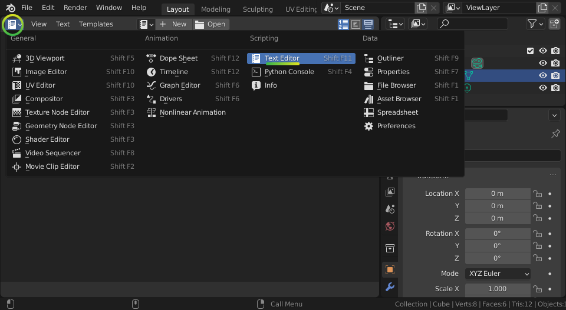
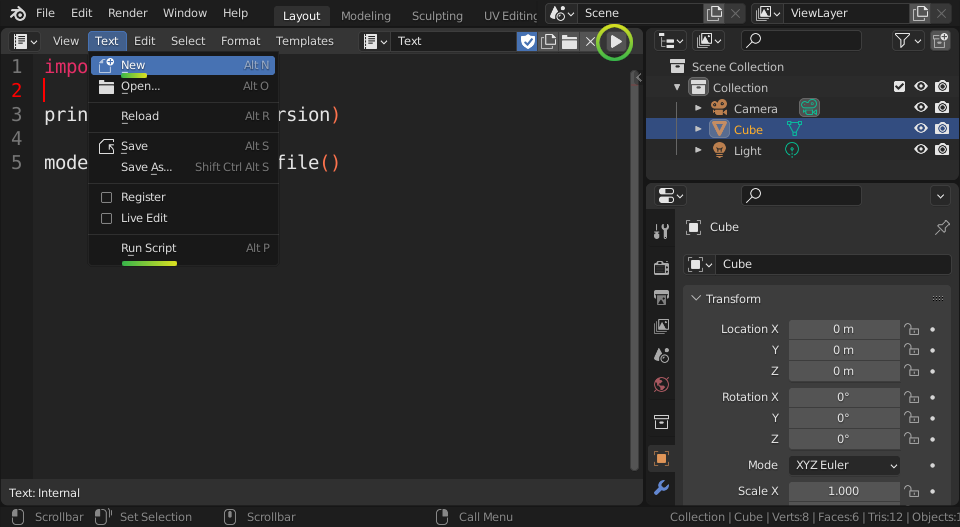

Installation
============

There are different methods of installation, depending on your situation. If
you aren't sure which to choose, if you're a programmer, go for **PyPI** if you
use Pip, otherwise go for the **ZIP packages**. If you aren't a programmer, go
for the **BlenderBIM Add-on**.

1. **PyPI** is recommended for developers using Pip.
2. **ZIP packages** is recommended for users doing a manual installation.
3. **Conda** is recommended for developers using Anaconda.
4. **Docker** is recommended for developers using Docker.
5. **AWS Lambda** is recommended for developers using AWS Lambda functions.
6. **Google Colab** is recommended for developers using Google Colab.
7. **Web Assembly** is recommended for developers experimenting with IfcOpenShell on the web.
8. **Using the BlenderBIM Add-on** is recommended for non-developers wanting a graphical interface.
9. **From source with precompiled binaries** is recommended for developers actively working with the Python code.
10. **Compiling from source** is recommended for developers actively working with the C++ core.

PyPI
----

.. code-block::

    pip install ifcopenshell

ZIP packages
------------

1. Choose which version to download based on your operating system, Python
   version, and computer architecture.

   +-------------+---------------------------------+-------------------------------+-------------------------------+---------------------------------+-----------------------------------+
   |             | Linux 64bit                     | Windows 32bit                 | Windows 64bit                 | MacOS Intel 64bit               | MacOS Silicon 64bit               |
   +=============+=================================+===============================+===============================+=================================+===================================+
   | Python 3.9  | :ios_python_url:`py39-linux64`  | :ios_python_url:`py39-win32`  | :ios_python_url:`py39-win64`  | :ios_python_url:`py39-macos64`  | :ios_python_url:`py39-macosm164`  |
   +-------------+---------------------------------+-------------------------------+-------------------------------+---------------------------------+-----------------------------------+
   | Python 3.10 | :ios_python_url:`py310-linux64` | :ios_python_url:`py310-win32` | :ios_python_url:`py310-win64` | :ios_python_url:`py310-macos64` | :ios_python_url:`py310-macosm164` |
   +-------------+---------------------------------+-------------------------------+-------------------------------+---------------------------------+-----------------------------------+
   | Python 3.11 | :ios_python_url:`py311-linux64` | :ios_python_url:`py311-win32` | :ios_python_url:`py311-win64` | :ios_python_url:`py311-macos64` | :ios_python_url:`py311-macosm164` |
   +-------------+---------------------------------+-------------------------------+-------------------------------+---------------------------------+-----------------------------------+
   | Python 3.12 | :ios_python_url:`py312-linux64` | :ios_python_url:`py312-win32` | :ios_python_url:`py312-win64` | :ios_python_url:`py312-macos64` | :ios_python_url:`py312-macosm164` |
   +-------------+---------------------------------+-------------------------------+-------------------------------+---------------------------------+-----------------------------------+

2. Unzip the downloaded file and copy the ``ifcopenshell`` directory into your
   Python path. If you're not sure where your Python path is, run the following
   code in Python:

   .. code-block:: python

      import sys
      print(sys.path)

   This will give you a list of possible directories that you can install the
   IfcOpenShell module into. Most commonly, you will want to copy the
   ``ifcopenshell`` directory into one of these called ``site-packages``.

3. Test importing the module in a Python session or script to make sure it works.

   .. code-block:: python

      import ifcopenshell
      print(ifcopenshell.version)
      model = ifcopenshell.file()

Conda
-----

.. code-block::

    # To install the latest daily build of IfcOpenShell (recommended)
    conda install -c ifcopenshell -c conda-forge ifcopenshell
    # Alteratively, to install an older, stable version
    conda install -c conda-forge ifcopenshell
    # If you want to install additional packages that rely on occt, you should install them at the same time into a fresh environment
    conda create -n testenv -c conda-forge ifcopenshell pythonocc-core

.. note::

    Installing IfcOpenShell from Conda will also install IfcConvert. Conda also
    supports Linux AArch64.

.. note::

    If you plan on using any other packages using `occt` (OpenCascade) you will need to ensure that
    the `occt` version installed by `ifcopenshell` is compatible with the other packages.
    A common error when using two packages compiled with different `occt` versions are
    `ImportError: cannot import name 'V3d' from 'OCC'`. To avoid this, you should install
    both packages at the same time and let conda resolve the common occt version. Here is an
    example where `ifcopenshell` and `pythonocc-core` are installed in the same environment `testenv`
    `conda create -n testenv -c conda-forge ifcopenshell pythonocc-core`

.. warning::

    Conda builds are not yet available for Mac ARM devices (M1 chip). Instead,
    please follow the instructions for the Pre-built packages or PyPI sections
    above.

Docker
------

.. code-block:: bash

    docker run -it aecgeeks/ifcopenshell python3 -c 'import ifcopenshell; print(ifcopenshell.version)'

.. note::

    Installing IfcOpenShell from Docker will also install IfcConvert.

AWS Lambda
----------

This guide provides a Dockerfile and sample code to help you run an AWS Lambda
function written in Python and using the IfcOpenShell library.

This is only a superficial guide, in order to make this work for your usecase
you will need a good understanding of other AWS services like SQS, S3, API
Gateways, etc.

.. seealso::

    For more information on building lambda containers refer to the `AWS guide
    on working with Lambda container images
    <https://docs.aws.amazon.com/lambda/latest/dg/images-create.html>`__

1. Clone or download the `IfcOpenShell repository
   <https://github.com/ifcopenshell/ifcopenshell>`_.

2. Replace the sample Lambda function code in the `example_handler
   <https://github.com/IfcOpenShell/IfcOpenShell/blob/v0.8.0/aws/lambda/example_handler/__init__.py>`__
   directory with your own code.

3. Update the import path in the Dockerfile's `CMD instruction
   <https://github.com/IfcOpenShell/IfcOpenShell/blob/v0.8.0/aws/lambda/Dockerfile#L40>`__
   to match your Lambda function's handler function.

4. Edit the `requirements.txt
   <https://github.com/IfcOpenShell/IfcOpenShell/blob/v0.8.0/aws/lambda/requirements.txt>`__
   file and add any additional dependencies required by your Lambda function.

5. Build the Docker image:

   .. code-block:: bash

      docker build -t lambda-ifcopenshell .

6. Run the Docker container:

   .. code-block:: bash

      docker run lambda-ifcopenshell

7. Test lambda locally by following the `AWS guide on testing Lambda container
   images locally
   <https://docs.aws.amazon.com/lambda/latest/dg/images-test.html>`__.

8. Deploy to lambda. This is beyond the scope of this guide. Please refer to
   the AWS documentation. Some tools that could be useful are AWS
   CloudFormaton, AWS CDK, pulumi or terraform.

Google Colab
------------

The Google Colab environment is based on the distribution from PyPI, but lets
you run it in an online notebook without any local setup required. This is
great for educators and those wanting to try it out without control on their
local system.

`Click here
<https://colab.research.google.com/drive/1S9uZQvqXRpF1z6JTiKk79M1Ln63rHHIZ?usp=sharing>`__
to launch a simple notebook.

Web Assembly
------------

IfcOpenShell is available as technology preview to be run using WASM. This
allows you to run IfcOpenShell in a browser using pyodide. This implementation
is incredibly heavy and will incur a long load time, but once loaded, will give
you full access to the entire IfcOpenShell API.

`Click here <https://github.com/IfcOpenShell/wasm-preview>`__ to learn how to
use WASM.

Using the BlenderBIM Add-on
---------------------------

The BlenderBIM Add-on is a Blender based graphical interface to IfcOpenShell.
Other than providing a graphical IFC authoring platform, it also comes with
IfcOpenShell, its utilities, and a Python shell built-in. This means you don't
need to install Python first, and you also can compare your IfcOpenShell
scripting to what you see with a visual model viewer, or use a graphical
interface to access the IfcOpenShell utilities.

The BlenderBIM Add-on is available either as a stable build or a daily build.

1. Install the BlenderBIM Add-on by following the `BlenderBIM Add-on
   installation documentation
   <https://docs.bonsaibim.org/guides/installation.html>`_.

2. Launch Blender. On the top left of the Viewport panel, click the **Editor
   Type** icon to change the viewport into a **Python Console**.

   .. image:: blenderbim-python-console-1.png

3. Make sure you can import IfcOpenShell successfully with the following script.

   .. image:: blenderbim-python-console-2.png

.. tip::

   Before changing the **Editor Type** to a **Python Console**, you can click on
   the ``View > Area > Vertical Split`` menu which will divide your viewport.
   This allows you to write scripts next to the 3D view of a model.

Blender also comes with a text editor so you can write longer scripts.  Instead
of choosing the **Python Console**, choose the **Text Editor**.

You can now create a new text file for your script by clicking ``Text > New``,
and run your script using the **Text > Run Script** menu or by clicking on the
**Play Icon**.

.. seealso::

   You may be interested in learning how to graphically explore an IFC model in
   Blender.  This can help when learning how to write scripts as you can double
   check the results of your scripts with what you see in the graphical
   interface. `Read more
   <https://docs.bonsaibim.org/guides/exploring_an_ifc_model.html>`_.

From source with precompiled binaries
-------------------------------------

1. Clone or download the `IfcOpenShell repository
   <https://github.com/ifcopenshell/ifcopenshell>`_.

2. Place ``src/ifcopenshell-python/ifcopenshell/`` in your Python path.

3. Download the relevant pre-built package, and copy over the two files with
   ``ifcopenshell_wrapper`` in their filename to
   ``src/ifcopenshell-python/ifcopenshell/``.

Compiling from source
---------------------

Advanced developers may want to compile IfcOpenShell. Refer to the
:doc:`IfcOpenShell installation guide <../ifcopenshell/installation>` for
instructions.

Legacy versions
---------------

It is not recommended to use older versions of IfcOpenShell, but for historic
reasons you may find them here:

- `Builds for IfcOpenShell v0.6.0 <https://github.com/IfcOpenBot/IfcOpenShell/commit/721fe4729aa5302efe1602971aae2558934ad098#comments>`_
- `Builds for IfcOpenShell v0.5.0 <https://github.com/IfcOpenShell/IfcOpenShell/releases/tag/v0.5.0-preview2>`_
