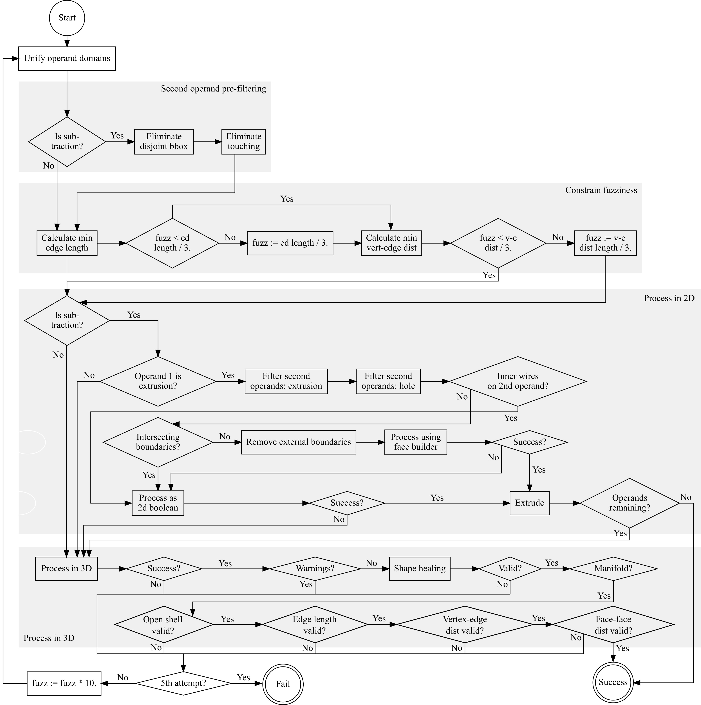

Boolean process
===============

Booleans are one of the more complex aspects of 3D geometry processing. IfcOpenShell orchestrates a variety of OpenCASCADE commands to ensure that booleans (whether through IFC openings or through IFC representation booleans) are processed reliably:

