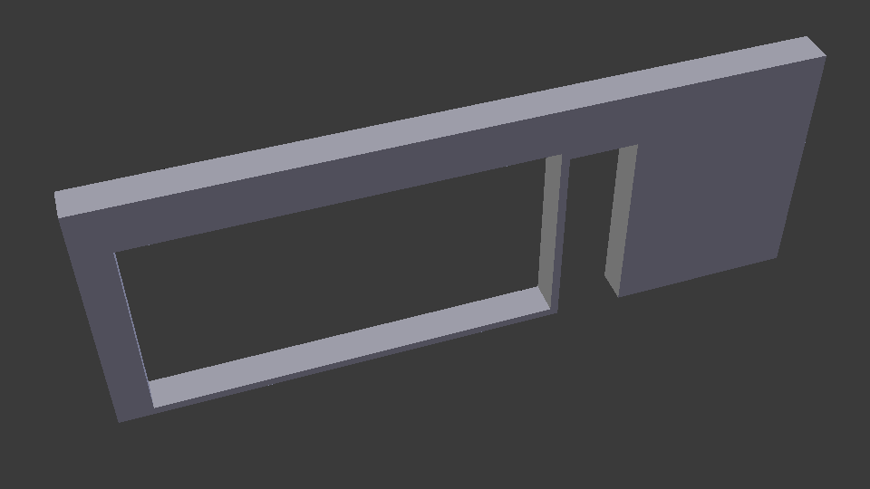
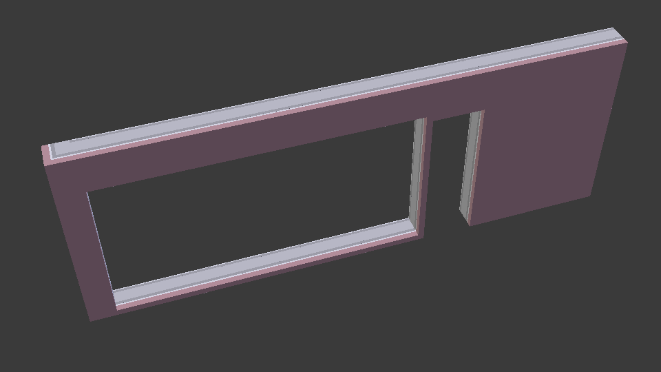
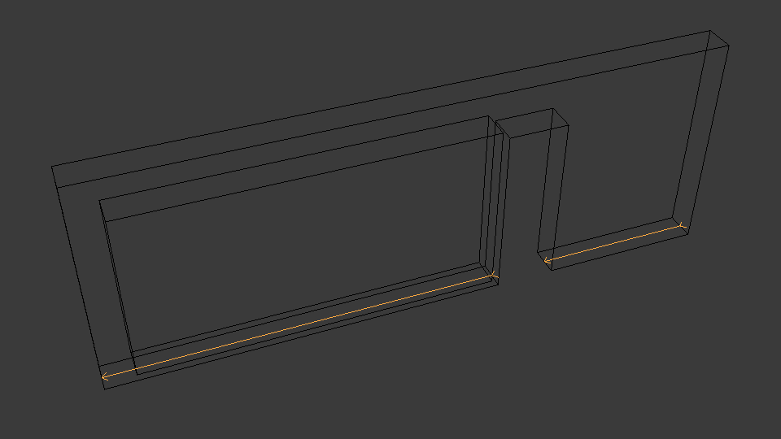
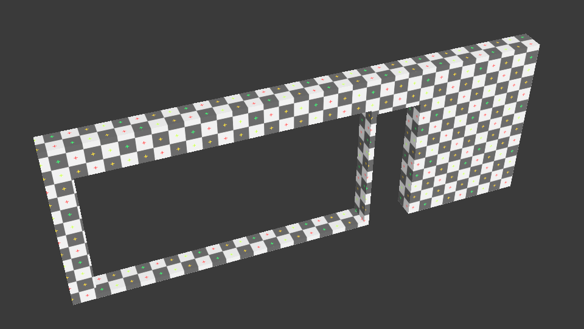

Geometry settings
=================

The geometry iterator has a variety of settings which can impact its output.
Some of these are set during the construction of the iterator, whereas some are
set in a specific iterator settings object.

All UPPERCASE settings are booleans which are always set in a separate settings
object. Lowercase settings are set either during iterator construction or via a
setting function.

All settings can be accessed with C++ and Python, but only some are exposed in
IfcConvert via command line arguments.

Here's an example of changing settings in C++:

.. code-block:: c++

    SerializerSettings settings;
    settings.set(IfcGeom::IteratorSettings::APPLY_DEFAULT_MATERIALS, true);
    settings.set_deflection_tolerance(1e-3);

Here's an example of changing settings in Python:

.. code-block:: python

    settings = ifcopenshell.geom.settings()
    settings.set("apply-default-materials", True)
    settings.set_deflection_tolerance(1e-3)

angular_tolerance
-----------------

+--------+-------------------------+---------+
| Type   | IfcConvert Option       | Default |
+========+=========================+=========+
| DOUBLE | ``--angular-tolerance`` | 0.5     |
+--------+-------------------------+---------+

Sets the angular tolerance of the mesher in radians.

Here is an example in C++:

.. code-block:: c++

    SerializerSettings settings;
    double tolerance;
    // ...
    settings.set_angular_tolerance(tolerance);

Here is an example in Python:

.. code-block:: python

    settings = ifcopenshell.geom.settings()
    settings.set("mesher-angular-deflection", 0.5)

APPLY_DEFAULT_MATERIALS
-----------------------

+------+-------------------+---------+
| Type | IfcConvert Option | Default |
+======+===================+=========+
| BOOL | Always enabled    | True    |
+------+-------------------+---------+

Given the command invocation:

::

    IfcConvert model.ifc d.dae -yv --include attribute GlobalId 3bXiCStxP6Fgxdej$yc50U

You will find log messages along the lines of

    [Warning] {3bXiCStxP6Fgxdej$yc50U} No material and surface styles for:
    #333=IfcCovering('3bXiCStxP6Fgxdej$yc50U',#1,'Compound Ceiling:Gypsum Board:187483',$,'Compound Ceiling:Gypsum Board',#17840,#17052,'187483',.CEILING.)

This means that there is no IfcStyledItem associated to the representation items and that the element does not have an IfcMaterial association with IfcMaterialRepresentation from which we can derive a style (colour) for the element.

The interactive session below shows how with this setting enabled you will get a default generated material from the IFC element entity type and material indices of 0 pointing to that. With this setting disabled the material index would be -1 to indicate a missing style. Note that there is one material index for every triangle in the list of `shp.geometry.faces`.

    >>> import ifcopenshell, ifcopenshell.geom
    >>> f = ifcopenshell.open("model.ifc")
    >>> s = ifcopenshell.geom.settings()
    >>> # By default setting is enabled, we disable it for demonstration.
    >>> s.set("apply-default-materials", False)
    >>> c = f["3bXiCStxP6Fgxdej$yc50U"]
    >>>
    >>> shp = ifcopenshell.geom.create_shape(s, c)
    >>> shp.geometry.material_ids
    (-1, -1, -1, -1, -1, -1, -1, -1, -1, -1, -1, -1)
    >>> [(m.name, m.diffuse) for m in shp.geometry.materials]
    []
    >>>
    >>> s.set("apply-default-materials", True)
    >>> shp = ifcopenshell.geom.create_shape(s, c)
    >>> shp.geometry.material_ids
    (0, 0, 0, 0, 0, 0, 0, 0, 0, 0, 0, 0)
    >>> [(m.name, m.diffuse) for m in shp.geometry.materials]
    [('IfcCovering', colour 0.7 0.7 0.7)]

This is enabled by default for the IfcConvert serializers as they will not gracefully handle -1 material indices and allows users to quickly assign colours based on entity types in their modelling applications.

APPLY_LAYERSETS
---------------

+------+-------------------------------+---------+
| Type | IfcConvert Option             | Default |
+======+===============================+=========+
| BOOL | ``--enable-layerset-slicing`` | False   |
+------+-------------------------------+---------+

For IfcWall and IfcSlab elements, takes the associated IfcMaterialLayerSet and builds a set of surfaces to segment the building element geometry.

.. warning::

    Enabling this settings is computationally intensive as it involves 3D Boolean operations.

::

    IfcConvert model.ifc d1.dae -yv --include attribute GlobalId 2O2Fr$t4X7Zf8NOew3FNr2
    

    
::

    IfcConvert model.ifc d2.dae --enable-layerset-slicing -yv --include attribute GlobalId 2O2Fr$t4X7Zf8NOew3FNr2
    

BOOLEAN_ATTEMPT_2D
------------------

+------+---------------------+---------+
| Type | IfcConvert Option   | Default |
+======+=====================+=========+
| BOOL | ``--no-2d-boolean`` | True    |
+------+---------------------+---------+

Try to perform boolean subtractions in 2d. This can result in 2-3x faster geometry processing.

BUILDING_LOCAL_PLACEMENT
------------------------

+------+--------------------------------+---------+
| Type | IfcConvert Option              | Default |
+======+================================+=========+
| BOOL | ``--building-local-placement`` | False   |
+------+--------------------------------+---------+

In the typical IfcSite > IfcBuilding > IfcBuildingStorey > ... hierarchy of elements, don't incorporate the ObjectPlacement of the IfcBuilding and above in the placement of elements in the output. This is useful when there is a large offset in this placement that reduces precision in further processing.

context_ids
-----------

+-------------+-------------------+---------+
| Type        | IfcConvert Option | Default |
+=============+===================+=========+
| LIST OF INT | N/A               | NULL    |
+-------------+-------------------+---------+

By default, geometry is processed from all geometric representation contexts.
In C++ and Python, it is possible to specify exactly which contexts should be
processed, by passing in a list of integers, where the integers are the IDs of
the contexts. Typically used to target only Body representations or non-Body
representations.

Here is an example in C++:

.. code-block:: c++

    SerializerSettings settings;
    std::vector<int> context_ids;
    // ...
    settings.set_context_ids(context_ids);

Here is an example in Python:

.. code-block:: python

    settings = ifcopenshell.geom.settings()
    contexts = [c.id() for c in ifc_file.by_type("IfcGeometricRepresentationContext") if c.ContextIdentifier == "Body"]
    settings.set("context-ids", contexts)

CONVERT_BACK_UNITS
------------------

+------+--------------------------+---------+
| Type | IfcConvert Option        | Default |
+======+==========================+=========+
| BOOL | ``--convert-back-units`` | False   |
+------+--------------------------+---------+

Internally IfcOpenShell uses meters as the global length unit to do calculations. This setting restores the coordinate positions after conversion by multiplying the factor of the IfcUnit with UnitType=LENGTHUNIT into the output geometry coordinate values.

DEBUG_BOOLEAN
-------------

+------+-----------------------+---------+
| Type | IfcConvert Option     | Default |
+======+=======================+=========+
| BOOL | ``--debug`` or ``-d`` | False   |
+------+-----------------------+---------+

Write boolean operands to file in current directory for debugging purposes.

deflection_tolerance
--------------------

+--------+----------------------------+---------+
| Type   | IfcConvert Option          | Default |
+========+============================+=========+
| DOUBLE | ``--deflection-tolerance`` | 1e-3    |
+--------+----------------------------+---------+

Sets the deflection tolerance of the mesher.

Here is an example in C++:

.. code-block:: c++

    SerializerSettings settings;
    double tolerance;
    // ...
    settings.set_deflection_tolerance(tolerance);

Here is an example in Python:

.. code-block:: python

    settings = ifcopenshell.geom.settings()
    settings.set("mesher-linear-deflection", 1e-3)

DISABLE_BOOLEAN_RESULT
----------------------

+------+-------------------------------+---------+
| Type | IfcConvert Option             | Default |
+======+===============================+=========+
| BOOL | ``--disable-boolean-results`` | False   |
+------+-------------------------------+---------+

Disables the evaluation of IfcBooleanResult and simply returns FirstOperand.

DISABLE_OPENING_SUBTRACTIONS
----------------------------

+------+------------------------------------+---------+
| Type | IfcConvert Option                  | Default |
+======+====================================+=========+
| BOOL | ``--disable-opening-subtractions`` | False   |
+------+------------------------------------+---------+

As in most viewer applications, IfcOpeningElement geometry is subtracted from their host elements. This setting disables this behavior.

::

    IfcConvert model.ifc d1.dae -yv --include attribute GlobalId 2O2Fr$t4X7Zf8NOew3FNr2
    

    
::

    IfcConvert model.ifc d3.dae --disable-opening-subtraction -yv --include attribute GlobalId 2O2Fr$t4X7Zf8NOew3FNr2
    
.. image:: images/settings-3.png

.. note::

    Disabling this settings will reduce processing time and improve robustness as it involves 3D Boolean operations.

For example, if you want to set this setting in a python script you can use the following:

.. code-block:: python
    
    settings = ifcopenshell.geom.settings()
    settings.set("disable-opening-subtractions", True)

DISABLE_TRIANGULATION
---------------------

+------+------------------------------------+---------+
| Type | IfcConvert Option                  | Default |
+======+====================================+=========+
| BOOL | True for SVG, HDF, otherwise False | False   |
+------+------------------------------------+---------+

By default, the iterator returns triangulated geometry. This setting allows to
disable triangulation, and instead to output BReps. Therefore, it is to be used
in conjunction with ``USE_BREP_DATA``. When ``DISABLE_TRIANGULATION`` is set to
False and ``USE_BREP_DATA`` is set to True, the iterator will return a
OpenCASCADE serialized TopoDS_Shape from ``create_shape()`` and ``iterator``.

    >>> import ifcopenshell, ifcopenshell.geom
    >>> s = ifcopenshell.geom.settings()
    >>> s.set(s.DISABLE_TRIANGULATION, True)
    >>> s.set(s.USE_BREP_DATA, True)
    >>> f = ifcopenshell.open("model.ifc")
    >>> c = f["3bXiCStxP6Fgxdej$yc50U"]
    >>> shp = ifcopenshell.geom.create_shape(s, c)
    >>> print(shp.geometry.brep_data)

    CASCADE Topology V1, (c) Matra-Datavision
    Locations 0
    Curve2ds 0
    Curves 12
    1 4.6750000000000034 -8.0749999999999904 2.657 -2.0455514041918775e-15 -1 0
    1 4.6750000000000034 -8.0749999999999904 2.657 1 -3.435893306383461e-15 0
    1 6.2260000000000044 -8.0749999999999957 2.657 -2.0455514041918724e-15 -1 0
    1 6.226 -10.246000000000031 2.657 -1 6.8717866127669219e-15 0
    ...

EDGE_ARROWS
-----------

+------+-------------------+---------+
| Type | IfcConvert Option | Default |
+======+===================+=========+
| BOOL | ``--edge-arrows`` | False   |
+------+-------------------+---------+

When ``INCLUDE_CURVES`` is true and geometric elements include curves (such as the wall axis), add arrow heads to the edges to indicate direction of the curve.

::

    IfcConvert model.ifc d4.dae --model --plan --edge-arrows -yv --include attribute GlobalId 2O2Fr$t4X7Zf8NOew3FNr2
    

ELEMENT_HIERARCHY
-----------------

+------+-----------------------------+---------+
| Type | IfcConvert Option           | Default |
+======+=============================+=========+
| BOOL | ``--use-element-hierarchy`` | False   |
+------+-----------------------------+---------+

.. warning::

    Only applicable to Collada .DAE output when used from IfcConvert.

Emit the relative placements from IFC instead of a flat listing of absolute placements.

exclude
-------

+-------------+----------------------------------+---------+
| Type        | IfcConvert Option                | Default |
+=============+==================================+=========+
| LIST OF OBJ | ``--exclude`` and ``--exclude+`` | NULL    |
+-------------+----------------------------------+---------+

By default, all possible geometry in the IFC model is processed. If an exclude
filter is specified, those geometries are excluded. Note that the include and
exclude options are mutually exclusive.

See include for more details.

EXCLUDE_SOLIDS_AND_SURFACES
---------------------------

+------+------------------------------------------------+---------+
| Type | IfcConvert Option                              | Default |
+======+================================================+=========+
| BOOL | ``--plan`` is used and ``--model`` is not used | False   |
+------+------------------------------------------------+---------+

Exclude faces, shells and solids from geometrical output.

FASTER_BOOLEANS
---------------

+------+-------------------------------+---------+
| Type | IfcConvert Option             | Default |
+======+===============================+=========+
| BOOL | ``--merge-boolean-operands``  | False   |
+------+-------------------------------+---------+

.. warning::

    Only applicable when using OCCT 6.9 and earlier.

Fuse the collection of all boolean operands into a single union before applying the boolean subtraction, as opposed to doing individual subtractions. This likely improves performance. From OCCT 7.0 onwards the boolean operations with multiple arguments is used.

GENERATE_UVS
------------

+------+--------------------+---------+
| Type | IfcConvert Option  | Default |
+======+====================+=========+
| BOOL | ``--generate-uvs`` | False   |
+------+--------------------+---------+

Applies a box projection on the generated geometry for the element to obtain UV coordinates. This is purely generated, it does not involve texture coordinates stored in the IFC model.

::

    IfcConvert model.ifc d5.dae --generate-uvs -yv --include attribute GlobalId 2O2Fr$t4X7Zf8NOew3FNr2

include
-------

+-------------+----------------------------------+---------+
| Type        | IfcConvert Option                | Default |
+=============+==================================+=========+
| LIST OF OBJ | ``--include`` and ``--include+`` | NULL    |
+-------------+----------------------------------+---------+

By default, all possible geometry in the IFC model is processed. If an include
filter is specified, only geometry from the included elements are processed.

In IfcConvert, this is specified using the following syntaxes:

::

    IfcConvert model.ifc out.glb --include=entities IfcWall
    IfcConvert model.ifc out.glb --include=layers A-WALL
    IfcConvert model.ifc out.glb --include=attribute GlobalId 1VQ5n5$RrEbPk8le4ZCI81
    IfcConvert model.ifc out.glb --include=attribute Name Foo
    IfcConvert model.ifc out.glb --include=attribute Description Bar
    IfcConvert model.ifc out.glb --include=attribute Tag 123456

IfcConvert also allows using ``--include+`` which includes all products
decomposed by that filter. For example, the following filter will process any
element with the attribute Name of Level 1, as well as all child elements. Child
elements include IsDecomposedBy, HasOpenings, FillsVoid, and
ContainedInStructure.

::

    IfcConvert model.ifc out.glb --include+=attribute Name "Level 1"

In C++, this is set when the iterator is constructed:

.. code-block:: c++

    IfcGeom::Iterator geom_iterator(settings, ifc_file, filter_funcs, num_threads);

In Python, this is set when the iterator is constructed, and requires a list of
IFC entity instances:

.. code-block:: python

    iterator = ifcopenshell.geom.iterator(settings, ifc_file, include=ifc_file.by_type("IfcWall"), exclude=None)

INCLUDE_CURVES
--------------

+------+--------------------+---------+
| Type | IfcConvert Option  | Default |
+======+====================+=========+
| BOOL | ``--plan``         | False   |
+------+--------------------+---------+

Include edge and wire geometries in the geometric output.

LAYERSET_FIRST
--------------

+------+----------------------+---------+
| Type | IfcConvert Option    | Default |
+======+======================+=========+
| BOOL | ``--layerset-first`` | False   |
+------+----------------------+---------+

When not using APPLY_LAYERSETS, take the first material layer from the set to use as the material for the overall element.

NO_NORMALS
----------

+------+-------------------+---------+
| Type | IfcConvert Option | Default |
+======+===================+=========+
| BOOL | ``--no-normals``  | False   |
+------+-------------------+---------+

Do not emit normals on geometric output

NO_WIRE_INTERSECTION_CHECK
--------------------------

+------+----------------------------------+---------+
| Type | IfcConvert Option                | Default |
+======+==================================+=========+
| BOOL | ``--no-wire-intersection-check`` | False   |
+------+----------------------------------+---------+

Disables wire intersection checks. These checks are done on faces to prevent
self-intersections of face bounds. Self-intersections reduce the reliability of
boolean operations and may lead to crashes.

NO_WIRE_INTERSECTION_TOLERANCE
------------------------------

+------+--------------------------------------+---------+
| Type | IfcConvert Option                    | Default |
+======+======================================+=========+
| BOOL | ``--no-wire-intersection-tolerance`` | False   |
+------+--------------------------------------+---------+

Set wire intersection tolerance to 0. By default the above check is done using a
tolerance criterium. So that when a vertex is a certain epsilon distance away
from an edge this is flagged as an intersection.

num_threads
-----------

+------+-------------------------+---------+
| Type | IfcConvert Option       | Default |
+======+=========================+=========+
| INT  | ``--threads`` or ``-j`` | 1       |
+------+-------------------------+---------+

Number of parallel processing threads for geometry interpretation.

In C++, this is set when the iterator is constructed:

.. code-block:: c++

    IfcGeom::Iterator geom_iterator(settings, ifc_file, filter_funcs, num_threads);

In Python, this is set when the iterator is constructed:

.. code-block:: python

    import multiprocessing
    iterator = ifcopenshell.geom.iterator(settings, ifc_file, num_threads=multiprocessing.cpu_count())

offset
------

+---------------+--------------------+---------+
| Type          | IfcConvert Option  | Default |
+===============+====================+=========+
| ARRAY<DOUBLE> | ``--model-offset`` | 0,0,0   |
+---------------+--------------------+---------+

Sets an offset to be applied to all the matrixes of geometries returned from
the iterator.

In Python, this is set in the settings passed to the iterator.

.. code-block:: python

    settings = ifcopenshell.geom.settings()
    offset = ifcopenshell.ifcopenshell_wrapper.float_array_3()
    offset[0], offset[1], offset[2] = (1, 2, 3)
    settings.offset = offset

REORIENT_SHELLS
----------

+------+---------------------+---------+
| Type | IfcConvert Option   | Default |
+======+=====================+=========+
| BOOL | ``--orient-shells`` | False   |
+------+---------------------+---------+

Re-orient or sew connected face sets to have a consistent outwards orientation.

SITE_LOCAL_PLACEMENT
--------------------

+------+----------------------------+---------+
| Type | IfcConvert Option          | Default |
+======+============================+=========+
| BOOL | ``--site-local-placement`` | False   |
+------+----------------------------+---------+

See ``BUILDING_LOCAL_PLACEMENT``, but exclude also the ObjectPlacement of the IfcSite.

STRICT_TOLERANCE
----------------

+------+------------------------+---------+
| Type | IfcConvert Option      | Default |
+======+========================+=========+
| BOOL | ``--strict-tolerance`` | False   |
+------+------------------------+---------+

Strictly use the tolerance from the IFC model. Typically this value is increased
10-fold to have more reliable boolean subtraction results. It is recommended to
always have this set to True and should only be set to False for backwards
compatibility.

USE_BREP_DATA
-------------

+------+------------------------------------+---------+
| Type | IfcConvert Option                  | Default |
+======+====================================+=========+
| BOOL | True for SVG, HDF, otherwise False | False   |
+------+------------------------------------+---------+

See ``DISABLE_TRIANGULATION``.

USE_PYTHON_OPENCASCADE
----------------------

+------+-------------------+---------+
| Type | IfcConvert Option | Default |
+======+===================+=========+
| BOOL | N/A               | False   |
+------+-------------------+---------+

.. warning::

    Only available in Python when an import of ``OCC.Core.BRepTools`` or ``OCC.BRepTools`` succeeds.

This implies ``USE_WORLD_COORDS`` and ``ITERATOR_OUTPUT`` set to ``SERIALIZED``. 
The serialized TopoDS_Shape from iterator output is deserialized by Python OpenCASCADE.

USE_WORLD_COORDS
----------------

+------+------------------------+---------+
| Type | IfcConvert Option      | Default |
+======+========================+=========+
| BOOL | ``--use-world-coords`` | False   |
+------+------------------------+---------+

Apply the ObjectPlacement of the building elements to the geometric output. This is implied when using the Wavefront .OBJ output in IfcConvert. Note that this also eliminates the possibility for geometric elements to point to the same interpreted geometry result.

VALIDATE_QUANTITIES
-------------------

+------+-------------------+---------+
| Type | IfcConvert Option | Default |
+======+===================+=========+
| BOOL | ``--validate``    | False   |
+------+-------------------+---------+

Running IfcConvert with ``--validate`` will set a non-zero exit code when ever a log message with severity equal or greater than ERROR has been emitted.

Currently for internal use only. For every building element geometry converted, looks for an associated quantity set where the OwnerHistory's organization name is IfcOpenShell. And looks for the quantities "Total Surface Area", "Volume", "Shape Validation Properties.Surface Genus" and validates these according to the interpreted geometry definition. Emit Logger::Error when calculated values are outside of the tolerance range for the value stored in the model.

WELD_VERTICES
-------------

+------+---------------------+---------------------------------------------+
| Type | IfcConvert Option   | Default                                     |
+======+=====================+=============================================+
| BOOL | ``--weld-vertices`` | False in IfcConvert, True in C++ and Python |
+------+---------------------+---------------------------------------------+

.. note::

    This setting only affects triangulated output.

Discards normals and joins vertices solely based on position. This is useful when output is to be modified in a modeling application.

    >>> import ifcopenshell, ifcopenshell.geom
    >>> s = ifcopenshell.geom.settings()
    >>> s.set(s.WELD_VERTICES, False)
    >>> f = ifcopenshell.open("model.ifc")
    >>> c = f["3bXiCStxP6Fgxdej$yc50U"]
    >>> shp = ifcopenshell.geom.create_shape(s, c)
    >>> shp.geometry.verts
    (4.675000000000003, -8.07499999999999, 2.657, 4.674999999999999, -10.24600000000002, 2.657, 6.226000000000004, -8.074999999999996, 2.657, 6.226, -10.24600000000003, 2.657, 4.675000000000003, -8.07499999999999, 2.6, 4.674999999999999, -10.24600000000002, 2.6, 6.226000000000004, -8.074999999999996, 2.6, 6.226, -10.24600000000003, 2.6, 4.674999999999999, -10.24600000000002, 2.657, 4.674999999999999, -10.24600000000002, 2.6, 4.675000000000003, -8.07499999999999, 2.657, 4.675000000000003, -8.07499999999999, 2.6, 6.226, -10.24600000000003, 2.657, 4.674999999999999, -10.24600000000002, 2.657, 6.226, -10.24600000000003, 2.6, 4.674999999999999, -10.24600000000002, 2.6, 6.226000000000004, -8.074999999999996, 2.657, 6.226, -10.24600000000003, 2.657, 6.226000000000004, -8.074999999999996, 2.6, 6.226, -10.24600000000003, 2.6, 4.675000000000003, -8.07499999999999, 2.657, 4.675000000000003, -8.07499999999999, 2.6, 6.226000000000004, -8.074999999999996, 2.657, 6.226000000000004, -8.074999999999996, 2.6)
    >>> shp.geometry.normals
    (3.059754518198021e-17, 0.0, -1.0, 3.059754518198021e-17, 0.0, -1.0, 3.059754518198021e-17, 0.0, -1.0, 3.059754518198021e-17, 0.0, -1.0, 2.110175529791737e-16, 0.0, -1.0, 2.110175529791737e-16, 0.0, -1.0, 2.110175529791737e-16, 0.0, -1.0, 2.110175529791737e-16, 0.0, -1.0, -1.0, 1.79434333701042e-15, 0.0, -1.0, 1.79434333701042e-15, 0.0, -1.0, 1.79434333701042e-15, 0.0, -1.0, 1.79434333701042e-15, 0.0, 6.8717866127669046e-15, 1.0, 0.0, 6.8717866127669046e-15, 1.0, 0.0, 6.8717866127669046e-15, 1.0, 0.0, 6.8717866127669046e-15, 1.0, 0.0, -1.0, 1.79434333701042e-15, 0.0, -1.0, 1.79434333701042e-15, 0.0, -1.0, 1.79434333701042e-15, 0.0, -1.0, 1.79434333701042e-15, 0.0, 3.4358933063834523e-15, 1.0, 0.0, 3.4358933063834523e-15, 1.0, 0.0, 3.4358933063834523e-15, 1.0, 0.0, 3.4358933063834523e-15, 1.0, 0.0)
    >>>
    >>> s.set(s.WELD_VERTICES, True)
    >>> shp = ifcopenshell.geom.create_shape(s, c)
    >>> shp.geometry.verts
    (4.675000000000003, -8.07499999999999, 2.657, 4.674999999999999, -10.24600000000002, 2.657, 6.226000000000004, -8.074999999999996, 2.657, 6.226, -10.24600000000003, 2.657, 4.675000000000003, -8.07499999999999, 2.6, 4.674999999999999, -10.24600000000002, 2.6, 6.226000000000004, -8.074999999999996, 2.6, 6.226, -10.24600000000003, 2.6)
    >>> shp.geometry.normals
    ()
