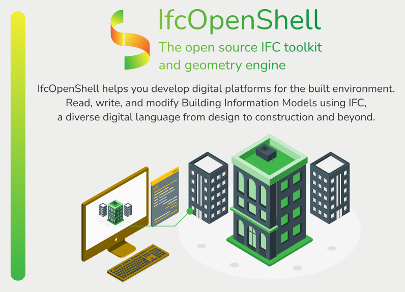

Let's learn IfcOpenShell!
=========================

.. toctree::
   :hidden:
   :maxdepth: 1
   :caption: Main:

   introduction
   ifcopenshell
   ifcopenshell-python
   ifcconvert
   bonsai

.. toctree::
   :hidden:
   :maxdepth: 1
   :caption: Utilities:

   bcf
   bimserver-plugin
   bimtester
   bsdd
   ifc2ca
   ifc4d
   ifc5d
   ifccityjson
   ifcclash
   ifccsv
   ifcdiff
   ifcfm
   ifcmax
   ifcpatch
   ifcsverchok
   ifctester
   other

.. toctree::
   :hidden:
   :maxdepth: 1
   :caption: API:

   C++ API Reference <https://ifcopenshell.github.io/docs/rst_files/library_root.html>
   Python API Reference <autoapi/index>
   indices
