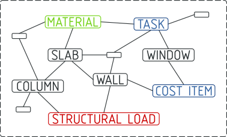
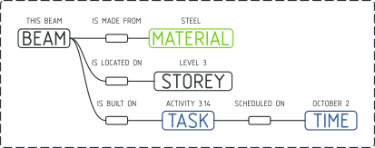
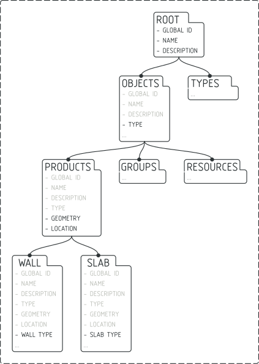

Introduction to IFC
===================

An IFC model is a collection of elements (e.g. doors, windows, construction
tasks, materials, etc) with relationships to other elements in a graph-like
database. Together, these elements and their relationships describe the digital
built environment.

Each element has a type known as an **IFC Class**. These classes define the
attributes that the element may store. For example, the **IfcWall Class** is
allowed to store a **Name** and **Description** attribute.

This IFC database can be stored in many formats. The most common is the ``.ifc``
format, which stores data in plain text. If you open a ``.ifc`` file in a text
editor, you'll see something like this:

::

    #1=IFCPROJECT('3Cbhu4euf1hfgM_SHZbeqM',$,'My Project',$,$,$,$,$,#4);
    #2=IFCSIUNIT(*,.LENGTHUNIT.,.MILLI.,.METRE.);
    #3=IFCSIUNIT(*,.AREAUNIT.,$,.SQUARE_METRE.);
    #4=IFCUNITASSIGNMENT((#2,#3));
    #5=IFCCARTESIANPOINT((0.,0.,0.));

In this example there are 5 elements in the graph. The element with the ID of
**#1** has an **IFC Class** of **IfcProject**. This element has 9
comma-separated attributes. IFC defines how many attributes each **IFC Class**
is allowed to have, attribute names, the order of attributes, data type,
optional or mandatory status (i.e. cardinality), and more.

::

       IFC Class   Quoted string value     Null value               ID reference
       ↓           ↓                       ↓                        ↓
    #1=IFCPROJECT('3Cbhu4euf1hfgM_SHZbeqM',$,'My Project',$,$,$,$,$,#4);
    ↑             ↑ 
    Element ID    Comma-separated list of attributes

By selecting elements by their **IFC Class**, and reading their attributes, you
can navigate from one element to another. The relationships between elements are
called **IFC Concepts** and create meaning in our industry. For example, if a
**IfcWall** element has an attribute that references an **IfcBuildingStorey**
element in a particular way, it will mean that the wall is located in the
ground floor of the building.

The official IFC documentation describes hundreds of **IFC Classes**, ranging
from walls, door, to tasks, cost items, parametric materials, and structural
analysis constraints. There are also hundreds of **IFC Concepts**, which may
describe how a wall is in a storey, a construction task might occur one after
another, or how an surface bounds a space for energy analysis.

It takes time to learn the many **IFC Classes** and **IFC Concepts** available.
Once you do, you will be able to richly describe our built environment
digitally. IfcOpenShell can help you navigate these IFC elements, read their
attributes, and explore relationships. Your journey begins here.

.. seealso::

    If you are already familiar with IFC and just want to learn how to use
    IfcOpenShell, you can jump to the `Core functionality crash course`_.

Begin learning IFC
------------------

IFC has three versions published by ISO: **IFC2X3** from 2007, **IFC4** from
2017, and **IFC4X3** in draft form. Each version improves on the previous
version, and will have different **IFC Classes** with different attributes and
different **IFC Concepts**.

You can access the official documentation here:

- `Official IFC2X3 documentation homepage <https://standards.buildingsmart.org/IFC/RELEASE/IFC2x3/TC1/HTML/>`__
- `Official IFC4 documentation homepage <https://standards.buildingsmart.org/IFC/RELEASE/IFC4/ADD2_TC1/HTML/>`__
- `Official IFC4X3 documentation homepage <http://ifc43-docs.standards.buildingsmart.org/>`__
- `List of all IFC2X3 classes <https://standards.buildingsmart.org/IFC/RELEASE/IFC2x3/TC1/HTML/alphabeticalorder_entities.htm>`__
- `List of all IFC4 classes <https://standards.buildingsmart.org/IFC/RELEASE/IFC4/ADD2_TC1/HTML/link/inheritance-general-usage-all%20entities.htm>`__
- `List of all IFC4X3 classes <https://ifc43-docs.standards.buildingsmart.org/IFC/RELEASE/IFC4x3/HTML/annex-c.html>`__

.. tip::

   It is recommended to use IFC4. However, the IFC4X3 documentation is a lot
   more friendly to newcomers.

The official ISO documentation is written for a technical audience and may be
overwhelming. This guide will take you slowly through the core concepts, and
leave you with the knowledge you need to discover more.

Before digging into theory, let's explore an existing IFC model. You can
download this sample IFC for this guide.

.. container:: blockbutton

    `Download sample IFC <https://www.ifcwiki.org/images/e/e3/AC20-FZK-Haus.ifc>`__

If you open up the model with a text editor, you will see text similar to this:

::

    ISO-10303-21;
    HEADER;FILE_DESCRIPTION(('ViewDefinition [, QuantityTakeOffAddOnView, SpaceBoundary2ndLevelAddOnView]'),'2;1');
    FILE_NAME('AC20-FZK-Haus.ifc','2016-12-21T17:54:06',('Architect'),(''),'','','');
    FILE_SCHEMA(('IFC4'));
    ENDSEC;

    DATA;
    #3= IFCORGANIZATION($,'Nicht definiert',$,$,$);
    #12= IFCOWNERHISTORY(#7,#11,$,.ADDED.,$,$,$,1482339244);
    #13= IFCSIUNIT(*,.LENGTHUNIT.,$,.METRE.);
    #14= IFCSIUNIT(*,.AREAUNIT.,$,.SQUARE_METRE.);

    ...

    #62= IFCGEOMETRICREPRESENTATIONCONTEXT($,'Model',3,1.00000000000E-5,#59,#60);
    #66= IFCPROJECT('0lY6P5Ur90TAQnnnI6wtnb',#12,'Projekt-FZK-Haus','Projekt FZK-House create by KHH Forschuungszentrum Karlsruhe',$,$,$,(#62,#374),#49);
    #77= IFCPROPERTYSINGLEVALUE('GS_TimeStamp',$,IFCTIMESTAMP(9685146),$);
    #85= IFCPROPERTYSET('1mnk_H9cG6eU2r9ped0WRu',#12,'GSPset_TimeStamp',$,(#77));

    ...

    #15033= IFCSHAPEREPRESENTATION(#15026,'Axis','Curve2D',(#15031));
    #15037= IFCPRODUCTDEFINITIONSHAPE($,$,(#15016,#15024,#15033));
    #15042= IFCWALLSTANDARDCASE('2XPyKWY018sA1ygZKgQPtU',#12,'Wand-Int-ERDG-4',$,$,#14983,#15037,'BC6F0F70-6195-495E-A2-FC-239713029DB1',$);
    #15046= IFCMATERIAL('Leichtbeton 102890359',$,$);

    ...

    #15231= IFCRELDEFINESBYPROPERTIES('3Q0nMR5elnJFWzAhgkZqe1',#12,$,$,(#15042),#15229);
    #15234= IFCWALLTYPE('2AEMyYvIjlsz7LRzqYHy64',#12,'Leichtbeton 102890359 240',$,$,$,(#15244,#15248,#15250,#17288,#17290,#17292,#18637,#18639,#18641,#19015,#19017,#19019,#20770,#20772,#20774),'8A396F22-E52B-6FDB-D1D5-6FDD2247C184',$,.NOTDEFINED.);
    #15237= IFCDIRECTION((1.,0.,0.));
    #15239= IFCDIRECTION((0.,0.,1.));

    ... etc

The first thing you should notice is the line that defines that this is an
**IFC4** version. This determines what **IFC Classes** and **IFC Concepts** are
available.

::

    FILE_SCHEMA(('IFC4'));

You'll notice certain **IFC Class** keywords jump out at you: things like
**IFCSIUNIT** which defines the length unit of metres, or **IFCPROJECT** which
defines the project, or **IFCPROPERTYSINGLEVALUE** which defines a property of
something, or **IFCWALLSTANDARDCASE** which defines a wall, or **IFCMATERIAL**
which defines a material, and so on.

Let's see how to fetch this data with code. Let's start with loading the model.
Import the IfcOpenShell module, then use the ``open`` function to load the
model into a variable called ``model``. The first piece of information we want
to check is what IFC schema version we are using.  We assume the model you are
learning with is IFC4. We'll then fetch all entities that use the **IfcSlab**
class.

.. code-block:: python

    import ifcopenshell
    model = ifcopenshell.open('/path/to/your/model.ifc')
    print(model.schema) # May return IFC2X3, IFC4, or IFC4X3.
    print(model.by_type("IfcSlab")) # Will return a list of IFCSLAB entities, like below:
    # [
    #     #34509=IfcSlab('1pPHnf7cXCpPsNEnQf8_6B',#12,'Bodenplatte',$,$,#34464,#34505,'E4D9CD4B-CA43-4735-94-BD-1FD4376BD455',.BASESLAB.),
    #      #59290=IfcSlab('2RGlQk4xH47RHK93zcTzUL',#12,'Slab-033',$,$,#59253,#59286,'DA0A17AC-B773-47AC-99-C5-D390C73AD5CC',.FLOOR.),
    #      #59553=IfcSlab('07Enbsqm9C7AQC9iyBwfSD',#12,'Dach-1',$,$,#59508,#59549,'E142B455-80E4-4B96-83-EC-E1589CA998DB',.ROOF.),
    #      #59753=IfcSlab('2IxUUNUVPB6Ob$eicCfP2N',#12,'Dach-2',$,$,#59716,#59749,'BD6D9414-37DF-40A8-88-40-301A32A9A5B5',.ROOF.)
    # ]

.. tip::

   Try changing ``model.by_type("IfcSlab")`` to fetch different types of
   entities based on their **IFC Class**.

An overview of all IFC classes
------------------------------

There are hundreds of **IFC Classes**. You don't need to know them all, but
we'll help describe the general breakdown so you know where to find the
appropriate class for what you're after.

**IFC Classes** are defined using an **Object Oriented** tree hierarchy. Child
**IFC Classes** inherit the attributes defined by the parent **IFC Class**.
This means that **IFC Classes** with common attributes are grouped together in
the tree.

For example, because all **IfcObject** classes can have a **GlobalId**
attribute, that means that because **IfcWall** is a subtype of **IfcObject**,
it can also have a **GlobalId** attribute.

Important IFC concepts
----------------------

There are hundreds of **IFC Concepts** that allow you to describe relationships
between **IFC Classes**. In this guide, we'll focus on the five most common
**IFC Concepts** to get you started.

Concept 1: the project context
------------------------------

Concept 2: spatial decomposition
--------------------------------

Concept 3: object typing
------------------------

Concept 4: attributes and property sets
---------------------------------------

Concept 5: material assignment
------------------------------

Self-learning IFC: how to learn more
------------------------------------

