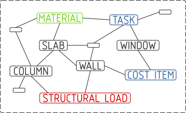
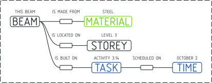
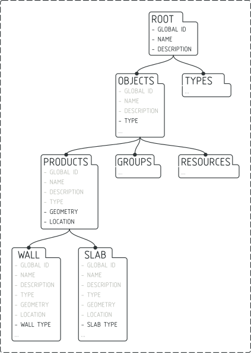

Introduction to IFC
===================

An IFC model is a collection of elements (e.g. doors, windows, construction
tasks, materials, etc) with relationships to other elements in a graph-like
database. Together, these elements and their relationships describe the digital
built environment.

Each element has a type known as an **IFC Class**. These classes define the
attributes that the element may store. For example, the **IfcWall Class** is
allowed to store a **Name** and **Description** attribute.

This IFC database can be stored in many formats. The most common is the ``.ifc``
format, which stores data in plain text. If you open a ``.ifc`` file in a text
editor, you'll see something like this:

::

    #1=IFCPROJECT('3Cbhu4euf1hfgM_SHZbeqM',$,'My Project',$,$,$,$,$,#4);
    #2=IFCSIUNIT(*,.LENGTHUNIT.,.MILLI.,.METRE.);
    #3=IFCSIUNIT(*,.AREAUNIT.,$,.SQUARE_METRE.);
    #4=IFCUNITASSIGNMENT((#2,#3));
    #5=IFCCARTESIANPOINT((0.,0.,0.));

In this example there are 5 elements in the graph. The element with the ID of
**#1** has an **IFC Class** of **IfcProject**. This element has 9
comma-separated attributes. IFC defines how many attributes each **IFC Class**
is allowed to have, attribute names, the order of attributes, data type,
optional or mandatory status (i.e. cardinality), and more.

::

       IFC Class   Quoted string value     Null value               ID reference
       ↓           ↓                       ↓                        ↓
    #1=IFCPROJECT('3Cbhu4euf1hfgM_SHZbeqM',$,'My Project',$,$,$,$,$,#4);
    ↑             ↑ 
    Element ID    Comma-separated list of attributes

By selecting elements by their **IFC Class**, and reading their attributes, you
can navigate from one element to another. The relationships between elements are
called **IFC Concepts** and create meaning in our industry. For example, if a
**IfcWall** element has an attribute that references an **IfcBuildingStorey**
element in a particular way, it will mean that the wall is located in the
ground floor of the building.

The official IFC documentation describes hundreds of **IFC Classes**, ranging
from walls, door, to tasks, cost items, parametric materials, and structural
analysis constraints. There are also hundreds of **IFC Concepts**, which may
describe how a wall is in a storey, a construction task might occur one after
another, or how a surface bounds a space for energy analysis.

It takes time to learn the many **IFC Classes** and **IFC Concepts** available.
Once you do, you will be able to richly describe our built environment
digitally. IfcOpenShell can help you navigate these IFC elements, read their
attributes, and explore relationships. Your journey begins here.

.. seealso::

    If you are already familiar with IFC and just want to learn how to use
    IfcOpenShell, you can jump to the :doc:`core functionality crash course
    <../ifcopenshell-python/hello_world>`.

Begin learning IFC
------------------

IFC has three versions published by ISO: **IFC2X3** from 2007, **IFC4** from
2017, and **IFC4X3** from 2024. Each version improves on the previous
version, and will have different **IFC Classes** with different attributes and
different **IFC Concepts**.

You can access the official documentation here:

- `Official IFC2X3 documentation homepage <https://standards.buildingsmart.org/IFC/RELEASE/IFC2x3/TC1/HTML/>`__
- `Official IFC4 documentation homepage <https://standards.buildingsmart.org/IFC/RELEASE/IFC4/ADD2_TC1/HTML/>`__
- `Official IFC4X3 documentation homepage <http://ifc43-docs.standards.buildingsmart.org/>`__
- `List of all IFC2X3 classes <https://standards.buildingsmart.org/IFC/RELEASE/IFC2x3/TC1/HTML/alphabeticalorder_entities.htm>`__
- `List of all IFC4 classes <https://standards.buildingsmart.org/IFC/RELEASE/IFC4/ADD2_TC1/HTML/link/inheritance-general-usage-all%20entities.htm>`__
- `List of all IFC4X3 classes <https://ifc43-docs.standards.buildingsmart.org/IFC/RELEASE/IFC4x3/HTML/annex-c.html>`__

.. tip::

   For most buildings, IFC4 is recommended. For infrastructure projects (road,
   railway, bridge, and other civil elements), use IFC4X3. The IFC4X3 documentation
   is also generally more newcomer-friendly.

The official ISO documentation is written for a technical audience and may be
overwhelming. This guide will take you slowly through the core concepts, and
leave you with the knowledge you need to discover more.

Before digging into theory, let's explore an existing IFC model. You can
download this sample IFC for this guide.

.. container:: blockbutton

    `Download sample IFC <https://www.ifcwiki.org/images/e/e3/AC20-FZK-Haus.ifc>`__

If you open up the model with a text editor, you will see text similar to this:

::

    ISO-10303-21;
    HEADER;FILE_DESCRIPTION(('ViewDefinition [, QuantityTakeOffAddOnView, SpaceBoundary2ndLevelAddOnView]'),'2;1');
    FILE_NAME('AC20-FZK-Haus.ifc','2016-12-21T17:54:06',('Architect'),(''),'','','');
    FILE_SCHEMA(('IFC4'));
    ENDSEC;

    DATA;
    #3= IFCORGANIZATION($,'Nicht definiert',$,$,$);
    #12= IFCOWNERHISTORY(#7,#11,$,.ADDED.,$,$,$,1482339244);
    #13= IFCSIUNIT(*,.LENGTHUNIT.,$,.METRE.);
    #14= IFCSIUNIT(*,.AREAUNIT.,$,.SQUARE_METRE.);

    ...

    #62= IFCGEOMETRICREPRESENTATIONCONTEXT($,'Model',3,1.00000000000E-5,#59,#60);
    #66= IFCPROJECT('0lY6P5Ur90TAQnnnI6wtnb',#12,'Projekt-FZK-Haus','Projekt FZK-House create by KHH Forschuungszentrum Karlsruhe',$,$,$,(#62,#374),#49);
    #77= IFCPROPERTYSINGLEVALUE('GS_TimeStamp',$,IFCTIMESTAMP(9685146),$);
    #85= IFCPROPERTYSET('1mnk_H9cG6eU2r9ped0WRu',#12,'GSPset_TimeStamp',$,(#77));

    ...

    #15033= IFCSHAPEREPRESENTATION(#15026,'Axis','Curve2D',(#15031));
    #15037= IFCPRODUCTDEFINITIONSHAPE($,$,(#15016,#15024,#15033));
    #15042= IFCWALLSTANDARDCASE('2XPyKWY018sA1ygZKgQPtU',#12,'Wand-Int-ERDG-4',$,$,#14983,#15037,'BC6F0F70-6195-495E-A2-FC-239713029DB1',$);
    #15046= IFCMATERIAL('Leichtbeton 102890359',$,$);

    ...

    #15231= IFCRELDEFINESBYPROPERTIES('3Q0nMR5elnJFWzAhgkZqe1',#12,$,$,(#15042),#15229);
    #15234= IFCWALLTYPE('2AEMyYvIjlsz7LRzqYHy64',#12,'Leichtbeton 102890359 240',$,$,$,(#15244,#15248,#15250,#17288,#17290,#17292,#18637,#18639,#18641,#19015,#19017,#19019,#20770,#20772,#20774),'8A396F22-E52B-6FDB-D1D5-6FDD2247C184',$,.NOTDEFINED.);
    #15237= IFCDIRECTION((1.,0.,0.));
    #15239= IFCDIRECTION((0.,0.,1.));

    ... etc

The first thing you should notice is the line that defines that this is an
**IFC4** version. This determines what **IFC Classes** and **IFC Concepts** are
available.

::

    FILE_SCHEMA(('IFC4'));

You'll notice certain **IFC Class** keywords jump out at you: things like
**IFCSIUNIT** which defines the length unit of metres, or **IFCPROJECT** which
defines the project, or **IFCPROPERTYSINGLEVALUE** which defines a property of
something, or **IFCWALLSTANDARDCASE** which defines a wall, or **IFCMATERIAL**
which defines a material, and so on.

Let's see how to fetch this data with code. Let's start with loading the model.
Import the IfcOpenShell module, then use the ``open`` function to load the
model into a variable called ``model``. The first piece of information we want
to check is what IFC schema version we are using.  We assume the model you are
learning with is IFC4. We'll then fetch all entities that use the **IfcSlab**
class.

.. code-block:: python

    import ifcopenshell
    model = ifcopenshell.open('/path/to/your/model.ifc')
    print(model.schema) # May return IFC2X3, IFC4, or IFC4X3.
    print(model.by_type("IfcSlab")) # Will return a list of IFCSLAB entities, like below:
    # [
    #     #34509=IfcSlab('1pPHnf7cXCpPsNEnQf8_6B',#12,'Bodenplatte',$,$,#34464,#34505,'E4D9CD4B-CA43-4735-94-BD-1FD4376BD455',.BASESLAB.),
    #      #59290=IfcSlab('2RGlQk4xH47RHK93zcTzUL',#12,'Slab-033',$,$,#59253,#59286,'DA0A17AC-B773-47AC-99-C5-D390C73AD5CC',.FLOOR.),
    #      #59553=IfcSlab('07Enbsqm9C7AQC9iyBwfSD',#12,'Dach-1',$,$,#59508,#59549,'E142B455-80E4-4B96-83-EC-E1589CA998DB',.ROOF.),
    #      #59753=IfcSlab('2IxUUNUVPB6Ob$eicCfP2N',#12,'Dach-2',$,$,#59716,#59749,'BD6D9414-37DF-40A8-88-40-301A32A9A5B5',.ROOF.)
    # ]

.. tip::

   Try changing ``model.by_type("IfcSlab")`` to fetch different types of
   entities based on their **IFC Class**.

An overview of all IFC classes
------------------------------

There are hundreds of **IFC Classes**. You don't need to know them all, but
we'll help describe the general breakdown so you know where to find the
appropriate class for what you're after.

**IFC Classes** are defined using an **Object Oriented** tree hierarchy. Child
**IFC Classes** inherit the attributes defined by the parent **IFC Class**.
This means that **IFC Classes** with common attributes are grouped together in
the tree.

For example, because all **IfcObject** classes can have a **GlobalId**
attribute, that means that because **IfcWall** is a subtype of **IfcObject**,
it can also have a **GlobalId** attribute.

Important IFC concepts
----------------------

There are hundreds of **IFC Concepts** that allow you to describe relationships
between **IFC Classes**. In this guide, we'll focus on the five most common
**IFC Concepts** to get you started.

Concept 1: the project context
------------------------------

An IFC model contains at most one **IfcProject**. It is the root of the
model. It provides the units the numbers in the model are in, and the
geometric contexts. A file may also contain any number of
**IfcProjectLibrary** entities.

.. code-block:: python

    import ifcopenshell
    import ifcopenshell.util.unit

    model = ifcopenshell.open('AC20-FZK-Haus.ifc') # the sample downloaded above

    project = model.by_type("IfcProject")[0]
    print(project.Name) # Projekt-FZK-Haus

    for unit in project.UnitsInContext.Units:
        if unit.is_a("IfcSIUnit"):
            print(unit.UnitType, unit.Name) # LENGTHUNIT METRE, AREAUNIT SQUARE_METRE, ...

    print(ifcopenshell.util.unit.calculate_unit_scale(model)) # 1.0 for a model in metres

The **IfcProject** also holds one or more **IfcGeometricRepresentationContext**
elements. These define the coordinate space that all geometry in the model is
expressed in, including its precision.

.. code-block:: python

    for context in project.RepresentationContexts:
        print(context.ContextType, context.Precision) # Model 1e-05, Plan 1e-05

Concept 2: spatial decomposition
--------------------------------

Real buildings are made of nested places: a site holds a building, a building
holds storeys, and a storey holds rooms. IFC mirrors this with a chain of
**IfcSite**, **IfcBuilding**, **IfcBuildingStorey** and **IfcSpace**.

Two different relationships are at work here:

**Aggregation** breaks a place into smaller places. A building is *made of*
its storeys. This relationship can also be used for physical products, such
as a window being made of frame and glazing.

**Containment** puts a physical element into a place. A wall is *located in* a
storey. The wall is not part of the storey the way a storey is part of a
building.

.. code-block:: python

    import ifcopenshell.util.element

    wall = model.by_type("IfcWall")[0]
    print(wall.Name) # Wand-Int-ERDG-4

    # Containment: which place is this wall in?
    storey = ifcopenshell.util.element.get_container(wall)
    print(storey.Name) # Erdgeschoss

    # Aggregation: what is that storey part of?
    building = ifcopenshell.util.element.get_aggregate(storey)
    print(building.Name) # FZK-Haus

Following that chain all the way up the sample model gives:

::

    IfcWallStandardCase   Wand-Int-ERDG-4
    IfcBuildingStorey     Erdgeschoss
    IfcBuilding           FZK-Haus
    IfcSite               Gelaende
    IfcProject            Projekt-FZK-Haus

You can also travel in the other direction and ask what a place holds. This
returns everything below the place rather than only its direct children, and
it includes more than the building elements you may be picturing. Of the 58
below this storey, 14 are **IfcOpeningElement** and 12 are **IfcAnnotation**,
alongside 9 walls, 9 windows, 6 spaces, 5 doors, a slab, a stair and a beam.

.. code-block:: python

    elements = ifcopenshell.util.element.get_decomposition(storey)
    print(len(elements)) # 58. This is a set, so it cannot be indexed.

.. tip::

   If you are looking for "all the walls on the ground floor", you want
   containment. If you are looking for "all the storeys in this building", you
   want aggregation.

Concept 3: object typing
------------------------

Most buildings repeat themselves. A house may have thirteen walls, but only
two kinds of wall. IFC separates the thing that exists from the kind of thing
it is.

Each individual wall is an **occurrence**. The shared definition is a **type**,
here an **IfcWallType**. Properties that are true of every wall of that kind,
such as its construction, live on the type and are not repeated thirteen
times. Occurrences can exist without types.

.. code-block:: python

    print(len(model.by_type("IfcWall")))     # 13 occurrences
    print(len(model.by_type("IfcWallType"))) # 2 types

    wall_type = ifcopenshell.util.element.get_type(wall)
    print(wall_type.Name) # Leichtbeton 102890359 240

    # And back the other way, every occurrence of that type:
    print(len(ifcopenshell.util.element.get_types(wall_type))) # 5 of the 13

.. tip::

   If you change something on the type, you change it for every occurrence of
   that type, unless the same property also exists on an occurrence and
   overrides it. That is usually what you want, and occasionally a nasty
   surprise.

.. note::

   ``by_type`` includes subclasses. In this model every wall is actually an
   **IfcWallStandardCase**, which is a subtype of **IfcWall**, so asking for
   ``IfcWall`` still finds all thirteen. If you ever need to exclude
   subclasses, pass ``include_subtypes=False``, which returns ``0`` on this
   model because it holds no direct ``IfcWall`` instances. Note that
   ``by_type()`` looks up by schema entity type, such as ``IfcWall`` or
   ``IfcCartesianPoint``, and not by **IfcTypeObject**, which is a specific
   type or family of walls.

Concept 4: attributes and property sets
---------------------------------------

There are two ways an element carries information:

**Attributes** are fixed by the IFC schema. Every **IfcWall** has a
**GlobalId**, a **Name** and a **Description**, in a defined order, whether or
not they are filled in. You read them directly:

.. code-block:: python

    print(wall.GlobalId)    # 2XPyKWY018sA1ygZKgQPtU
    print(wall.Name)        # Wand-Int-ERDG-4
    print(wall.is_a())      # IfcWallStandardCase

**Property sets** are extensible. Tools and modellers can attach their own,
and this is where most of the interesting data in a real model actually
lives. When using the API, IfcOpenShell returns them as a plain dictionary
keyed by property name:

.. code-block:: python

    psets = ifcopenshell.util.element.get_psets(wall)
    print(psets["Pset_WallCommon"]["ThermalTransmittance"]) # 1.5
    print(psets["BaseQuantities"]["Width"])                 # 0.24

In this model that one wall carries ``Pset_WallCommon``, ``BaseQuantities`` and
several sets written by the authoring application. Each returned dictionary
also carries an ``id`` key holding the property set's own STEP id. That is not
a property, so skip it when you iterate.

.. tip::

   Property set names beginning with ``Pset_`` are standardised by
   buildingSMART and mean the same thing in every model. Names like
   ``ArchiCADProperties`` were invented by the software that exported the file,
   and another tool will not know what they mean.

Concept 5: material assignment
------------------------------

Materials in IFC are not simply a name attached to an element. A wall is often
built of layers, and IFC records the thickness and order of those layers so
that the model knows the wall is 240 mm of lightweight concrete rather than
merely "concrete".

.. code-block:: python

    material = ifcopenshell.util.element.get_material(wall)
    print(material.is_a()) # IfcMaterialLayerSetUsage

That result is not a material. It is a *usage*, which describes how a layer
set is applied to this particular wall, including which side it is measured
from. The layers themselves are one step further in:

.. code-block:: python

    layer_set = material.ForLayerSet
    for layer in layer_set.MaterialLayers:
        print(layer.Material.Name, layer.LayerThickness) # Leichtbeton 102890359 0.24

If you only want the layer set and not the usage wrapper, ask for it directly:

.. code-block:: python

    ifcopenshell.util.element.get_material(wall, should_skip_usage=True)
    # #15069=IfcMaterialLayerSet((#15067),'Leichtbeton 102890359 0.24',$)

.. note::

   Other elements use different material concepts. A column may use an
   **IfcMaterialProfileSet**, and a simple element may point straight at a
   single **IfcMaterial**. ``get_material`` handles all of them, which is why
   it is worth using instead of following the relationships by hand.

Self-learning IFC: how to learn more
------------------------------------

You now know enough to explore a model on your own. The most effective way to
learn IFC is to open a real file and follow it, rather than to read the
specification front to back.

A method that works well:

1. Open a model you understand, ideally one of your own buildings.
2. Pick an element you can point at in real life, such as a particular door.
3. Print it, read its attributes, and print its property sets.
4. Ask what it is contained in, what its type is, and what it is made of, using
   the four utilities from this guide.
5. When you meet an **IFC Class** you do not recognise, look it up in the
   official documentation for your schema version.

.. code-block:: python

    element = model.by_type("IfcDoor")[0]
    print(element.Name)
    print(ifcopenshell.util.element.get_container(element))
    print(ifcopenshell.util.element.get_type(element))
    print(ifcopenshell.util.element.get_psets(element))
    print(ifcopenshell.util.element.get_material(element))

Two habits will save you a great deal of time. First, remember that the plain
text of a ``.ifc`` file is readable: when something surprises you, search the
file for the element ID and look at the raw line. Second, remember that the
official documentation is organised by **IFC Class**, so once you know the
class name you can always find the authoritative answer.

.. seealso::

    :doc:`../ifcopenshell-python/hello_world` gets you running IfcOpenShell in
    a few lines, and :doc:`../ifcopenshell-python/code_examples` covers
    selecting, editing and creating IFC data in much more depth.
