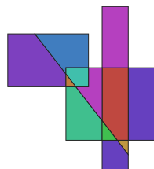

svgfill
=======

An application to fill areas bounded by unconnected lines in SVG.

Dependencies
------------

* [CGAL 2D Arrangements](https://doc.cgal.org/latest/Arrangement_on_surface_2/index.html) GPL
* [SVG++](http://svgpp.org/) Boost software license

Compilation
-----------

svgfill is built as part of IfcOpenShell when `WITH_CGAL` is enabled (the default),
see the [IfcOpenShell installation docs](https://docs.ifcopenshell.org/ifcopenshell/installation.html).

License
-------

LGPL

Example
-------

in:

out:

